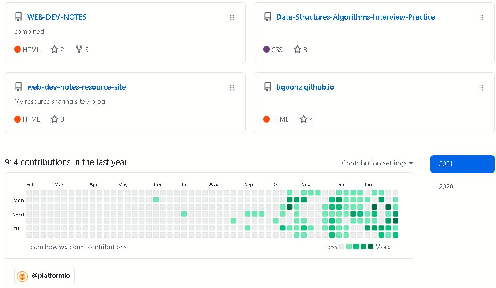
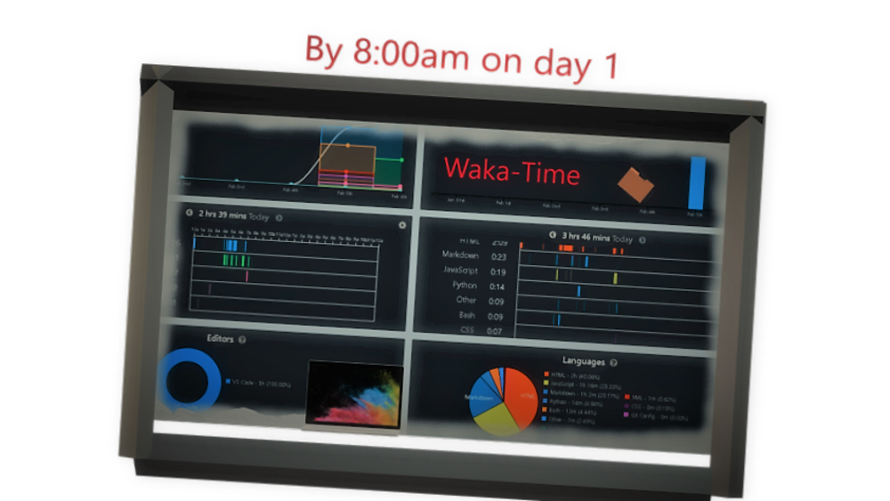
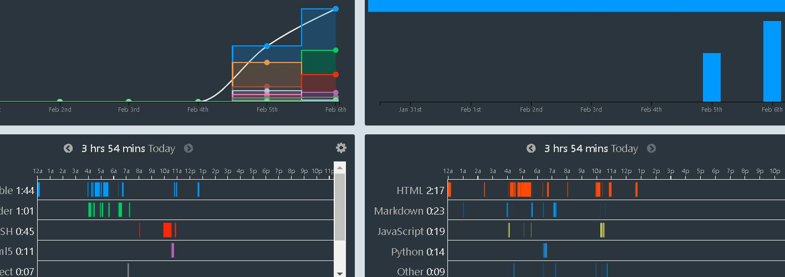
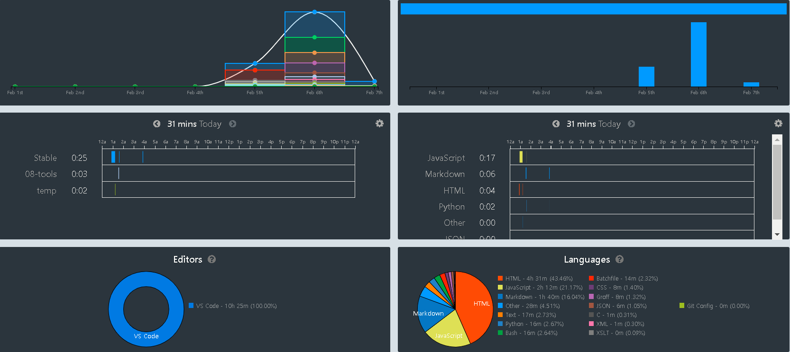

 

---

 
 
---
 
 

---
---

# Hi, I am Bryan!

</img>    </img>

 

 

 
 ---
 
 
 ## DAY # 1 WakaTime app:
 
 

---

---
### _DAY2_
---

 
</img>   

<figcaption>Day # 2 Tracking Coding with WakaTime </figcaption>

---

### _DAY3_
---

 
</img>   

---

---

 

 

 ---
 
 
 
 
 

 
 
 

 

---

[Hi I'm Bryan!](#hi-im-bryan)
- [ ] ✅ [Portfolio:](#portfolio)
- [ ] ✅- [OR:](#or)
- [ ] ✅ [Github-Pages](#github-pages)re
- [ ] ✅ [Github Gists](#github-gists)
- [ ] ✅ [Web Dev Resource Hub](#web-dev-resource-hub)
- [ ] ✅ [Mihir\_Beg.com](#mihir_begcom)
- [ ] ✅ [Interview Prep Static Site](#interview-prep-static-site)
- [ ] ✅ [Data Structures Repository](#data-structures-repository)
- [ ] ✅ [Learning React Blog](#learning-react-blog)
- [ ] ✅ [React Repo:](#react-repo)
- [ ] ✅ [React Repo](#react-repo-1)
- [ ] ✅ [_Email_](#email)
- [ ] ✅ [_Phone_](#phone)
- [ ] ✅ [Social](#social)

---

 

---

---

---
 

 

  

   

 
 

       

  

                                                                            

---

*    [**GitHub**](https://github.com/bgoonz)
*    [**Instagram**](https://www.instagram.com/bgoonz/)
*    [**LinkedIn**](https://www.linkedin.com/in/bryan-guner-046199128/)

 

 

 

---
Portfolio:
------------

[netlify](https://tender-bartik-074feb.netlify.app/)

#### OR:

[Github-Pages](https://bgoonz.github.io/)

---

 

[Github Gists](https://gist.github.com/bgoonz)

---

 
 

---

[github-resume](https://resume.github.io/?bgoonz)

---

 

Web Dev Resource Hub
----------------------

### My personal Web Development blog and resource sharing site

*   [Live Site](https://goofy-euclid-1cd736.netlify.app/)

*   [Main Page](https://goofy-euclid-1cd736.netlify.app/core-site/index.html)

  
 

---

 MihirBeg.com
---------------

### Created a dynamic web page for a local musician using the Bootsrtap framework.

-Talk about App Features & Design Process Here-

-   [Live Site](https://eloquent-sammet-ba1810.netlify.app/)

 

---       
Interview Prep Static Site 
-----------------------------

### Data Structures Repository

-Hope this helps someone other than me!-

*   [Live Site](https://gracious-raman-474030.netlify.app)

---

 

---

Learning React Blog
--------------------
https://ecstatic-jang-593fd1.netlify.app/readme

#### React Repo:

[React Repo](https://github.com/bgoonz/React-Practice)

---

 

## _Email_

[bryan.guner@gmail.com](#)

## _Phone_

*551-254-5505*

## Social

-   [GitHub](https://github.com/bgoonz)
-   [code pen](https://codepen.io/bgoonz)
-   [Instagram](https://www.instagram.com/bgoonz/)
-   [LinkedIn](https://www.linkedin.com/in/bryan-guner-046199128/)
-   [Replit](https://repl.it/@bgoonz/)
-   [Redit](https://www.reddit.com/user/bgoonz1)
-   [runkit](https://runkit.com/bgoonz)
-   [stack-exchange](https://meta.stackexchange.com/users/936785/bryan-guner)

# _MY Interests / Resources_:

<h1 class="code-line" data-line-start=325 data-line-end=326 ><em>MY INTERESTS</em>:</h1>
<ul>
<li class="has-line-data" data-line-start="328" data-line-end="329"><a href="#ansible">Ansible</a></li>
<li class="has-line-data" data-line-start="329" data-line-end="330"><a href="#awesome-lists">Awesome Lists</a></li>
<li class="has-line-data" data-line-start="330" data-line-end="331"><a href="#continious-integration">CI/CD</a></li>
<li class="has-line-data" data-line-start="331" data-line-end="332"><a href="#data-science">Data Science</a></li>
<li class="has-line-data" data-line-start="332" data-line-end="333"><a href="#docker">Docker</a></li>
<li class="has-line-data" data-line-start="333" data-line-end="334"><a href="#dynamodb">DynamoDB</a></li>
<li class="has-line-data" data-line-start="334" data-line-end="335"><a href="#elasticsearch">Elasticsearch</a></li>
<li class="has-line-data" data-line-start="335" data-line-end="336"><a href="#environment-setups">Environment Setups</a></li>
<li class="has-line-data" data-line-start="336" data-line-end="337"><a href="#epic-github-repos">Epic Github Repos</a></li>
<li class="has-line-data" data-line-start="337" data-line-end="338"><a href="#golang">Golang</a></li>
<li class="has-line-data" data-line-start="338" data-line-end="339"><a href="#grafana">Grafana</a></li>
<li class="has-line-data" data-line-start="339" data-line-end="340"><a href="#great-blogs">Great Blogs</a></li>
<li class="has-line-data" data-line-start="340" data-line-end="341"><a href="#knowledge-base">Knowledge Base</a></li>
<li class="has-line-data" data-line-start="341" data-line-end="343"><a href="#kubernetes">Kubernetes</a>
<ul>
<li class="has-line-data" data-line-start="342" data-line-end="343"><a href="#kubernetes-storage">Kubernetes Storage</a></li>
</ul>
</li>
<li class="has-line-data" data-line-start="343" data-line-end="344"><a href="#machine-learning">Machine Learning</a></li>
<li class="has-line-data" data-line-start="344" data-line-end="345"><a href="#monitoring">Monitoring</a></li>
<li class="has-line-data" data-line-start="345" data-line-end="346"><a href="#mongodb">MongoDB</a></li>
<li class="has-line-data" data-line-start="346" data-line-end="347"><a href="#programming">Programming</a></li>
<li class="has-line-data" data-line-start="347" data-line-end="348"><a href="#queues">Queues</a></li>
<li class="has-line-data" data-line-start="348" data-line-end="351"><a href="#self-hosting">Self Hosting</a>
<ul>
<li class="has-line-data" data-line-start="349" data-line-end="350"><a href="#email-server-setups">Email Server Setups</a></li>
<li class="has-line-data" data-line-start="350" data-line-end="351"><a href="#mailscanner-server-setups">Mailscanner Server Setups</a></li>
</ul>
</li>
<li class="has-line-data" data-line-start="351" data-line-end="352"><a href="#serverless">Serverless</a></li>
<li class="has-line-data" data-line-start="352" data-line-end="353"><a href="#sysadmin-references">Sysadmin References</a></li>
<li class="has-line-data" data-line-start="353" data-line-end="354"><a href="#vpn">VPN</a></li>
<li class="has-line-data" data-line-start="354" data-line-end="356"><a href="#web-frameworks">Web Frameworks</a></li>
</ul>
<h2 class="code-line" data-line-start=356 data-line-end=357 >Ansible</h2>
<ul>
<li class="has-line-data" data-line-start="357" data-line-end="359"><a href="https://github.com/zimmertr/Bootstrap-Kubernetes-with-LXC">Kubernetes on LXC with Ansible</a></li>
</ul>
<h2 class="code-line" data-line-start=359 data-line-end=360 >Awesome Lists</h2>
<ul>
<li class="has-line-data" data-line-start="360" data-line-end="361"><a href="https://github.com/exAspArk/awesome-chatops">Awesome ChatOps</a></li>
<li class="has-line-data" data-line-start="361" data-line-end="362"><a href="https://github.com/binhnguyennus/awesome-scalability">Awesome Scalability</a></li>
<li class="has-line-data" data-line-start="362" data-line-end="364"><a href="https://github.com/drone/awesome-drone">Awesome Drone</a></li>
</ul>
<h2 class="code-line" data-line-start=364 data-line-end=365 >Epic Github Repos</h2>
<ul>
<li class="has-line-data" data-line-start="365" data-line-end="367"><a href="https://github.com/mlabouardy?tab=repositories">mlabouardy</a></li>
</ul>
<h2 class="code-line" data-line-start=367 data-line-end=368 >Authentication</h2>
<ul>
<li class="has-line-data" data-line-start="368" data-line-end="370"><a href="https://mapr.com/blog/how-secure-elasticsearch-and-kibana/">Nginx ES and Kibana Proxy with LDAP</a></li>
</ul>
<h2 class="code-line" data-line-start=370 data-line-end=371 >Data Science</h2>
<ul>
<li class="has-line-data" data-line-start="371" data-line-end="373"><a href="https://github.com/bulutyazilim/awesome-datascience">bulutyazilim - datascience awesome list</a></li>
</ul>
<h2 class="code-line" data-line-start=373 data-line-end=374 >Grafana</h2>
<ul>
<li class="has-line-data" data-line-start="374" data-line-end="376"><a href="https://github.com/mlabouardy/grafana-dashboards">Grafana Dashboards @mlabouardy</a></li>
</ul>
<h2 class="code-line" data-line-start=376 data-line-end=377 >Docker</h2>
<h4 class="code-line" data-line-start=378 data-line-end=379 >Deploy Stacks to your Swarm: :whale: :heart:</h4>

Logging:

<ul>
<li class="has-line-data" data-line-start="382" data-line-end="384"><a href="https://github.com/shazChaudhry/docker-elastic">shazChaudhry Swarm GELF Stack</a></li>
</ul>

Metrics:

<ul>
<li class="has-line-data" data-line-start="386" data-line-end="387"><a href="https://github.com/stefanprodan/swarmprom">StefanProdan - Prometheus, Grafana, cAdvisor, Node Exporter and Alert Manager</a></li>
<li class="has-line-data" data-line-start="387" data-line-end="389"><a href="https://github.com/mlabouardy/swarm-tick">Mlabouardy - Telegraf, InfluxDB, Chronograf, Kapacitor &amp; Slack</a></li>
</ul>
<h4 class="code-line" data-line-start=389 data-line-end=390 >Awesome Docker Repos</h4>
<ul>
<li class="has-line-data" data-line-start="390" data-line-end="391"><a href="https://github.com/jessfraz/dockerfiles">Jess's Dockerfiles</a></li>
<li class="has-line-data" data-line-start="391" data-line-end="393"><a href="https://github.com/firecat53/dockerfiles">Firecat53's Dockerfiles</a></li>
</ul>
<h4 class="code-line" data-line-start=393 data-line-end=394 >RaspberryPi ARM Images:</h4>
<ul>
<li class="has-line-data" data-line-start="394" data-line-end="395"><a href="https://hub.docker.com/r/arm32v6/alpine/">arm32v6/alpine:edge</a></li>
<li class="has-line-data" data-line-start="395" data-line-end="396"><a href="https://hub.docker.com/r/arm32v6/golang/">arm32v6/golang:alpine</a></li>
<li class="has-line-data" data-line-start="396" data-line-end="397"><a href="https://hub.docker.com/r/arm32v6/haproxy/">arm32v6/haproxy:alpine</a></li>
<li class="has-line-data" data-line-start="397" data-line-end="398"><a href="https://hub.docker.com/r/arm32v6/node/">arm32v6/node:alpine</a></li>
<li class="has-line-data" data-line-start="398" data-line-end="399"><a href="https://hub.docker.com/r/arm32v6/openjdk/">arm32v6/openjdk:alpine</a></li>
<li class="has-line-data" data-line-start="399" data-line-end="400"><a href="https://hub.docker.com/r/arm32v6/postgres/">arm32v6/postgres:alpine</a></li>
<li class="has-line-data" data-line-start="400" data-line-end="401"><a href="https://hub.docker.com/r/arm32v6/python/">arm32v6/python:2.7-alpine3.6</a></li>
<li class="has-line-data" data-line-start="401" data-line-end="402"><a href="https://hub.docker.com/r/arm32v6/python/">arm32v6/python:3.6-alpine3.6</a></li>
<li class="has-line-data" data-line-start="402" data-line-end="403"><a href="https://hub.docker.com/r/arm32v6/rabbitmq/">arm32v6/rabbitmq:alpine</a></li>
<li class="has-line-data" data-line-start="403" data-line-end="404"><a href="https://hub.docker.com/r/arm32v6/redis/">arm32v6/redis:alpine</a></li>
<li class="has-line-data" data-line-start="404" data-line-end="405"><a href="https://hub.docker.com/r/arm32v6/ruby/">arm32v6/ruby:alpine3.6</a></li>
<li class="has-line-data" data-line-start="405" data-line-end="406"><a href="https://hub.docker.com/r/arm32v6/tomcat/">arm32v6/tomcat:alpine</a></li>
<li class="has-line-data" data-line-start="406" data-line-end="407"><a href="https://hub.docker.com/r/arm32v6/traefik/">arm32v6/traefik:latest</a></li>
<li class="has-line-data" data-line-start="407" data-line-end="408"><a href="https://hub.docker.com/r/arm32v7/debian/">arm32v7/debian:lates</a></li>
<li class="has-line-data" data-line-start="408" data-line-end="409"><a href="https://hub.docker.com/r/hypriot/rpi-redis/">hypriot/rpi-redis</a></li>
<li class="has-line-data" data-line-start="409" data-line-end="410"><a href="https://github.com/jixer/rpi-mongo">jixer/rpi-mongo</a></li>
<li class="has-line-data" data-line-start="410" data-line-end="411"><a href="https://github.com/alexellis/docker-arm/tree/master/images/armhf">alexellis/armhf</a></li>
<li class="has-line-data" data-line-start="411" data-line-end="412"><a href="https://github.com/zeiot">zeiot: rpi-prometheus stack</a></li>
<li class="has-line-data" data-line-start="412" data-line-end="413"><a href="https://hub.docker.com/u/larmog/">larmog</a></li>
<li class="has-line-data" data-line-start="413" data-line-end="414"><a href="https://github.com/andresvidal/rpi3-mongodb3">Rpi MongoDB</a></li>
<li class="has-line-data" data-line-start="414" data-line-end="416"><a href="https://github.com/armswarm">ARM Swarm</a></li>
</ul>
<h4 class="code-line" data-line-start=416 data-line-end=417 >Docker Image Repositories</h4>
<ul>
<li class="has-line-data" data-line-start="417" data-line-end="418"><a href="https://hub.docker.com/u/arm32v6/">Docker Hub: arm32v6</a></li>
<li class="has-line-data" data-line-start="418" data-line-end="419"><a href="https://hub.docker.com/u/armv7/">Docker Hub: armv7</a></li>
<li class="has-line-data" data-line-start="419" data-line-end="420"><a href="https://github.com/luvres/armhf">Github: Luvres Armhf</a></li>
<li class="has-line-data" data-line-start="420" data-line-end="421"><a href="https://github.com/ulsmith/alpine-apache-php7">Apache/PHP7 on Alpine</a></li>
<li class="has-line-data" data-line-start="421" data-line-end="422"><a href="https://github.com/docker-library/tomcat/blob/master/8.0/jre8-alpine/Dockerfile">Tomcat on Alpine</a></li>
<li class="has-line-data" data-line-start="422" data-line-end="423"><a href="https://github.com/jwilder/nginx-proxy">Nginx (jwilder)</a></li>
<li class="has-line-data" data-line-start="423" data-line-end="424"><a href="https://github.com/smebberson/docker-alpine">Alpine Images (smebberson)</a></li>
<li class="has-line-data" data-line-start="424" data-line-end="425"><a href="https://hub.docker.com/u/sameersbn/">SameerSbn</a></li>
<li class="has-line-data" data-line-start="425" data-line-end="426"><a href="https://hub.docker.com/u/linuxserver/">Linuxserver.io</a></li>
<li class="has-line-data" data-line-start="426" data-line-end="427"><a href="https://hub.docker.com/r/nimmis/alpine-apache-php5/">Apache-PHP5</a></li>
<li class="has-line-data" data-line-start="427" data-line-end="429"><a href="https://github.com/harobed/docker-php-ssmtp">Apache-PHP-Email</a></li>
</ul>
<h4 class="code-line" data-line-start=429 data-line-end=430 >Docker-Awesome-Lists</h4>
<ul>
<li class="has-line-data" data-line-start="430" data-line-end="431"><a href="https://github.com/AdamBien/docklands">Java Docker Services</a></li>
<li class="has-line-data" data-line-start="431" data-line-end="433"><a href="https://gist.github.com/shouse/a14c44e97a2cd2a1f030">shouse Docker Awesome List</a></li>
</ul>
<h4 class="code-line" data-line-start=433 data-line-end=434 >Docker Blogs:</h4>
<ul>
<li class="has-line-data" data-line-start="434" data-line-end="435"><a href="https://hub.docker.com/r/emilevauge/whoami/">Whoami used in Traefik Docs</a></li>
<li class="has-line-data" data-line-start="435" data-line-end="436"><a href="https://github.com/spartakode/my-docker-repos/blob/master/sqlite3/Dockerfile">Sqlite with Docker</a></li>
<li class="has-line-data" data-line-start="436" data-line-end="437"><a href="https://github.com/mookjp/rails-docker-example">Rails with Postgres and Redis</a></li>
<li class="has-line-data" data-line-start="437" data-line-end="438"><a href="https://testdriven.io/asynchronous-tasks-with-flask-and-redis-queue">Async Tasks with Flask and Redis</a></li>
<li class="has-line-data" data-line-start="438" data-line-end="439"><a href="https://github.com/davidmukiibi/docker-flask">Flask and Postgres</a></li>
<li class="has-line-data" data-line-start="439" data-line-end="441"><a href="http://ict.renevdmark.nl/2016/07/05/elastic-beats-on-raspberry-pi/">Elastic Beats on RaspberryPi</a></li>
</ul>
<h4 class="code-line" data-line-start=441 data-line-end=442 >Docker Storage</h4>
<ul>
<li class="has-line-data" data-line-start="442" data-line-end="443"><a href="https://github.com/rancher/convoy">Rancher Convoy</a></li>
<li class="has-line-data" data-line-start="443" data-line-end="444"><a href="https://flocker.readthedocs.io/en/latest/flocker-features/storage-backends.html#supported-backends">Flocker</a></li>
<li class="has-line-data" data-line-start="444" data-line-end="445"><a href="http://node.mu/2017/06/30/scaleio-on-ubuntu-xenial/">EMC ScaleIO</a></li>
<li class="has-line-data" data-line-start="445" data-line-end="446"><a href="https://github.com/lucj/swarm-rexray-ceph">RexRay Ceph with Ansible</a></li>
<li class="has-line-data" data-line-start="446" data-line-end="447"><a href="http://containx.io/">ContainX</a></li>
</ul>
<h4 class="code-line" data-line-start=449 data-line-end=450 >OpenFaas:</h4>
<ul>
<li class="has-line-data" data-line-start="450" data-line-end="451"><a href="https://github.com/openfaas/faas/releases">FaaS Releases</a></li>
<li class="has-line-data" data-line-start="451" data-line-end="453"><a href="https://github.com/openfaas/workshop">FaaS Workshop</a></li>
</ul>
<h4 class="code-line" data-line-start=453 data-line-end=454 >Prometheus / Grafana on Swarm:</h4>
<ul>
<li class="has-line-data" data-line-start="454" data-line-end="455"><a href="https://github.com/stefanprodan/swarmprom">StefanProdan - SwarmProm</a></li>
<li class="has-line-data" data-line-start="455" data-line-end="456"><a href="https://medium.com/@soumyadipde/monitoring-in-docker-stacks-its-that-easy-with-prometheus-5d71c1042443">Monitoring with Prometheus</a></li>
<li class="has-line-data" data-line-start="456" data-line-end="457"><a href="https://github.com/uschtwill/docker_monitoring_logging_alerting">UschtWill - Prometheus Grafana Elastalert</a></li>
<li class="has-line-data" data-line-start="457" data-line-end="458"><a href="https://github.com/chmod666org/docker-swarm-prometheus">Chmod-Org Promethus with Blackbox</a></li>
<li class="has-line-data" data-line-start="458" data-line-end="460"><a href="https://finestructure.co/blog/2016/5/16/monitoring-with-prometheus-grafana-docker-part-1">Finestructure: Prometheus Tutorial</a></li>
</ul>
<h2 class="code-line" data-line-start=460 data-line-end=461 >Logging / Kibana / Beats</h2>
<h3 class="code-line" data-line-start=462 data-line-end=463 >Libraries</h3>
<ul>
<li class="has-line-data" data-line-start="463" data-line-end="465"><a href="https://github.com/Delgan/loguru">Loguru</a> | <a href="https://gist.github.com/M0r13n/0b8c62c603fdbc98361062bd9ebe8153">Flask Example with Loguru</a></li>
</ul>
<h3 class="code-line" data-line-start=465 data-line-end=466 >Frameworks</h3>
<ul>
<li class="has-line-data" data-line-start="466" data-line-end="467"><a href="https://github.com/shazChaudhry/docker-elastic">shazChaudhry Swarm GELF Stack</a></li>
</ul>
<h2 class="code-line" data-line-start=469 data-line-end=470 >Continious Integration:</h2>
<h4 class="code-line" data-line-start=471 data-line-end=472 >Circle-CI</h4>
<ul>
<li class="has-line-data" data-line-start="472" data-line-end="474"><a href="https://circleci.com/docs/1.0/language-php/">PHP with Circle-CI</a></li>
</ul>
<h4 class="code-line" data-line-start=474 data-line-end=475 >Concourse</h4>
<ul>
<li class="has-line-data" data-line-start="475" data-line-end="476"><a href="https://concourse.ci/docker-repository.html">Setup Concourse Environment with Docker</a></li>
<li class="has-line-data" data-line-start="476" data-line-end="477"><a href="https://blog.anynines.com/getting-started-with-concourse-ci-and-docker/">Getting Started with Concourse and Docker</a></li>
<li class="has-line-data" data-line-start="477" data-line-end="478"><a href="https://github.com/pivotalservices/concourse-pipeline-samples/tree/master/concourse-pipeline-patterns/gated-pipelines">Concourse Gated Pipelines</a></li>
<li class="has-line-data" data-line-start="478" data-line-end="480"><a href="https://github.com/EugenMayer/concourseci-server-boilerplate">Concourse Boilerplate</a></li>
</ul>
<h4 class="code-line" data-line-start=480 data-line-end=481 >Jenkins</h4>
<ul>
<li class="has-line-data" data-line-start="481" data-line-end="482"><a href="https://modess.io/jenkins-php/">Modess - PHP with Jenkins</a></li>
<li class="has-line-data" data-line-start="482" data-line-end="483"><a href="https://code.tutsplus.com/tutorials/setting-up-continuous-integration-continuous-deployment-with-jenkins--cms-21511">CI/CD Nodejs Tutorial with Jenkins</a></li>
<li class="has-line-data" data-line-start="483" data-line-end="484"><a href="https://medium.com/@mosheezderman/how-to-set-up-ci-cd-pipeline-for-a-node-js-app-with-jenkins-c51581cc783c">CI/CD Nodejs Tutorial with Jenkins @medium</a></li>
<li class="has-line-data" data-line-start="484" data-line-end="486"><a href="https://github.com/shazChaudhry/docker-swarm-mode">Epic CICD workflow with Jenkins, Gitlab, Sonar, Nexus</a></li>
</ul>
<h4 class="code-line" data-line-start=486 data-line-end=487 >SwarmCi</h4>
<ul>
<li class="has-line-data" data-line-start="487" data-line-end="489"><a href="https://github.com/ghostsquad/swarmci">SwarmCI</a></li>
</ul>
<h4 class="code-line" data-line-start=489 data-line-end=490 >Travis-CI</h4>
<ul>
<li class="has-line-data" data-line-start="490" data-line-end="491"><a href="https://docs.travis-ci.com/user/getting-started/">Getting Started with Travis-CI (Original Docs)</a></li>
<li class="has-line-data" data-line-start="491" data-line-end="492"><a href="https://github.com/dwyl/learn-travis">Getting Started with Travis-CI (dwyl - nodejs)</a></li>
<li class="has-line-data" data-line-start="492" data-line-end="493"><a href="https://matthewmoisen.com/blog/how-to-set-up-travis-ci-with-github-for-a-python-project/">Blog Site with Travis-CI (Python)</a></li>
<li class="has-line-data" data-line-start="493" data-line-end="494"><a href="https://github.com/softwaresaved/build_and_test_examples/blob/master/travis/HelloWorld.md">Build Tests with Python on Travis-CI</a></li>
<li class="has-line-data" data-line-start="494" data-line-end="496"><a href="https://www.raywenderlich.com/109418/travis-ci-tutorial">Moving app with Travis-CI</a></li>
</ul>
<h4 class="code-line" data-line-start=496 data-line-end=497 >LambCI</h4>
<ul>
<li class="has-line-data" data-line-start="497" data-line-end="499"><a href="https://github.com/lambci/lambci">LambCI</a></li>
</ul>
<h2 class="code-line" data-line-start=499 data-line-end=500 >DynamoDB</h2>
<h4 class="code-line" data-line-start=501 data-line-end=502 >DynamoDB Docs</h4>
<ul>
<li class="has-line-data" data-line-start="503" data-line-end="505"><a href="https://docs.aws.amazon.com/amazondynamodb/latest/developerguide/SQLtoNoSQL.ReadData.Query.html">AWS DynamoDB: SQL to NoSQL</a></li>
</ul>
<h4 class="code-line" data-line-start=505 data-line-end=506 >DynamoDB Best Practices</h4>
<ul>
<li class="has-line-data" data-line-start="507" data-line-end="508"><a href="https://aws.amazon.com/blogs/database/choosing-the-right-dynamodb-partition-key/">Choosing the Right Partition Key</a></li>
<li class="has-line-data" data-line-start="508" data-line-end="510"><a href="https://cloudacademy.com/blog/amazon-dynamodb-ten-things/">10 Things you should know</a></li>
</ul>
<h4 class="code-line" data-line-start=510 data-line-end=511 >DynamoDB General Info</h4>
<ul>
<li class="has-line-data" data-line-start="512" data-line-end="514"><a href="https://medium.com/@yaofei/understand-dynamodb-b278f718ddb8">Understanding DynamoDB</a></li>
</ul>
<h2 class="code-line" data-line-start=514 data-line-end=515 >Elasticsearch</h2>
<h4 class="code-line" data-line-start=516 data-line-end=517 >Elasticsearch Documentation</h4>
<ul>
<li class="has-line-data" data-line-start="517" data-line-end="518"><a href="https://www.elastic.co/guide/en/elasticsearch/reference/current/general-recommendations.html">General Recommendation</a></li>
<li class="has-line-data" data-line-start="518" data-line-end="519"><a href="https://www.elastic.co/blog/how-many-shards-should-i-have-in-my-elasticsearch-cluster">How Many Shards in my Cluster</a></li>
<li class="has-line-data" data-line-start="519" data-line-end="520"><a href="https://www.elastic.co/blog/managing-time-based-indices-efficiently">Managing Time-Based Indices Efficiently</a></li>
<li class="has-line-data" data-line-start="520" data-line-end="521"><a href="https://bonsai.io/2016/01/11/ideal-elasticsearch-cluster">Elasticsearch Best Practices (Bonsai.io)</a></li>
<li class="has-line-data" data-line-start="521" data-line-end="523"><a href="https://aws.amazon.com/premiumsupport/knowledge-center/elasticsearch-scale-up/">AWS ES - Scaling up my Domain</a></li>
</ul>
<h4 class="code-line" data-line-start=523 data-line-end=524 >Elasticsearch Cheetsheets:</h4>
<ul>
<li class="has-line-data" data-line-start="524" data-line-end="526"><a href="https://gist.github.com/ruanbekker/e8a09604b14f37e8d2f743a87b930f93">My ES Cheatsheet</a></li>
</ul>
<h4 class="code-line" data-line-start=526 data-line-end=527 >Elasticsearch Blogs</h4>
<ul>
<li class="has-line-data" data-line-start="527" data-line-end="528"><a href="https://qbox.io/blog/maximize-guide-elasticsearch-indexing-performance-part-1">Maximize Elasticsearch Indexing Performance</a></li>
<li class="has-line-data" data-line-start="528" data-line-end="529"><a href="https://qbox.io/blog/authoritative-guide-elasticsearch-performance-tuning-part-1">Autoritative Guide to ES Performance Tuning</a></li>
<li class="has-line-data" data-line-start="529" data-line-end="530"><a href="https://opendistro.github.io/for-elasticsearch-docs/docs/elasticsearch/full-text/">Full text Search Queries</a></li>
<li class="has-line-data" data-line-start="530" data-line-end="532"><a href="https://okfnlabs.org/blog/2013/07/01/elasticsearch-query-tutorial.html">Query Elasticsearch</a></li>
</ul>
<h4 class="code-line" data-line-start=532 data-line-end=533 >Elasticsearch Tools</h4>
<ul>
<li class="has-line-data" data-line-start="533" data-line-end="535"><a href="https://github.com/mallocator/Elasticsearch-Exporter">Export Data from ES to ES</a></li>
</ul>
<h2 class="code-line" data-line-start=535 data-line-end=536 >Environment Setups:</h2>
<ul>
<li class="has-line-data" data-line-start="536" data-line-end="538"><a href="https://medium.com/aishik/install-golang-the-right-way-4743fee9255f">Golang</a></li>
</ul>
<h2 class="code-line" data-line-start=538 data-line-end=539 >Knowledge Base</h2>
<h2 class="code-line" data-line-start=540 data-line-end=541 >KB HTTPS</h2>
<ul>
<li class="has-line-data" data-line-start="541" data-line-end="543"><a href="https://blog.miguelgrinberg.com/post/running-your-flask-application-over-https">How does HTTPS work (Miguel Grinberg)</a></li>
</ul>
<h2 class="code-line" data-line-start=543 data-line-end=544 >Kubernetes</h2>
<ul>
<li class="has-line-data" data-line-start="545" data-line-end="546"><a href="https://github.com/ramitsurana/awesome-kubernetes/blob/master/README.md">Awesome Kubernetes</a></li>
<li class="has-line-data" data-line-start="546" data-line-end="547"><a href="https://cheatsheet.dennyzhang.com/cheatsheet-kubernetes-a4">Kubernetes Cheatsheet</a></li>
<li class="has-line-data" data-line-start="547" data-line-end="548"><a href="https://kubernetes.io/blog/2019/07/23/get-started-with-kubernetes-using-python/">Getting Started: Python application on Kubernetes</a></li>
<li class="has-line-data" data-line-start="548" data-line-end="549"><a href="https://semaphoreci.com/blog/kubernetes-deployment">Kubernetes Deployments: The Ultimate Guide</a></li>
<li class="has-line-data" data-line-start="549" data-line-end="550"><a href="https://www.digitalocean.com/community/tutorials/how-to-set-up-a-prometheus-grafana-and-alertmanager-monitoring-stack-on-digitalocean-kubernetes">Prometheus Monitoring Stack with Kubernetes on DO</a></li>
<li class="has-line-data" data-line-start="550" data-line-end="551"><a href="https://tech.evaneos.com/traefik-as-an-ingress-controller-on-minikube-with-kustomize-helm-a3b2f44a5c2a">Traefik as an Ingress Controller on Minikube</a></li>
<li class="has-line-data" data-line-start="551" data-line-end="552"><a href="https://itnext.io/traefik-cluster-as-ingress-controller-for-kubernetes-99fa6c34402">Traefik Ingress with Kubernetes</a></li>
<li class="has-line-data" data-line-start="552" data-line-end="553"><a href="https://medium.com/faun/manually-connect-to-your-kubernetes-cluster-from-the-outside-d852346a7f0a">Manual Connect your Kubernetes from Outside</a></li>
<li class="has-line-data" data-line-start="553" data-line-end="554"><a href="https://pascalw.me/blog/2019/07/02/k3s-https-letsencrypt.html">HTTPS Letsencrypt on k3s</a></li>
<li class="has-line-data" data-line-start="554" data-line-end="555"><a href="https://medium.com/google-cloud/kubernetes-nodeport-vs-loadbalancer-vs-ingress-when-should-i-use-what-922f010849e0">Kubernetes: Nodeport vs Loadbalancer</a></li>
<li class="has-line-data" data-line-start="555" data-line-end="556"><a href="https://medium.com/kubernetes-tutorials/simple-management-of-prometheus-monitoring-pipeline-with-the-prometheus-operator-b445da0e0d1a">Prometheus Monitoring Pipeline on Kubernetes</a></li>
<li class="has-line-data" data-line-start="556" data-line-end="557"><a href="https://rancher.com/blog/2018/2018-08-07-cicd-pipeline-k8s-autodevops-rancher-and-gitlab/">Building a Kubernetes CI/CD Pipeline with Rancher</a></li>
<li class="has-line-data" data-line-start="557" data-line-end="558"><a href="https://medium.com/swlh/universal-cicd-pipeline-on-aws-and-k8s-7b4129fac5d4">Building a Kubernetes CI/CD Pipeline with AWS</a></li>
<li class="has-line-data" data-line-start="558" data-line-end="559"><a href="https://itnext.io/explore-gitea-drone-ci-cd-on-k3s-4a9e99f8b938">Gitea and Drone CI/CD on k3s</a></li>
<li class="has-line-data" data-line-start="559" data-line-end="560"><a href="https://github.com/openfaas-incubator/openfaas-linkerd2/blob/master/README.md">Serverless with Kubernetes using OpenFaaS and Linkerd2</a></li>
<li class="has-line-data" data-line-start="560" data-line-end="561"><a href="https://rancher.com/blog/2019/how-to-manage-kubernetes-with-kubectl/">Managing Kubernetes with kubectl</a></li>
<li class="has-line-data" data-line-start="561" data-line-end="562"><a href="https://gist.github.com/alexellis/a6ee5f094f86987a0dc508442220c52a">OpenFaas Workshop on k3s</a></li>
<li class="has-line-data" data-line-start="562" data-line-end="563"><a href="http://collabnix.com/kubernetes-hands-on-lab-4-deploy-application-stack-using-helm-on-play-with-kubernetes-platform/">Kubernetes Hands-On Lab with collabnix</a></li>
<li class="has-line-data" data-line-start="563" data-line-end="564"><a href="https://medium.com/asl19-developers/create-readwritemany-persistentvolumeclaims-on-your-kubernetes-cluster-3a8db51f98e3">Create ReadWrite Persistent Volumes on Kubernetes</a></li>
<li class="has-line-data" data-line-start="564" data-line-end="566"><a href="https://medium.com/@mattiaperi/kubernetes-cluster-with-k3s-and-multipass-7532361affa3">Kubernetes Clusters with k3s and multipass</a></li>
</ul>
<h3 class="code-line" data-line-start=566 data-line-end=567 >Kubernetes Storage</h3>
<ul>
<li class="has-line-data" data-line-start="567" data-line-end="568"><a href="https://kadalu.io/docs/quick-start">Kadalu</a></li>
<li class="has-line-data" data-line-start="568" data-line-end="569"><a href="https://rancher.com/docs/k3s/latest/en/storage/">Rancher: Longhorn Storage</a></li>
</ul>
<h2 class="code-line" data-line-start=571 data-line-end=572 >Golang</h2>
<ul>
<li class="has-line-data" data-line-start="573" data-line-end="574"><a href="https://github.com/brianvoe/gofakeit">Generate Fake Random Data with Golang</a></li>
<li class="has-line-data" data-line-start="574" data-line-end="576"><a href="https://github.com/hoanhan101/ultimate-go">Ultimate Golang Study Guide</a></li>
</ul>
<h2 class="code-line" data-line-start=576 data-line-end=577 >Great Blogs</h2>
<ul>
<li class="has-line-data" data-line-start="578" data-line-end="579"><a href="https://www.exratione.com/blog/">Exratione.com</a></li>
<li class="has-line-data" data-line-start="579" data-line-end="580"><a href="http://joelabrahamsson.com/elasticsearch-101/">Joelabrahamsson.com</a></li>
<li class="has-line-data" data-line-start="580" data-line-end="581"><a href="http://bencane.com/">Benjamin Cane</a></li>
<li class="has-line-data" data-line-start="581" data-line-end="582"><a href="http://mherman.org/">Michael Herman</a></li>
<li class="has-line-data" data-line-start="582" data-line-end="583"><a href="http://charlesleifer.com/">Charles Leifer</a></li>
<li class="has-line-data" data-line-start="583" data-line-end="584"><a href="https://www.blog.labouardy.com/">Labouardy</a></li>
<li class="has-line-data" data-line-start="584" data-line-end="586"><a href="https://tech.marksblogg.com">Mark's Tech Blog</a></li>
</ul>
<h2 class="code-line" data-line-start=586 data-line-end=587 >Linuxkit:</h2>
<ul>
<li class="has-line-data" data-line-start="587" data-line-end="589"><a href="https://medium.com/aishik/getting-started-with-linuxkit-and-moby-project-ff7121c4e321">Getting Started with Linuxkit</a></li>
</ul>
<h2 class="code-line" data-line-start=589 data-line-end=590 >Logging Stacks</h2>
<ul>
<li class="has-line-data" data-line-start="590" data-line-end="592"><a href="https://github.com/shazChaudhry/docker-elastic">shazChaudhry Swarm GELF Stack</a></li>
</ul>
<h2 class="code-line" data-line-start=592 data-line-end=593 >Machine Learning:</h2>
<ul>
<li class="has-line-data" data-line-start="593" data-line-end="595"><a href="https://github.com/GokuMohandas/practicalAI/blob/master/README.md">PracticalAI</a></li>
</ul>
<h2 class="code-line" data-line-start=595 data-line-end=596 >Metrics:</h2>
<ul>
<li class="has-line-data" data-line-start="596" data-line-end="597"><a href="https://github.com/avalente/appmetrics">AppMetrics with Flask</a></li>
<li class="has-line-data" data-line-start="597" data-line-end="598"><a href="https://github.com/Cue/scales">Scales: Metrics for Python</a></li>
<li class="has-line-data" data-line-start="598" data-line-end="600"><a href="https://pypi.org/project/graphite-pymetrics/">Graphite: Python Flask Metrics</a></li>
</ul>
<h2 class="code-line" data-line-start=600 data-line-end=601 >MongoDB:</h2>
<ul>
<li class="has-line-data" data-line-start="601" data-line-end="602"><a href="https://linode.com/docs/databases/mongodb/build-database-clusters-with-mongodb/">Setup MongoDB Cluster</a></li>
<li class="has-line-data" data-line-start="602" data-line-end="603"><a href="https://github.com/AD7six/mongo-scripts">MongoDB Scripts</a></li>
<li class="has-line-data" data-line-start="603" data-line-end="604"><a href="https://docs.mongodb.com/v2.4/administration/monitoring/#self-hosted-monitoring-tools">MongoDB Monitoring Tools</a></li>
<li class="has-line-data" data-line-start="604" data-line-end="605"><a href="https://studio3t.com/knowledge-base/articles/mongodb-users-roles-explained-part-1/">Roles with MongoDB</a></li>
<li class="has-line-data" data-line-start="605" data-line-end="606"><a href="https://www.guru99.com/mongodb-tutorials.html">Queries: Guru99</a></li>
<li class="has-line-data" data-line-start="606" data-line-end="607"><a href="https://blog.exploratory.io/an-introduction-to-mongodb-query-for-beginners-bd463319aa4c">Queries: Exploratory</a></li>
<li class="has-line-data" data-line-start="607" data-line-end="608"><a href="https://www.tutorialspoint.com/mongodb/mongodb_create_database.htm">Queries: Tutorialspoint</a></li>
<li class="has-line-data" data-line-start="608" data-line-end="610"><a href="https://gist.github.com/rbekker87/5b4cd9ef36b6ae092a6260ab9e621a43">Queries: MongoDB Cheatsheet</a></li>
</ul>
<h2 class="code-line" data-line-start=610 data-line-end=611 >Monitoring</h2>
<ul>
<li class="has-line-data" data-line-start="611" data-line-end="612"><a href="https://hackernoon.com/monitor-swarm-cluster-with-tick-stack-slack-3aaa6483d44a">Docker Swarm Monitoring Stack: Telegraf, InfluxDB, Chronograf, Kapacitor</a> <a href="https://github.com/mlabouardy/swarm-tick">github source</a></li>
<li class="has-line-data" data-line-start="612" data-line-end="613"><a href="https://stefanprodan.com/2017/docker-swarm-instrumentation-with-prometheus/">Docker Swarm Monitoring Stack: Prometheus, Grafana, cAdvisor, Node Exporter</a> <a href="https://github.com/stefanprodan/swarmprom">github source</a></li>
<li class="has-line-data" data-line-start="613" data-line-end="614"><a href="https://finestructure.co/blog/2016/5/16/monitoring-with-prometheus-grafana-docker-part-1">Prometheus Grafana Docker</a></li>
<li class="has-line-data" data-line-start="614" data-line-end="615"><a href="https://pierrevincent.github.io/2017/12/prometheus-blog-series-part-1-metrics-and-labels/">Prometheus Blog Seros</a></li>
<li class="has-line-data" data-line-start="615" data-line-end="616"><a href="https://blog.serverdensity.com/monitor-memcached/">Memcached Monitoring</a></li>
<li class="has-line-data" data-line-start="616" data-line-end="617"><a href="https://raymii.org/s/tutorials/Nagios_Core_4_Installation_on_Ubuntu_12.04.html">Nagios with Nagios Graph</a></li>
<li class="has-line-data" data-line-start="617" data-line-end="618"><a href="https://medium.com/quiq-blog/better-slack-alerts-from-prometheus-49125c8c672b">Slack Alerts with Prometheus</a></li>
<li class="has-line-data" data-line-start="618" data-line-end="619"><a href="https://github.com/deanwilson/docker-compose-prometheus">Local Prometheus Stack</a></li>
<li class="has-line-data" data-line-start="619" data-line-end="621"><a href="https://github.com/chmod666org/docker-swarm-prometheus">Docker Swarm Promethus Setup #1</a>
<ul>
<li class="has-line-data" data-line-start="620" data-line-end="621"><a href="https://chmod666.org/2017/08/monitoring-a-docker-swarm-cluster-with-prometheus">Docker Swarm Prometheus Setup #1: Blog</a></li>
</ul>
</li>
<li class="has-line-data" data-line-start="621" data-line-end="622"><a href="https://homelab.business/docker-swarm-monitoring-part-01/">Docker Swarm Promethus Setup #2</a></li>
<li class="has-line-data" data-line-start="622" data-line-end="623"><a href="https://medium.com/the-telegraph-engineering/how-prometheus-and-the-blackbox-exporter-makes-monitoring-microservice-endpoints-easy-and-free-of-a986078912ee">Docker Swarm Promethus Setup #3 (Blackbox)</a></li>
<li class="has-line-data" data-line-start="623" data-line-end="625"><a href="https://github.com/fzaninotto/uptime">Uptime (fzaninotto)</a></li>
</ul>
<h2 class="code-line" data-line-start=625 data-line-end=626 >Monitoring and Alerting</h2>
<ul>
<li class="has-line-data" data-line-start="626" data-line-end="627"><a href="https://github.com/arachnys/cabot">Cabot (Lightweight Pagerduty)</a></li>
<li class="has-line-data" data-line-start="627" data-line-end="629"><a href="https://www.nagios.org/">Nagios</a></li>
</ul>
<h2 class="code-line" data-line-start=629 data-line-end=630 >Monitoring as Statuspages</h2>
<ul>
<li class="has-line-data" data-line-start="630" data-line-end="631"><a href="https://github.com/darkpixel/statuspage">Statuspage (darkpixel</a></li>
<li class="has-line-data" data-line-start="631" data-line-end="633"><a href="https://github.com/cachethq/Cachet">Cachet</a></li>
</ul>
<h2 class="code-line" data-line-start=633 data-line-end=634 >Programming</h2>
<h4 class="code-line" data-line-start=635 data-line-end=636 >Golang:</h4>
<ul>
<li class="has-line-data" data-line-start="636" data-line-end="637"><a href="http://golangtutorials.blogspot.co.za/2011/05/table-of-contents.html">Golang Tutorials</a></li>
<li class="has-line-data" data-line-start="637" data-line-end="639"><a href="https://github.com/golang/go/wiki">Golang Wiki</a></li>
</ul>
<h4 class="code-line" data-line-start=639 data-line-end=640 >Java:</h4>
<ul>
<li class="has-line-data" data-line-start="640" data-line-end="642"><a href="https://wiki.ruanbekker.com/index.php/Java_Spring_Boot_App_Examples">Java Spring Boot Examples</a></li>
</ul>
<h4 class="code-line" data-line-start=642 data-line-end=643 >Python</h4>
<h4 class="code-line" data-line-start=644 data-line-end=645 >Ruby:</h4>
<ul>
<li class="has-line-data" data-line-start="645" data-line-end="646"><a href="https://learnrubythehardway.org/book">Learn Ruby: Learn Ruby the Hard Way</a></li>
<li class="has-line-data" data-line-start="646" data-line-end="647"><a href="http://ruby-for-beginners.rubymonstas.org/index.html">Learn Ruby: Ruby for Beginners</a></li>
<li class="has-line-data" data-line-start="647" data-line-end="648"><a href="https://launchschool.com/books/ruby/read/loops_iterators#forloops">Learn Ruby: Launch School</a></li>
<li class="has-line-data" data-line-start="648" data-line-end="649"><a href="https://gistpages.com/posts/ruby_arrays_insert_append_length_index_remove">Learn Ruby: Arrays</a></li>
<li class="has-line-data" data-line-start="649" data-line-end="651"><a href="https://gorails.com/setup/osx/10.12-sierra">Install Ruby Environment on Mac</a></li>
</ul>
<h4 class="code-line" data-line-start=651 data-line-end=652 >Ruby on Rails:</h4>
<ul>
<li class="has-line-data" data-line-start="652" data-line-end="653"><a href="https://www.railstutorial.org/book/beginning">Tutorial: Ruby On Rails</a></li>
<li class="has-line-data" data-line-start="653" data-line-end="655"><a href="http://codingnudge.com/2017/03/17/tutorial-how-to-run-ruby-on-rails-on-docker-part-1/">Tutorial: ROR on Docker</a></li>
</ul>
<h2 class="code-line" data-line-start=655 data-line-end=656 >Queues</h2>
<ul>
<li class="has-line-data" data-line-start="657" data-line-end="658"><a href="https://github.com/roribio/alpine-sqs">Alpine SQS</a></li>
<li class="has-line-data" data-line-start="658" data-line-end="659"><a href="https://github.com/celery/kombu">Kombu: Messaging library for Python</a></li>
<li class="has-line-data" data-line-start="659" data-line-end="661"><a href="https://python-rq.org/">Python Job Queues with Redis</a></li>
</ul>
<h2 class="code-line" data-line-start=661 data-line-end=662 >Sysadmin References:</h2>
<ul>
<li class="has-line-data" data-line-start="662" data-line-end="663"><a href="https://gist.github.com/ruanbekker/3118ed23c25451132becacd3b974db08">Sysadmin Command References</a></li>
<li class="has-line-data" data-line-start="663" data-line-end="664"><a href="https://medium.com/@chrishantha/linux-performance-observability-tools-19ae2328f87f">Linux Performance Observability Tools</a></li>
<li class="has-line-data" data-line-start="664" data-line-end="665"><a href="http://bencane.com/2012/08/06/troubleshooting-high-io-wait-in-linux/">Troubleshooting High IO Wait</a></li>
<li class="has-line-data" data-line-start="665" data-line-end="666"><a href="https://blog.pythian.com/basic-io-monitoring-on-linux/">IO Monitoring in Linux</a></li>
<li class="has-line-data" data-line-start="666" data-line-end="667"><a href="http://xiayubin.com/blog/2014/01/29/how-i-use-iostat-and-vmstat-for-performance-analysis/">IOStat and VMStat for Performance Monitoring</a></li>
<li class="has-line-data" data-line-start="667" data-line-end="669"><a href="https://www.tummy.com/articles/isolating-heavy-load/">Debugging Heavy Load</a></li>
</ul>
<h2 class="code-line" data-line-start=669 data-line-end=670 >Self Hosting</h2>
<h4 class="code-line" data-line-start=671 data-line-end=672 >Email Server Setups</h4>
<ul>
<li class="has-line-data" data-line-start="672" data-line-end="673"><a href="https://www.exratione.com/2016/05/a-mailserver-on-ubuntu-16-04-postfix-dovecot-mysql/">Extratione: Postfix Dovecot MySQL Virtual Users Postfixadmin</a></li>
<li class="has-line-data" data-line-start="673" data-line-end="674"><a href="https://www.exratione.com/2019/02/a-mailserver-on-ubuntu-18-04-postfix-dovecot-mysql/">Extratione: Postfix Dovecot MySQL Virtual Users Postfixadmin (Ubuntu 18)</a></li>
<li class="has-line-data" data-line-start="674" data-line-end="675"><a href="https://linuxize.com/post/set-up-an-email-server-with-postfixadmin/">Linuxsize: Postfix Dovecot MySQL Virtual Users Postfixadmin</a></li>
<li class="has-line-data" data-line-start="675" data-line-end="676"><a href="https://www.howtoforge.com/postfix_mysql_dovecot_dspam_clamav_postgrey_rbl_debian_etch">Howtoforge: Postfix, MySQL, Dovecto, Dspam</a></li>
<li class="has-line-data" data-line-start="676" data-line-end="678"><a href="https://linuxize.com/post/set-up-an-email-server-with-postfixadmin/">Linuxsize: VirtualUsers, MySQL, Postfix, Dovecot</a></li>
</ul>
<h4 class="code-line" data-line-start=678 data-line-end=679 >Mailscanner Server Setups</h4>
<ul>
<li class="has-line-data" data-line-start="679" data-line-end="681"><a href="https://syslint.com/blog/tutorial/how-to-install-and-configure-spamassassin-with-postfix-in-debian-8/">Spamassassin with Debian 8</a></li>
</ul>
<h4 class="code-line" data-line-start=681 data-line-end=682 >Financial</h4>
<ul>
<li class="has-line-data" data-line-start="682" data-line-end="683"><a href="https://github.com/firefly-iii/firefly-iii">SelfHosted Firefly</a></li>
</ul>
<h4 class="code-line" data-line-start=686 data-line-end=687 >Self Hosting Frameworks:</h4>
<ul>
<li class="has-line-data" data-line-start="687" data-line-end="689"><a href="https://sandstorm.io/">Sandstorm</a></li>
</ul>
<h2 class="code-line" data-line-start=689 data-line-end=690 >Serverless</h2>
<ul>
<li class="has-line-data" data-line-start="691" data-line-end="692"><a href="https://github.com/Miserlou/Zappa">Serverless Zappa</a></li>
<li class="has-line-data" data-line-start="692" data-line-end="693"><a href="https://github.com/faizanbashir/python-ses-dynamodb-contactform">Serverless Contact Form</a></li>
<li class="has-line-data" data-line-start="693" data-line-end="695"><a href="https://github.com/danilop/LambdAuth">Serverless Authentication on AWS (danilop)</a></li>
</ul>
<h2 class="code-line" data-line-start=695 data-line-end=696 >VPN:</h2>
<h4 class="code-line" data-line-start=696 data-line-end=697 >VPN-Howto:</h4>
<ul>
<li class="has-line-data" data-line-start="697" data-line-end="698"><a href="https://www.cyberciti.biz/faq/howto-setup-openvpn-server-on-ubuntu-linux-14-04-or-16-04-lts/">Ubuntu OpenVPN Script</a></li>
<li class="has-line-data" data-line-start="698" data-line-end="699"><a href="https://github.com/hwdsl2/setup-ipsec-vpn">Ubuntu IPSec Script</a></li>
<li class="has-line-data" data-line-start="699" data-line-end="700"><a href="https://www.digitalocean.com/community/tutorials/how-to-set-up-an-openvpn-server-on-ubuntu-16-04">DO - Setup OpenVPN on Ubuntu</a></li>
<li class="has-line-data" data-line-start="700" data-line-end="701"><a href="https://www.elastichosts.com/blog/linux-l2tpipsec-vpn-client/">Elasticshosts - IPSec VPN</a></li>
<li class="has-line-data" data-line-start="701" data-line-end="703"><a href="https://github.com/bedefaced/vpn-install">PPTP/IPSec/OpenVPN Auto Install</a></li>
</ul>
<h2 class="code-line" data-line-start=703 data-line-end=704 >Website Templates</h2>
<h4 class="code-line" data-line-start=705 data-line-end=706 >Resume Templates</h4>
<ul>
<li class="has-line-data" data-line-start="706" data-line-end="708"><a href="https://github.com/johnmarcampbell/resume-site">johnmarcampbell resume-site</a></li>
</ul>
<h2 class="code-line" data-line-start=708 data-line-end=709 >Web Frameworks</h2>
<h4 class="code-line" data-line-start=710 data-line-end=711 >Python Flask:</h4>
<ul>
<li class="has-line-data" data-line-start="711" data-line-end="712"><a href="https://gist.github.com/dAnjou/2874714">Python Flask Upload Example</a></li>
<li class="has-line-data" data-line-start="712" data-line-end="713"><a href="https://github.com/humiaozuzu/awesome-flask#awesome-flask">Awesome Flask - humiaozuzu</a></li>
<li class="has-line-data" data-line-start="713" data-line-end="714"><a href="https://github.com/greyli?tab=repositories">Awesome Flask Apps - Greyli</a></li>
<li class="has-line-data" data-line-start="714" data-line-end="715"><a href="https://blog.miguelgrinberg.com/post/running-your-flask-application-over-https">Flask over HTTPS (MG)</a></li>
<li class="has-line-data" data-line-start="715" data-line-end="716"><a href="https://speakerdeck.com/mitsuhiko/advanced-flask-patterns-1">Flask Advanced Patterns</a></li>
<li class="has-line-data" data-line-start="716" data-line-end="718"><a href="https://github.com/tojrobinson/flask-mvc">Flask MVC Boilerplate</a></li>
</ul>
