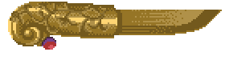
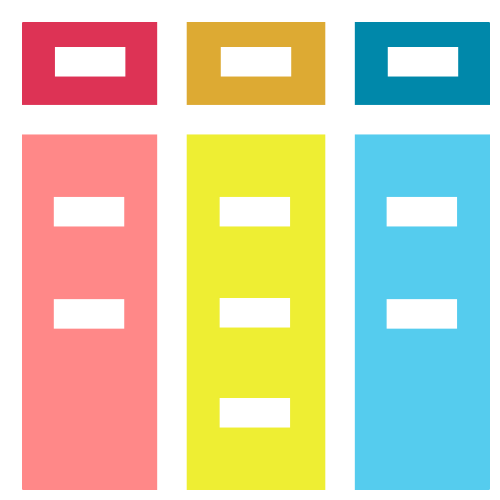
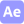
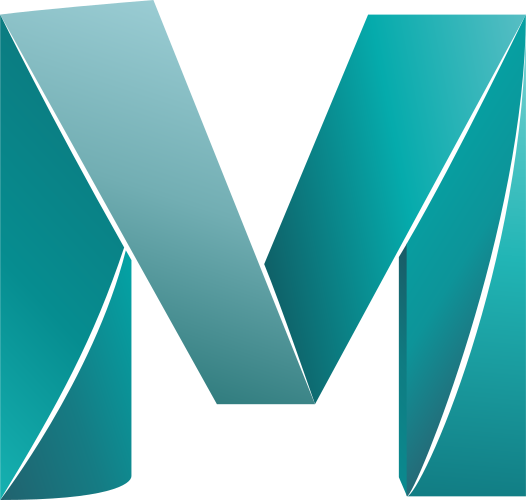
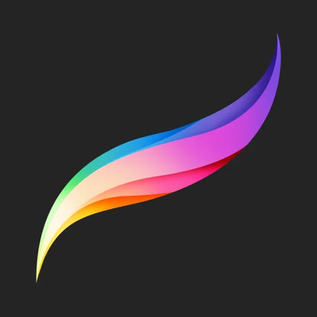
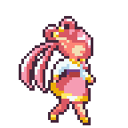

## Hello, world! It's Alicia Mira Kim!
<!-- TODO: Badges, picture, project previews/links -->

[![Handshake](https://img.shields.io/badge/-Handshake-f10?style=flat-square&logo=data:image/svg%2bxml;base64,PHN2ZyBmaWxsPSIjZmZmIiB4bWxucz0iaHR0cDovL3d3dy53My5vcmcvMjAwMC9zdmciIGlkPSJsb2dvLWljb24iIHZpZXdCb3g9IjAgMCA4MC4xIDk2LjEiIGNsYXNzPSJzdHlsZV9fbG9nby1pY29uX19fMzhra2ciIHdpZHRoPSIzMiIgaGVpZ2h0PSIzMiI+PHRpdGxlPkhhbmRzaGFrZTwvdGl0bGU+PHBhdGggY2xhc3M9InN0eWxlX19sb2dvLWljb24tY29udGVudF9fXzI1b2FfIiBkPSIgICAgICAgICAgTTc2LjYgNDIuOWMtMS42LS42LTkuMi0yLjQtMTkgICAgICAgICAgLjEtMjQuNiA2LjMtMjkuMS02LjYtMzkuNS05LjYtMi40LS43LTEyLjItMS41LTE1LjkuNC0xLjMuNy0yLjIgICAgICAgICAgMi4zLTIuMiAzLjggMCA2LjctLjEgMzYuOC0uMSA1MSAwIDQuMSAzLjMgNy40IDcuNCAgICAgICAgICA3LjRoMTUuNGM0IDAgNy4zLTMuMyA3LjQtNy4zLjEtMTIuNC4zLTMzLjcuMy0zNi4xICAgICAgICAgIDAtLjkuNS0xLjEgMS42LTEuNCA5LjgtMi41IDE3LjQgMyAxNy42IDEwLjcuMiA4LjUuNCAgICAgICAgICAxOC4zLjQgMjYuOCAwIDQgMy4zIDcuMyA3LjMgNy4zIDQuNiAwIDEwLjQuMSAxNS4zLjEgICAgICAgICAgNCAwIDcuMy0zLjMgNy4zLTcuMyAwLTEzLjcuMS0zMy4zLjEtNDEuNCAwLTIuNC0xLjQtMy43LTMuNC00LjV6TTY2LjUgICAgICAgICAgMzYuOGM3LjUgMCAxMy42LTYuMSAxMy42LTEzLjZTNzQgOS42IDY2LjUgOS42cy0xMy42IDYuMS0xMy42ICAgICAgICAgIDEzLjZjMCA3LjYgNi4xIDEzLjYgMTMuNiAxMy42ek0xNC4zIDI4LjZjNy45IDAgMTQuMy02LjQgMTQuMy0xNC4zUzIyLjIgICAgICAgICAgMCAxNC4zIDAgMCA2LjQgMCAxNC4zczYuNCAxNC4zIDE0LjMgMTQuM3ogICAgICAgICI+PC9wYXRoPjwvc3ZnPg==&logoColor=white&link=https://app.joinhandshake.com/users/29679495)](https://app.joinhandshake.com/users/29679495)

- 💬 **Currently:** Jobseeker! Need a full-stack dev? Contact me! :D
- 💼 **Work History:** CAD/Web Contractor (2yrs-OSI), ESL Teacher (3yrs-remote/VIPKid, 2yrs-South Korea/EPIK) 
- 🍎 **Education:** app Academy (SWE bootcamp), Towson University (Bachelor's Degree in General Design)
- 🎨 **Hobbies:** Streaming code, game jams, pixel art, drawing, painting, candle-making, jewelry-making, sewing, embroidery, historical/lternative fashion, video games, anime/manga, DnD, eating, sleeping... 💤
- 🌱 **Learning Next:** TypeScript, Jest, NextJS, React Native, C#

<!-- --- -->

<!--  -->

## &nbsp;&nbsp;Tools & Technologies

<!-- 
 
 -->

**Languages**
  &nbsp;&nbsp;&nbsp;&nbsp; 
  
  
  
  
  
  
  
  

**Frontend** 
  &nbsp;&nbsp;&nbsp;&nbsp; 
  
  
  
  
  
  
  
  
  
  
  

**Backend** 
  &nbsp;&nbsp;&nbsp;&nbsp; 
  
  
  
  
  

**Database** 
  &nbsp;&nbsp;&nbsp;&nbsp; 
  
  
  
  

**Systems** 
  &nbsp;&nbsp;&nbsp;&nbsp; 
  
  
  
  
  
**Testing**
  &nbsp;&nbsp;&nbsp;&nbsp; 
  
  
  
  <!--  -->

**IDEs & Tools** 
  &nbsp;&nbsp;&nbsp;&nbsp; 
  
  
  
  
  
  
  
  
  
  <!--  -->

**Collaborative** 
  &nbsp;&nbsp;&nbsp;&nbsp; 
  
  
  
  
  
  
  

**Design** 
  &nbsp;&nbsp;&nbsp;&nbsp; 
  
  
  
  
  
  
  
  
  <!-- 
  
  
   -->

**Other** 
  &nbsp;&nbsp;&nbsp;&nbsp; 
  
  
  
  
  
  
  
  
  
  
  

<!-- 

 -->

<!-- 
### Currently working on:
-----------------------------

| Rebuild Coven | Clean up Chronicles/NPSeed | Polish Persistamp | Afterwards |
|---------------|----------------------------|-------------------|------------|
| Layout        | Debugging                  | Styling touchups  | Polish     |
| High-level styling (fonts, key colors, global rules) | Navigation/instructions | Drag-n-drop | Web Design 101 Site |
| Functionality | Seeder data | Debugging, styling, READMEs, etc  | GenieBot Site
| Seeder data   | | | a/A Curriculum Review |
| Portfolio+README update/Postmortem | | | Learn new tech (NextJS, Native | 
-->

---------------------------------

 

**Thank you (attributions)**  <a href="https://iconscout.com/icons/maya" target="_blank">Maya Logo Icon</a> by <a href="https://iconscout.com/contributors/icon-mafia">Icon Mafia</a> on <a href="https://iconscout.com">Iconscout</a>, [REST API Icon](https://www.visualpharm.com/free-icons/rest%20api-595b40b65ba036ed117d1778), The Noun Project: [terminal by Bluetip](https://thenounproject.com/term/terminal/334312/), [kanban by Shocho ](https://thenounproject.com/search/?q=kanban&i=3688411), [agile by SBTS](https://thenounproject.com/search/?q=agile&i=3428387), [SQL File by Milinda Courey ](https://thenounproject.com/search/?q=sql&i=237080)

 We can do it!!

