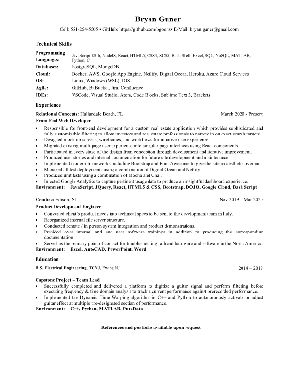

-   [GitHub](https://github.com/bgoonz)
-   [Instagram](https://www.instagram.com/bgoonz/)
-   [LinkedIn](https://www.linkedin.com/in/bryan-guner-046199128/)

Hi I'm Bryan!
=============

[github-resume](https://resume.github.io/?bgoonz)

---
Before I deleted some repositories to clean out my github account I had over 1000 commits in my personal repository in just a few months, I have a lot to learn... but I live and breathe code.

<table><tr><td></td><td></td></tr></table>

---

Web Dev Resource Hub
----------------------

### My personal Web Development blog and resource sharing site

-   [Live Site](https://goofy-euclid-1cd736.netlify.app/)
-   [Main Page](https://goofy-euclid-1cd736.netlify.app/core-site/index.html)

Mihir\_Beg.com
-----------------

### Created a dynamic web page for a local musician using the Bootsrtap framework.

-Talk about App Features & Design Process Here-

-   [Live Site](https://eloquent-sammet-ba1810.netlify.app/)

Interview Prep Static Site 
-----------------------------

### Data Structures Repository

-Hope this helps someone other than me!-

-   [Live Site](https://gracious-raman-474030.netlify.app)

-   ### Email

    [bryan.guner@gmail.com](#)

-   ### Phone

    551-254-5505

-   ### Social

    -   [GitHub](https://github.com/bgoonz)
    -   [Instagram](https://www.instagram.com/bgoonz/)
    -   [LinkedIn](https://www.linkedin.com/in/bryan-guner-046199128/)
