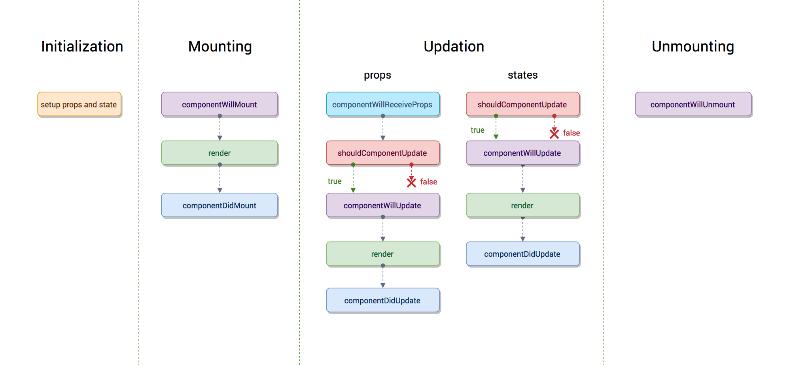
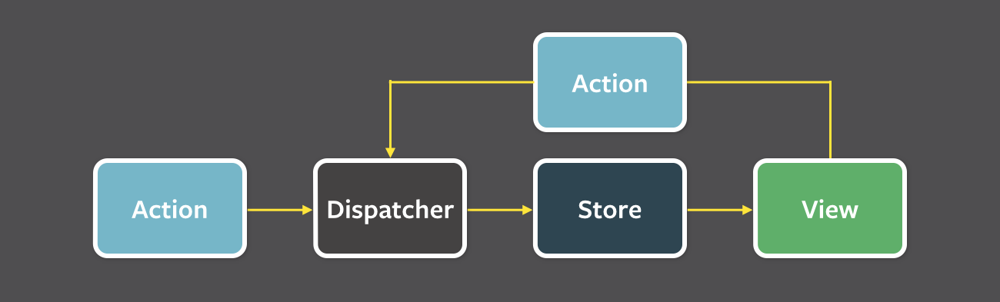

# React Interview Questions & Answers

> Click :star:if you like the project. Pull Request are highly appreciated. Follow me <span class="citation" data-cites="SudheerJonna">\[@SudheerJonna\]</span>(https://twitter.com/SudheerJonna) for technical updates.

### Table of Contents

<table style="width:99%;"><colgroup><col style="width: 1%" /><col style="width: 98%" /></colgroup><thead><tr class="header"><th>No.</th><th>Questions</th></tr></thead><tbody><tr class="odd"><td></td><td><strong>Core React</strong></td></tr><tr class="even"><td>1</td><td><a href="#what-is-react">What is React?</a></td></tr><tr class="odd"><td>2</td><td><a href="#what-are-the-major-features-of-react">What are the major features of React?</a></td></tr><tr class="even"><td>3</td><td><a href="#what-is-jsx">What is JSX?</a></td></tr><tr class="odd"><td>4</td><td><a href="#what-is-the-difference-between-element-and-component">What is the difference between Element and Component?</a></td></tr><tr class="even"><td>5</td><td><a href="#how-to-create-components-in-react">How to create components in React?</a></td></tr><tr class="odd"><td>6</td><td><a href="#when-to-use-a-class-component-over-a-function-component">When to use a Class Component over a Function Component?</a></td></tr><tr class="even"><td>7</td><td><a href="#what-are-pure-components">What are Pure Components?</a></td></tr><tr class="odd"><td>8</td><td><a href="#what-is-state-in-react">What is state in React?</a></td></tr><tr class="even"><td>9</td><td><a href="#what-are-props-in-react">What are props in React?</a></td></tr><tr class="odd"><td>10</td><td><a href="#what-is-the-difference-between-state-and-props">What is the difference between state and props?</a></td></tr><tr class="even"><td>11</td><td><a href="#why-should-we-not-update-the-state-directly">Why should we not update the state directly?</a></td></tr><tr class="odd"><td>12</td><td><a href="#what-is-the-purpose-of-callback-function-as-an-argument-of-setstate">What is the purpose of callback function as an argument of setState()?</a></td></tr><tr class="even"><td>13</td><td><a href="#what-is-the-difference-between-html-and-react-event-handling">What is the difference between HTML and React event handling?</a></td></tr><tr class="odd"><td>14</td><td><a href="#how-to-bind-methods-or-event-handlers-in-jsx-callbacks">How to bind methods or event handlers in JSX callbacks?</a></td></tr><tr class="even"><td>15</td><td><a href="#how-to-pass-a-parameter-to-an-event-handler-or-callback">How to pass a parameter to an event handler or callback?</a></td></tr><tr class="odd"><td>16</td><td><a href="#what-are-synthetic-events-in-react">What are synthetic events in React?</a></td></tr><tr class="even"><td>17</td><td><a href="#what-is-inline-conditional-expressions">What is inline conditional expressions?</a></td></tr><tr class="odd"><td>18</td><td><a href="#what-are-key-props-and-what-is-the-benefit-of-using-them-in-arrays-of-elements">What are “key” props and what is the benefit of using them in arrays of elements?</a></td></tr><tr class="even"><td>19</td><td><a href="#what-is-the-use-of-refs">What is the use of refs?</a></td></tr><tr class="odd"><td>20</td><td><a href="#how-to-create-refs">How to create refs?</a></td></tr><tr class="even"><td>21</td><td><a href="#what-are-forward-refs">What are forward refs?</a></td></tr><tr class="odd"><td>22</td><td><a href="#which-is-preferred-option-with-in-callback-refs-and-finddomnode">Which is preferred option with in callback refs and findDOMNode()?</a></td></tr><tr class="even"><td>23</td><td><a href="#why-are-string-refs-legacy">Why are String Refs legacy?</a></td></tr><tr class="odd"><td>24</td><td><a href="#what-is-virtual-dom">What is Virtual DOM?</a></td></tr><tr class="even"><td>25</td><td><a href="#how-virtual-dom-works">How Virtual DOM works?</a></td></tr><tr class="odd"><td>26</td><td><a href="#what-is-the-difference-between-shadow-dom-and-virtual-dom">What is the difference between Shadow DOM and Virtual DOM?</a></td></tr><tr class="even"><td>27</td><td><a href="#what-is-react-fiber">What is React Fiber?</a></td></tr><tr class="odd"><td>28</td><td><a href="#what-is-the-main-goal-of-react-fiber">What is the main goal of React Fiber?</a></td></tr><tr class="even"><td>29</td><td><a href="#what-are-controlled-components">What are controlled components?</a></td></tr><tr class="odd"><td>30</td><td><a href="#what-are-uncontrolled-components">What are uncontrolled components?</a></td></tr><tr class="even"><td>31</td><td><a href="#what-is-the-difference-between-createelement-and-cloneelement">What is the difference between createElement and cloneElement?</a></td></tr><tr class="odd"><td>32</td><td><a href="#what-is-lifting-state-up-in-react">What is Lifting State Up in React?</a></td></tr><tr class="even"><td>33</td><td><a href="#what-are-the-different-phases-of-component-lifecycle">What are the different phases of component lifecycle?</a></td></tr><tr class="odd"><td>34</td><td><a href="#what-are-the-lifecycle-methods-of-react">What are the lifecycle methods of React?</a></td></tr><tr class="even"><td>35</td><td><a href="#what-are-higher-order-components">What are Higher-Order components?</a></td></tr><tr class="odd"><td>36</td><td><a href="#how-to-create-props-proxy-for-hoc-component">How to create props proxy for HOC component?</a></td></tr><tr class="even"><td>37</td><td><a href="#what-is-context">What is context?</a></td></tr><tr class="odd"><td>38</td><td><a href="#what-is-children-prop">What is children prop?</a></td></tr><tr class="even"><td>39</td><td><a href="#how-to-write-comments-in-react">How to write comments in React?</a></td></tr><tr class="odd"><td>40</td><td><a href="#what-is-the-purpose-of-using-super-constructor-with-props-argument">What is the purpose of using super constructor with props argument?</a></td></tr><tr class="even"><td>41</td><td><a href="#what-is-reconciliation">What is reconciliation?</a></td></tr><tr class="odd"><td>42</td><td><a href="#how-to-set-state-with-a-dynamic-key-name">How to set state with a dynamic key name?</a></td></tr><tr class="even"><td>43</td><td><a href="#what-would-be-the-common-mistake-of-function-being-called-every-time-the-component-renders">What would be the common mistake of function being called every time the component renders?</a></td></tr><tr class="odd"><td>44</td><td><a href="#is-lazy-function-supports-named-exports">Is lazy function supports named exports??</a></td></tr><tr class="even"><td>45</td><td><a href="#why-react-uses-classname-over-class-attribute">Why React uses className over class attribute?</a></td></tr><tr class="odd"><td>46</td><td><a href="#what-are-fragments">What are fragments?</a></td></tr><tr class="even"><td>47</td><td><a href="#why-fragments-are-better-than-container-divs">Why fragments are better than container divs?</a></td></tr><tr class="odd"><td>48</td><td><a href="#what-are-portals-in-react">What are portals in React?</a></td></tr><tr class="even"><td>49</td><td><a href="#what-are-stateless-components">What are stateless components?</a></td></tr><tr class="odd"><td>50</td><td><a href="#what-are-stateful-components">What are stateful components?</a></td></tr><tr class="even"><td>51</td><td><a href="#how-to-apply-validation-on-props-in-react">How to apply validation on props in React?</a></td></tr><tr class="odd"><td>52</td><td><a href="#what-are-the-advantages-of-react">What are the advantages of React?</a></td></tr><tr class="even"><td>53</td><td><a href="#what-are-the-limitations-of-react">What are the limitations of React?</a></td></tr><tr class="odd"><td>54</td><td><a href="#what-are-error-boundaries-in-react-v16">What are error boundaries in React v16</a></td></tr><tr class="even"><td>55</td><td><a href="#how-error-boundaries-handled-in-react-v15">How error boundaries handled in React v15?</a></td></tr><tr class="odd"><td>56</td><td><a href="#what-are-the-recommended-ways-for-static-type-checking">What are the recommended ways for static type checking?</a></td></tr><tr class="even"><td>57</td><td><a href="#what-is-the-use-of-react-dom-package">What is the use of react-dom package?</a></td></tr><tr class="odd"><td>58</td><td><a href="#what-is-the-purpose-of-render-method-of-react-dom">What is the purpose of render method of react-dom?</a></td></tr><tr class="even"><td>59</td><td><a href="#what-is-reactdomserver">What is ReactDOMServer?</a></td></tr><tr class="odd"><td>60</td><td><a href="#how-to-use-innerhtml-in-react">How to use InnerHtml in React?</a></td></tr><tr class="even"><td>61</td><td><a href="#how-to-use-styles-in-react">How to use styles in React?</a></td></tr><tr class="odd"><td>62</td><td><a href="#how-events-are-different-in-react">How events are different in React?</a></td></tr><tr class="even"><td>63</td><td><a href="#what-will-happen-if-you-use-setstate-in-constructor">What will happen if you use setState in constructor?</a></td></tr><tr class="odd"><td>64</td><td><a href="#what-is-the-impact-of-indexes-as-keys">What is the impact of indexes as keys?</a></td></tr><tr class="even"><td>65</td><td><a href="#is-it-good-to-use-setstate-in-componentwillmount-method">Is it good to use setState() in componentWillMount() method?</a></td></tr><tr class="odd"><td>66</td><td><a href="#what-will-happen-if-you-use-props-in-initial-state">What will happen if you use props in initial state?</a></td></tr><tr class="even"><td>67</td><td><a href="#how-do-you-conditionally-render-components">How do you conditionally render components?</a></td></tr><tr class="odd"><td>68</td><td><a href="#why-we-need-to-be-careful-when-spreading-props-on-dom-elements">Why we need to be careful when spreading props on DOM elements??</a></td></tr><tr class="even"><td>69</td><td><a href="#how-you-use-decorators-in-react">How you use decorators in React?</a></td></tr><tr class="odd"><td>70</td><td><a href="#how-do-you-memoize-a-component">How do you memoize a component?</a></td></tr><tr class="even"><td>71</td><td><a href="#how-you-implement-server-side-rendering-or-ssr">How you implement Server-Side Rendering or SSR?</a></td></tr><tr class="odd"><td>72</td><td><a href="#how-to-enable-production-mode-in-react">How to enable production mode in React?</a></td></tr><tr class="even"><td>73</td><td><a href="#what-is-cra-and-its-benefits">What is CRA and its benefits?</a></td></tr><tr class="odd"><td>74</td><td><a href="#what-is-the-lifecycle-methods-order-in-mounting">What is the lifecycle methods order in mounting?</a></td></tr><tr class="even"><td>75</td><td><a href="#what-are-the-lifecycle-methods-going-to-be-deprecated-in-react-v16">What are the lifecycle methods going to be deprecated in React v16?</a></td></tr><tr class="odd"><td>76</td><td><a href="#what-is-the-purpose-of-getderivedstatefromprops-lifecycle-method">What is the purpose of getDerivedStateFromProps() lifecycle method?</a></td></tr><tr class="even"><td>77</td><td><a href="#what-is-the-purpose-of-getsnapshotbeforeupdate-lifecycle-method">What is the purpose of getSnapshotBeforeUpdate() lifecycle method?</a></td></tr><tr class="odd"><td>78</td><td><a href="#do-hooks-replace-render-props-and-higher-order-components">Do Hooks replace render props and higher order components?</a></td></tr><tr class="even"><td>79</td><td><a href="#what-is-the-recommended-way-for-naming-components">What is the recommended way for naming components?</a></td></tr><tr class="odd"><td>80</td><td><a href="#what-is-the-recommended-ordering-of-methods-in-component-class">What is the recommended ordering of methods in component class?</a></td></tr><tr class="even"><td>81</td><td><a href="#what-is-a-switching-component">What is a switching component?</a></td></tr><tr class="odd"><td>82</td><td><a href="#why-we-need-to-pass-a-function-to-setstate">Why we need to pass a function to setState()?</a></td></tr><tr class="even"><td>83</td><td><a href="#what-is-strict-mode-in-react">What is strict mode in React?</a></td></tr><tr class="odd"><td>84</td><td><a href="#what-are-react-mixins">What are React Mixins?</a></td></tr><tr class="even"><td>85</td><td><a href="#why-is-ismounted-an-anti-pattern-and-what-is-the-proper-solution">Why is isMounted() an anti-pattern and what is the proper solution?</a></td></tr><tr class="odd"><td>86</td><td><a href="#what-are-the-pointer-events-supported-in-react">What are the Pointer Events supported in React?</a></td></tr><tr class="even"><td>87</td><td><a href="#why-should-component-names-start-with-capital-letter">Why should component names start with capital letter?</a></td></tr><tr class="odd"><td>88</td><td><a href="#are-custom-dom-attributes-supported-in-react-v16">Are custom DOM attributes supported in React v16?</a></td></tr><tr class="even"><td>89</td><td><a href="#what-is-the-difference-between-constructor-and-getinitialstate">What is the difference between constructor and getInitialState?</a></td></tr><tr class="odd"><td>90</td><td><a href="#can-you-force-a-component-to-re-render-without-calling-setstate">Can you force a component to re-render without calling setState?</a></td></tr><tr class="even"><td>91</td><td><a href="#what-is-the-difference-between-super-and-superprops-in-react-using-es6-classes">What is the difference between super() and super(props) in React using ES6 classes?</a></td></tr><tr class="odd"><td>92</td><td><a href="#how-to-loop-inside-jsx">How to loop inside JSX?</a></td></tr><tr class="even"><td>93</td><td><a href="#how-do-you-access-props-in-attribute-quotes">How do you access props in attribute quotes?</a></td></tr><tr class="odd"><td>94</td><td><a href="#what-is-react-proptype-array-with-shape">What is React PropType array with shape?</a></td></tr><tr class="even"><td>95</td><td><a href="#how-to-conditionally-apply-class-attributes">How to conditionally apply class attributes?</a></td></tr><tr class="odd"><td>96</td><td><a href="#what-is-the-difference-between-react-and-reactdom">What is the difference between React and ReactDOM?</a></td></tr><tr class="even"><td>97</td><td><a href="#why-reactdom-is-separated-from-react">Why ReactDOM is separated from React?</a></td></tr><tr class="odd"><td>98</td><td><a href="#how-to-use-react-label-element">How to use React label element?</a></td></tr><tr class="even"><td>99</td><td><a href="#how-to-combine-multiple-inline-style-objects">How to combine multiple inline style objects?</a></td></tr><tr class="odd"><td>100</td><td><a href="#how-to-re-render-the-view-when-the-browser-is-resized">How to re-render the view when the browser is resized?</a></td></tr><tr class="even"><td>101</td><td><a href="#what-is-the-difference-between-setstate-and-replacestate-methods">What is the difference between setState and replaceState methods?</a></td></tr><tr class="odd"><td>102</td><td><a href="#how-to-listen-to-state-changes">How to listen to state changes?</a></td></tr><tr class="even"><td>103</td><td><a href="#what-is-the-recommended-approach-of-removing-an-array-element-in-react-state">What is the recommended approach of removing an array element in react state?</a></td></tr><tr class="odd"><td>104</td><td><a href="#is-it-possible-to-use-react-without-rendering-html">Is it possible to use React without rendering HTML?</a></td></tr><tr class="even"><td>105</td><td><a href="#how-to-pretty-print-json-with-react">How to pretty print JSON with React?</a></td></tr><tr class="odd"><td>106</td><td><a href="#why-you-cant-update-props-in-react">Why you can’t update props in React?</a></td></tr><tr class="even"><td>107</td><td><a href="#how-to-focus-an-input-element-on-page-load">How to focus an input element on page load?</a></td></tr><tr class="odd"><td>108</td><td><a href="#what-are-the-possible-ways-of-updating-objects-in-state">What are the possible ways of updating objects in state?</a></td></tr><tr class="even"><td>109</td><td><a href="#why-function-is-preferred-over-object-for-setstate">Why function is preferred over object for setState?</a></td></tr><tr class="odd"><td>110</td><td><a href="#how-can-we-find-the-version-of-react-at-runtime-in-the-browser">How can we find the version of React at runtime in the browser?</a></td></tr><tr class="even"><td>111</td><td><a href="#what-are-the-approaches-to-include-polyfills-in-your-create-react-app">What are the approaches to include polyfills in your create-react-app?</a></td></tr><tr class="odd"><td>112</td><td><a href="#how-to-use-https-instead-of-http-in-create-react-app">How to use https instead of http in create-react-app?</a></td></tr><tr class="even"><td>113</td><td><a href="#how-to-avoid-using-relative-path-imports-in-create-react-app">How to avoid using relative path imports in create-react-app?</a></td></tr><tr class="odd"><td>114</td><td><a href="#how-to-add-google-analytics-for-react-router">How to add Google Analytics for react-router?</a></td></tr><tr class="even"><td>115</td><td><a href="#how-to-update-a-component-every-second">How to update a component every second?</a></td></tr><tr class="odd"><td>116</td><td><a href="#how-do-you-apply-vendor-prefixes-to-inline-styles-in-react">How do you apply vendor prefixes to inline styles in React?</a></td></tr><tr class="even"><td>117</td><td><a href="#how-to-import-and-export-components-using-react-and-es6">How to import and export components using react and ES6?</a></td></tr><tr class="odd"><td>118</td><td><a href="#why-react-component-names-must-begin-with-a-capital-letter">Why React component names must begin with a capital letter?</a></td></tr><tr class="even"><td>119</td><td><a href="#why-is-a-component-constructor-called-only-once">Why is a component constructor called only once?</a></td></tr><tr class="odd"><td>120</td><td><a href="#how-to-define-constants-in-react">How to define constants in React?</a></td></tr><tr class="even"><td>121</td><td><a href="#how-to-programmatically-trigger-click-event-in-react">How to programmatically trigger click event in React?</a></td></tr><tr class="odd"><td>122</td><td><a href="#is-it-possible-to-use-asyncawait-in-plain-react">Is it possible to use async/await in plain React?</a></td></tr><tr class="even"><td>123</td><td><a href="#what-are-the-common-folder-structures-for-react">What are the common folder structures for React?</a></td></tr><tr class="odd"><td>124</td><td><a href="#what-are-the-popular-packages-for-animation">What are the popular packages for animation?</a></td></tr><tr class="even"><td>125</td><td><a href="#what-is-the-benefit-of-styles-modules">What is the benefit of styles modules?</a></td></tr><tr class="odd"><td>126</td><td><a href="#what-are-the-popular-react-specific-linters">What are the popular React-specific linters?</a></td></tr><tr class="even"><td>127</td><td><a href="#how-to-make-ajax-call-and-in-which-component-lifecycle-methods-should-i-make-an-ajax-call">How to make AJAX call and In which component lifecycle methods should I make an AJAX call?</a></td></tr><tr class="odd"><td>128</td><td><a href="#what-are-render-props">What are render props?</a></td></tr><tr class="even"><td></td><td><strong>React Router</strong></td></tr><tr class="odd"><td>129</td><td><a href="#what-is-react-router">What is React Router?</a></td></tr><tr class="even"><td>130</td><td><a href="#how-react-router-is-different-from-history-library">How React Router is different from history library?</a></td></tr><tr class="odd"><td>131</td><td><a href="#what-are-the-router-components-of-react-router-v4">What are the &lt;Router&gt; components of React Router v4?</a></td></tr><tr class="even"><td>132</td><td><a href="#what-is-the-purpose-of-push-and-replace-methods-of-history">What is the purpose of push and replace methods of history?</a></td></tr><tr class="odd"><td>133</td><td><a href="#how-do-you-programmatically-navigate-using-react-router-v4">How do you programmatically navigate using React router v4?</a></td></tr><tr class="even"><td>134</td><td><a href="#how-to-get-query-parameters-in-react-router-v4">How to get query parameters in React Router v4</a></td></tr><tr class="odd"><td>135</td><td><a href="#why-you-get-router-may-have-only-one-child-element-warning">Why you get “Router may have only one child element” warning?</a></td></tr><tr class="even"><td>136</td><td><a href="#how-to-pass-params-to-historypush-method-in-react-router-v4">How to pass params to history.push method in React Router v4?</a></td></tr><tr class="odd"><td>137</td><td><a href="#how-to-implement-default-or-notfound-page">How to implement default or NotFound page?</a></td></tr><tr class="even"><td>138</td><td><a href="#how-to-get-history-on-react-router-v4">How to get history on React Router v4?</a></td></tr><tr class="odd"><td>139</td><td><a href="#how-to-perform-automatic-redirect-after-login">How to perform automatic redirect after login?</a></td></tr><tr class="even"><td></td><td><strong>React Internationalization</strong></td></tr><tr class="odd"><td>140</td><td><a href="#what-is-react-intl">What is React-Intl?</a></td></tr><tr class="even"><td>141</td><td><a href="#what-are-the-main-features-of-react-intl">What are the main features of React Intl?</a></td></tr><tr class="odd"><td>142</td><td><a href="#what-are-the-two-ways-of-formatting-in-react-intl">What are the two ways of formatting in React Intl?</a></td></tr><tr class="even"><td>143</td><td><a href="#how-to-use-formattedmessage-as-placeholder-using-react-intl">How to use FormattedMessage as placeholder using React Intl?</a></td></tr><tr class="odd"><td>144</td><td><a href="#how-to-access-current-locale-with-react-intl">How to access current locale with React Intl</a></td></tr><tr class="even"><td>145</td><td><a href="#how-to-format-date-using-react-intl">How to format date using React Intl?</a></td></tr><tr class="odd"><td></td><td><strong>React Testing</strong></td></tr><tr class="even"><td>146</td><td><a href="#what-is-shallow-renderer-in-react-testing">What is Shallow Renderer in React testing?</a></td></tr><tr class="odd"><td>147</td><td><a href="#what-is-testrenderer-package-in-react">What is TestRenderer package in React?</a></td></tr><tr class="even"><td>148</td><td><a href="#what-is-the-purpose-of-reacttestutils-package">What is the purpose of ReactTestUtils package?</a></td></tr><tr class="odd"><td>149</td><td><a href="#what-is-jest">What is Jest?</a></td></tr><tr class="even"><td>150</td><td><a href="#what-are-the-advantages-of-jest-over-jasmine">What are the advantages of Jest over Jasmine?</a></td></tr><tr class="odd"><td>151</td><td><a href="#give-a-simple-example-of-jest-test-case">Give a simple example of Jest test case</a></td></tr><tr class="even"><td></td><td><strong>React Redux</strong></td></tr><tr class="odd"><td>152</td><td><a href="#what-is-flux">What is Flux?</a></td></tr><tr class="even"><td>153</td><td><a href="#what-is-redux">What is Redux?</a></td></tr><tr class="odd"><td>154</td><td><a href="#what-are-the-core-principles-of-redux">What are the core principles of Redux?</a></td></tr><tr class="even"><td>155</td><td><a href="#what-are-the-downsides-of-redux-compared-to-flux">What are the downsides of Redux compared to Flux?</a></td></tr><tr class="odd"><td>156</td><td><a href="#what-is-the-difference-between-mapstatetoprops-and-mapdispatchtoprops">What is the difference between mapStateToProps() and mapDispatchToProps()?</a></td></tr><tr class="even"><td>157</td><td><a href="#can-i-dispatch-an-action-in-reducer">Can I dispatch an action in reducer?</a></td></tr><tr class="odd"><td>158</td><td><a href="#how-to-access-redux-store-outside-a-component">How to access Redux store outside a component?</a></td></tr><tr class="even"><td>159</td><td><a href="#what-are-the-drawbacks-of-mvw-pattern">What are the drawbacks of MVW pattern</a></td></tr><tr class="odd"><td>160</td><td><a href="#are-there-any-similarities-between-redux-and-rxjs">Are there any similarities between Redux and RxJS?</a></td></tr><tr class="even"><td>161</td><td><a href="#how-to-dispatch-an-action-on-load">How to dispatch an action on load?</a></td></tr><tr class="odd"><td>162</td><td><a href="#how-to-use-connect-from-react-redux">How to use connect from React Redux?</a></td></tr><tr class="even"><td>163</td><td><a href="#how-to-reset-state-in-redux">How to reset state in Redux?</a></td></tr><tr class="odd"><td>164</td><td><a href="#whats-the-purpose-of-at-symbol-in-the-redux-connect-decorator">Whats the purpose of at symbol in the redux connect decorator?</a></td></tr><tr class="even"><td>165</td><td><a href="#what-is-the-difference-between-react-context-and-react-redux">What is the difference between React context and React Redux?</a></td></tr><tr class="odd"><td>166</td><td><a href="#why-are-redux-state-functions-called-reducers">Why are Redux state functions called reducers?</a></td></tr><tr class="even"><td>167</td><td><a href="#how-to-make-ajax-request-in-redux">How to make AJAX request in Redux?</a></td></tr><tr class="odd"><td>168</td><td><a href="#should-i-keep-all-components-state-in-redux-store">Should I keep all component’s state in Redux store?</a></td></tr><tr class="even"><td>169</td><td><a href="#what-is-the-proper-way-to-access-redux-store">What is the proper way to access Redux store?</a></td></tr><tr class="odd"><td>170</td><td><a href="#what-is-the-difference-between-component-and-container-in-react-redux">What is the difference between component and container in React Redux?</a></td></tr><tr class="even"><td>171</td><td><a href="#what-is-the-purpose-of-the-constants-in-redux">What is the purpose of the constants in Redux?</a></td></tr><tr class="odd"><td>172</td><td><a href="#what-are-the-different-ways-to-write-mapdispatchtoprops">What are the different ways to write mapDispatchToProps()?</a></td></tr><tr class="even"><td>173</td><td><a href="#what-is-the-use-of-the-ownprops-parameter-in-mapstatetoprops-and-mapdispatchtoprops">What is the use of the ownProps parameter in mapStateToProps() and mapDispatchToProps()?</a></td></tr><tr class="odd"><td>174</td><td><a href="#how-to-structure-redux-top-level-directories">How to structure Redux top level directories?</a></td></tr><tr class="even"><td>175</td><td><a href="#what-is-redux-saga">What is redux-saga?</a></td></tr><tr class="odd"><td>176</td><td><a href="#what-is-the-mental-model-of-redux-saga">What is the mental model of redux-saga?</a></td></tr><tr class="even"><td>177</td><td><a href="#what-are-the-differences-between-call-and-put-in-redux-saga">What are the differences between call and put in redux-saga</a></td></tr><tr class="odd"><td>178</td><td><a href="#what-is-redux-thunk">What is Redux Thunk?</a></td></tr><tr class="even"><td>179</td><td><a href="#what-are-the-differences-between-redux-saga-and-redux-thunk">What are the differences between redux-saga and redux-thunk</a></td></tr><tr class="odd"><td>180</td><td><a href="#what-is-redux-devtools">What is Redux DevTools?</a></td></tr><tr class="even"><td>181</td><td><a href="#what-are-the-features-of-redux-devtools">What are the features of Redux DevTools?</a></td></tr><tr class="odd"><td>182</td><td><a href="#what-are-redux-selectors-and-why-to-use-them">What are Redux selectors and Why to use them?</a></td></tr><tr class="even"><td>183</td><td><a href="#what-is-redux-form">What is Redux Form?</a></td></tr><tr class="odd"><td>184</td><td><a href="#what-are-the-main-features-of-redux-form">What are the main features of Redux Form?</a></td></tr><tr class="even"><td>185</td><td><a href="#how-to-add-multiple-middlewares-to-redux">How to add multiple middlewares to Redux?</a></td></tr><tr class="odd"><td>186</td><td><a href="#how-to-set-initial-state-in-redux">How to set initial state in Redux?</a></td></tr><tr class="even"><td>187</td><td><a href="#how-relay-is-different-from-redux">How Relay is different from Redux?</a></td></tr><tr class="odd"><td></td><td><strong>React Native</strong></td></tr><tr class="even"><td>188</td><td><a href="#what-is-the-difference-between-react-native-and-react">What is the difference between React Native and React?</a></td></tr><tr class="odd"><td>189</td><td><a href="#how-to-test-react-native-apps">How to test React Native apps?</a></td></tr><tr class="even"><td>190</td><td><a href="#how-to-do-logging-in-react-native">How to do logging in React Native?</a></td></tr><tr class="odd"><td>191</td><td><a href="#how-to-debug-your-react-native">How to debug your React Native?</a></td></tr><tr class="even"><td></td><td><strong>React supported libraries and Integration</strong></td></tr><tr class="odd"><td>192</td><td><a href="#what-is-reselect-and-how-it-works">What is reselect and how it works?</a></td></tr><tr class="even"><td>193</td><td><a href="#what-is-flow">What is Flow?</a></td></tr><tr class="odd"><td>194</td><td><a href="#what-is-the-difference-between-flow-and-proptypes">What is the difference between Flow and PropTypes?</a></td></tr><tr class="even"><td>195</td><td><a href="#how-to-use-font-awesome-icons-in-react">How to use font-awesome icons in React?</a></td></tr><tr class="odd"><td>196</td><td><a href="#what-is-react-dev-tools">What is React Dev Tools?</a></td></tr><tr class="even"><td>197</td><td><a href="#why-is-devtools-not-loading-in-chrome-for-local-files">Why is DevTools not loading in Chrome for local files?</a></td></tr><tr class="odd"><td>198</td><td><a href="#how-to-use-polymer-in-react">How to use Polymer in React?</a></td></tr><tr class="even"><td>199</td><td><a href="#what-are-the-advantages-of-react-over-vuejs">What are the advantages of React over Vue.js?</a></td></tr><tr class="odd"><td>200</td><td><a href="#what-is-the-difference-between-react-and-angular">What is the difference between React and Angular?</a></td></tr><tr class="even"><td>201</td><td><a href="#why-react-tab-is-not-showing-up-in-devtools">Why React tab is not showing up in DevTools?</a></td></tr><tr class="odd"><td>202</td><td><a href="#what-are-styled-components">What are styled components?</a></td></tr><tr class="even"><td>203</td><td><a href="#give-an-example-of-styled-components">Give an example of Styled Components?</a></td></tr><tr class="odd"><td>204</td><td><a href="#what-is-relay">What is Relay?</a></td></tr><tr class="even"><td>205</td><td><a href="#how-to-use-typescript-in-create-react-app-application">How to use TypeScript in create-react-app application?</a></td></tr><tr class="odd"><td></td><td><strong>Miscellaneous</strong></td></tr><tr class="even"><td>206</td><td><a href="#what-are-the-main-features-of-reselect-library">What are the main features of reselect library?</a></td></tr><tr class="odd"><td>207</td><td><a href="#give-an-example-of-reselect-usage">Give an example of reselect usage?</a></td></tr><tr class="even"><td>208</td><td><a href="#what-is-an-action-in-redux">What is an action in Redux?</a></td></tr><tr class="odd"><td>209</td><td><a href="#does-the-statics-object-work-with-es6-classes-in-react">Does the statics object work with ES6 classes in React?</a></td></tr><tr class="even"><td>210</td><td><a href="#can-redux-only-be-used-with-react">Can Redux only be used with React?</a></td></tr><tr class="odd"><td>211</td><td><a href="#do-you-need-to-have-a-particular-build-tool-to-use-redux">Do you need to have a particular build tool to use Redux?</a></td></tr><tr class="even"><td>212</td><td><a href="#how-redux-form-initialvalues-get-updated-from-state">How Redux Form initialValues get updated from state?</a></td></tr><tr class="odd"><td>213</td><td><a href="#how-react-proptypes-allow-different-types-for-one-prop">How React PropTypes allow different type for one prop?</a></td></tr><tr class="even"><td>214</td><td><a href="#can-i-import-an-svg-file-as-react-component">Can I import an SVG file as react component?</a></td></tr><tr class="odd"><td>215</td><td><a href="#why-are-inline-ref-callbacks-or-functions-not-recommended">Why are inline ref callbacks or functions not recommended?</a></td></tr><tr class="even"><td>216</td><td><a href="#what-is-render-hijacking-in-react">What is render hijacking in React?</a></td></tr><tr class="odd"><td>217</td><td><a href="#what-are-hoc-factory-implementations">What are HOC factory implementations?</a></td></tr><tr class="even"><td>218</td><td><a href="#how-to-pass-numbers-to-react-component">How to pass numbers to React component?</a></td></tr><tr class="odd"><td>219</td><td><a href="#do-i-need-to-keep-all-my-state-into-redux-should-i-ever-use-react-internal-state">Do I need to keep all my state into Redux? Should I ever use react internal state?</a></td></tr><tr class="even"><td>220</td><td><a href="#what-is-the-purpose-of-registerserviceworker-in-react">What is the purpose of registerServiceWorker in React?</a></td></tr><tr class="odd"><td>221</td><td><a href="#what-is-react-memo-function">What is React memo function?</a></td></tr><tr class="even"><td>222</td><td><a href="#what-is-react-lazy-function">What is React lazy function?</a></td></tr><tr class="odd"><td>223</td><td><a href="#how-to-prevent-unnecessary-updates-using-setstate">How to prevent unnecessary updates using setState?</a></td></tr><tr class="even"><td>224</td><td><a href="#how-do-you-render-array-strings-and-numbers-in-react-16-version">How do you render Array, Strings and Numbers in React 16 Version?</a></td></tr><tr class="odd"><td>225</td><td><a href="#how-to-use-class-field-declarations-syntax-in-react-classes">How to use class field declarations syntax in React classes?</a></td></tr><tr class="even"><td>226</td><td><a href="#what-are-hooks">What are hooks?</a></td></tr><tr class="odd"><td>227</td><td><a href="#what-are-the-rules-needs-to-follow-for-hooks">What are the rules needs to follow for hooks?</a></td></tr><tr class="even"><td>228</td><td><a href="#how-to-ensure-hooks-followed-the-rules-in-your-project">How to ensure hooks followed the rules in your project?</a></td></tr><tr class="odd"><td>229</td><td><a href="#what-are-the-differences-between-flux-and-redux">What are the differences between Flux and Redux?</a></td></tr><tr class="even"><td>230</td><td><a href="#what-are-the-benefits-of-react-router-v4">What are the benefits of React Router V4?</a></td></tr><tr class="odd"><td>231</td><td><a href="#can-you-describe-about-componentdidcatch-lifecycle-method-signature">Can you describe about componentDidCatch lifecycle method signature?</a></td></tr><tr class="even"><td>232</td><td><a href="#in-which-scenarios-error-boundaries-do-not-catch-errors">In which scenarios error boundaries do not catch errors?</a></td></tr><tr class="odd"><td>233</td><td><a href="#why-do-not-you-need-error-boundaries-for-event-handlers">Why do not you need error boundaries for event handlers?</a></td></tr><tr class="even"><td>234</td><td><a href="#what-is-the-difference-between-try-catch-block-and-error-boundaries">What is the difference between try cath block and error boundaries?</a></td></tr><tr class="odd"><td>235</td><td><a href="#what-is-the-behavior-of-uncaught-errors-in-react-16">What is the behavior of uncaught errors in react 16?</a></td></tr><tr class="even"><td>236</td><td><a href="#what-is-the-proper-placement-for-error-boundaries">What is the proper placement for error boundaries?</a></td></tr><tr class="odd"><td>237</td><td><a href="#what-is-the-benefit-of-component-stack-trace-from-error-boundary">What is the benefit of component stack trace from error boundary?</a></td></tr><tr class="even"><td>238</td><td><a href="#what-is-the-required-method-to-be-defined-for-a-class-component">What is the required method to be defined for a class component?</a></td></tr><tr class="odd"><td>239</td><td><a href="#what-are-the-possible-return-types-of-render-method">What are the possible return types of render method?</a></td></tr><tr class="even"><td>240</td><td><a href="#what-is-the-main-purpose-of-constructor">What is the main purpose of constructor?</a></td></tr><tr class="odd"><td>241</td><td><a href="#is-it-mandatory-to-define-constructor-for-react-component">Is it mandatory to define constructor for React component?</a></td></tr><tr class="even"><td>242</td><td><a href="#what-are-default-props">What are default props?</a></td></tr><tr class="odd"><td>243</td><td><a href="#why-should-not-call-setstate-in-componentwillunmount">Why should not call setState in componentWillUnmount?</a></td></tr><tr class="even"><td>244</td><td><a href="#what-is-the-purpose-of-getderivedstatefromerror">What is the purpose of getDerivedStateFromError?</a></td></tr><tr class="odd"><td>245</td><td><a href="#what-is-the-methods-order-when-component-re-rendered">What is the methods order when component re-rendered?</a></td></tr><tr class="even"><td>246</td><td><a href="#what-are-the-methods-invoked-during-error-handling">What are the methods invoked during error handling?</a></td></tr><tr class="odd"><td>247</td><td><a href="#what-is-the-purpose-of-displayname-class-property">What is the purpose of displayName class property?</a></td></tr><tr class="even"><td>248</td><td><a href="#what-is-the-browser-support-for-react-applications">What is the browser support for react applications?</a></td></tr><tr class="odd"><td>249</td><td><a href="#what-is-the-purpose-of-unmountcomponentatnode-method">What is the purpose of unmountComponentAtNode method?</a></td></tr><tr class="even"><td>250</td><td><a href="#what-is-code-splitting">What is code-splitting?</a></td></tr><tr class="odd"><td>251</td><td><a href="#what-is-the-benefit-of-strict-mode">What is the benefit of strict mode?</a></td></tr><tr class="even"><td>252</td><td><a href="#what-are-keyed-fragments">What are Keyed Fragments?</a></td></tr><tr class="odd"><td>253</td><td><a href="#does-react-support-all-html-attributes">Does React support all HTML attributes?</a></td></tr><tr class="even"><td>254</td><td><a href="#what-are-the-limitations-with-hocs">What are the limitations with HOCs?</a></td></tr><tr class="odd"><td>255</td><td><a href="#how-to-debug-forwardrefs-in-devtools">How to debug forwardRefs in DevTools?</a></td></tr><tr class="even"><td>256</td><td><a href="#when-component-props-defaults-to-true">When component props defaults to true?</a></td></tr><tr class="odd"><td>257</td><td><a href="#what-is-nextjs-and-major-features-of-it">What is NextJS and major features of it?</a></td></tr><tr class="even"><td>258</td><td><a href="#how-do-you-pass-an-event-handler-to-a-component">How do you pass an event handler to a component?</a></td></tr><tr class="odd"><td>259</td><td><a href="#is-it-good-to-use-arrow-functions-in-render-methods">Is it good to use arrow functions in render methods?</a></td></tr><tr class="even"><td>260</td><td><a href="#how-to-prevent-a-function-from-being-called-multiple-times">How to prevent a function from being called multiple times?</a></td></tr><tr class="odd"><td>261</td><td><a href="#how-jsx-prevents-injection-attacks">How JSX prevents Injection Attacks?</a></td></tr><tr class="even"><td>262</td><td><a href="#how-do-you-update-rendered-elements">How do you update rendered elements?</a></td></tr><tr class="odd"><td>263</td><td><a href="#how-do-you-say-that-props-are-read-only">How do you say that props are read only?</a></td></tr><tr class="even"><td>264</td><td><a href="#how-do-you-say-that-state-updates-are-merged">How do you say that state updates are merged?</a></td></tr><tr class="odd"><td>265</td><td><a href="#how-do-you-pass-arguments-to-an-event-handler">How do you pass arguments to an event handler?</a></td></tr><tr class="even"><td>266</td><td><a href="#how-to-prevent-component-from-rendering">How to prevent component from rendering?</a></td></tr><tr class="odd"><td>267</td><td><a href="#what-are-the-conditions-to-safely-use-the-index-as-a-key">What are the conditions to safely use the index as a key?</a></td></tr><tr class="even"><td>268</td><td><a href="#is-it-keys-should-be-globally-unique">Is it keys should be globally unique?</a></td></tr><tr class="odd"><td>269</td><td><a href="#what-is-the-popular-choice-for-form-handling">What is the popular choice for form handling?</a></td></tr><tr class="even"><td>270</td><td><a href="#what-are-the-advantages-of-formik-over-redux-form-library">What are the advantages of formik over redux form library?</a></td></tr><tr class="odd"><td>271</td><td><a href="#why-do-you-not-required-to-use-inheritance">Why do you not required to use inheritance?</a></td></tr><tr class="even"><td>272</td><td><a href="#can-i-use-web-components-in-react-application">Can I use web components in react application?</a></td></tr><tr class="odd"><td>273</td><td><a href="#what-is-dynamic-import">What is dynamic import?</a></td></tr><tr class="even"><td>274</td><td><a href="#what-are-loadable-components">What are loadable components?</a></td></tr><tr class="odd"><td>275</td><td><a href="#what-is-suspense-component">What is suspense component?</a></td></tr><tr class="even"><td>276</td><td><a href="#what-is-route-based-code-splitting">What is route based code splitting?</a></td></tr><tr class="odd"><td>277</td><td><a href="#give-an-example-on-how-to-use-context">Give an example on How to use context?</a></td></tr><tr class="even"><td>278</td><td><a href="#what-is-the-purpose-of-default-value-in-context">What is the purpose of default value in context?</a></td></tr><tr class="odd"><td>279</td><td><a href="#how-do-you-use-contexttype">How do you use contextType?</a></td></tr><tr class="even"><td>280</td><td><a href="#what-is-a-consumer">What is a consumer?</a></td></tr><tr class="odd"><td>281</td><td><a href="#how-do-you-solve-performance-corner-cases-while-using-context">How do you solve performance corner cases while using context?</a></td></tr><tr class="even"><td>282</td><td><a href="#what-is-the-purpose-of-forward-ref-in-hocs">What is the purpose of forward ref in HOCs?</a></td></tr><tr class="odd"><td>283</td><td><a href="#is-it-ref-argument-available-for-all-functions-or-class-components">Is it ref argument available for all functions or class components?</a></td></tr><tr class="even"><td>284</td><td><a href="#why-do-you-need-additional-care-for-component-libraries-while-using-forward-refs">Why do you need additional care for component libraries while using forward refs?</a></td></tr><tr class="odd"><td>285</td><td><a href="#how-to-create-react-class-components-without-es6">How to create react class components without ES6?</a></td></tr><tr class="even"><td>286</td><td><a href="#is-it-possible-to-use-react-without-jsx">Is it possible to use react without JSX?</a></td></tr><tr class="odd"><td>287</td><td><a href="#what-is-diffing-algorithm">What is diffing algorithm?</a></td></tr><tr class="even"><td>288</td><td><a href="#what-are-the-rules-covered-by-diffing-algorithm">What are the rules covered by diffing algorithm?</a></td></tr><tr class="odd"><td>289</td><td><a href="#when-do-you-need-to-use-refs">When do you need to use refs?</a></td></tr><tr class="even"><td>290</td><td><a href="#is-it-prop-must-be-named-as-render-for-render-props">Is it prop must be named as render for render props?</a></td></tr><tr class="odd"><td>291</td><td><a href="#what-are-the-problems-of-using-render-props-with-pure-components">What are the problems of using render props with pure components?</a></td></tr><tr class="even"><td>292</td><td><a href="#how-do-you-create-hoc-using-render-props">How do you create HOC using render props?</a></td></tr><tr class="odd"><td>293</td><td><a href="#what-is-windowing-technique">What is windowing technique?</a></td></tr><tr class="even"><td>294</td><td><a href="#how-do-you-print-falsy-values-in-jsx">How do you print falsy values in JSX?</a></td></tr><tr class="odd"><td>295</td><td><a href="#what-is-the-typical-use-case-of-portals?">What is the typical use case of portals?</a></td></tr><tr class="even"><td>296</td><td><a href="#how-do-you-set-default-value-for-uncontrolled-component">How do you set default value for uncontrolled component?</a></td></tr><tr class="odd"><td>297</td><td><a href="#what-is-your-favorite-react-stack">What is your favorite React stack?</a></td></tr><tr class="even"><td>298</td><td><a href="#what-is-the-difference-between-real-dom-and-virtual-dom">What is the difference between Real DOM and Virtual DOM?</a></td></tr><tr class="odd"><td>299</td><td><a href="#how-to-add-bootstrap-to-react-application">How to add Bootstrap to a react application?</a></td></tr><tr class="even"><td>300</td><td><a href="#can-you-list-down-top-websites-or-applications-using-react-as-front-end-framework">Can you list down top websites or applications using react as front end framework?</a></td></tr><tr class="odd"><td>301</td><td><a href="#is-it-recommended-to-use-css-in-js-technique-in-react">Is it recommended to use CSS In JS technique in React?</a></td></tr><tr class="even"><td>302</td><td><a href="#do-i-need-to-rewrite-all-my-class-components-with-hooks">Do I need to rewrite all my class components with hooks?</a></td></tr><tr class="odd"><td>303</td><td><a href="#how-to-fetch-data-with-react-hooks">How to fetch data with React Hooks?</a></td></tr><tr class="even"><td>304</td><td><a href="#is-hooks-cover-all-use-cases-for-classes">Is Hooks cover all use cases for classes?</a></td></tr><tr class="odd"><td>305</td><td><a href="#what-is-the-stable-release-for-hooks-support">What is the stable release for hooks support?</a></td></tr><tr class="even"><td>306</td><td><a href="#why-do-we-use-array-destructuring-square-brackets-notation-in-usestate">Why do we use array destructuring (square brackets notation) in useState?</a></td></tr><tr class="odd"><td>307</td><td><a href="#what-are-the-sources-used-for-introducing-hooks">What are the sources used for introducing hooks?</a></td></tr><tr class="even"><td>308</td><td><a href="#how-do-you-access-imperative-api-of-web-components">How do you access imperative API of web components?</a></td></tr><tr class="odd"><td>309</td><td><a href="#what-is-formik">What is formik?</a></td></tr><tr class="even"><td>310</td><td><a href="#what-are-typical-middleware-choices-for-handling-asynchronous-calls-in-redux">What are typical middleware choices for handling asynchronous calls in Redux?</a></td></tr><tr class="odd"><td>311</td><td><a href="#is-browsers-understand-jsx-code">Is browsers understand JSX code?</a></td></tr><tr class="even"><td>312</td><td><a href="#describe-about-data-flow-in-react">Describe about data flow in react?</a></td></tr><tr class="odd"><td>313</td><td><a href="#what-is-react-scripts">What is react scripts?</a></td></tr><tr class="even"><td>314</td><td><a href="#what-are-the-features-of-create-react-app">What are the features of create react app?</a></td></tr><tr class="odd"><td>315</td><td><a href="#what-is-the-purpose-of-rendertonodestream-method">What is the purpose of renderToNodeStream method?</a></td></tr><tr class="even"><td>316</td><td><a href="#what-is-mobx">What is MobX?</a></td></tr><tr class="odd"><td>317</td><td><a href="#what-are-the-differences-between-redux-and-mobx">What are the differences between Redux and MobX?</a></td></tr><tr class="even"><td>318</td><td><a href="#should-i-learn-es6-before-learning-reactjs">Should I learn ES6 before learning ReactJS?</a></td></tr><tr class="odd"><td>319</td><td><a href="#what-is-concurrent-rendering">What is Concurrent Rendering?</a></td></tr><tr class="even"><td>320</td><td><a href="#what-is-the-difference-between-async-mode-and-concurrent-mode">What is the difference between async mode and concurrent mode?</a></td></tr><tr class="odd"><td>321</td><td><a href="#can-i-use-javascript-urls-in-react16.9">Can I use javascript urls in react16.9?</a></td></tr><tr class="even"><td>322</td><td><a href="#what-is-the-purpose-of-eslint-plugin-for-hooks">What is the purpose of eslint plugin for hooks?</a></td></tr><tr class="odd"><td>323</td><td><a href="#what-is-the-difference-between-imperative-and-declarative-in-react">What is the difference between Imperative and Declarative in React?</a></td></tr><tr class="even"><td>324</td><td><a href="#what-are-the-benefits-of-using-typescript-with-reactjs">What are the benefits of using typescript with reactjs?</a></td></tr></tbody></table>

## Core React

### What is React?

React is an **open-source frontend JavaScript library** which is used for building user interfaces especially for single page applications. It is used for handling view layer for web and mobile apps. React was created by [Jordan Walke](https://github.com/jordwalke), a software engineer working for Facebook. React was first deployed on Facebook’s News Feed in 2011 and on Instagram in 2012.

**[⬆ Back to Top](#table-of-contents)**

### What are the major features of React?

The major features of React are:

- It uses **VirtualDOM** instead RealDOM considering that RealDOM manipulations are expensive.
- Supports **server-side rendering**.
- Follows **Unidirectional** data flow or data binding.
- Uses **reusable/composable** UI components to develop the view.

**[⬆ Back to Top](#table-of-contents)**

### What is JSX?

_JSX_ is a XML-like syntax extension to ECMAScript (the acronym stands for _JavaScript XML_). Basically it just provides syntactic sugar for the `React.createElement()` function, giving us expressiveness of JavaScript along with HTML like template syntax.

In the example below text inside `<h1>` tag return as JavaScript function to the render function.

`jsx harmony class App extends React.Component { render() { return ( <div> <h1>{"Welcome to React world!"}</h1> </div> ); } }`

**[⬆ Back to Top](#table-of-contents)**

### What is the difference between Element and Component?

An _Element_ is a plain object describing what you want to appear on the screen in terms of the DOM nodes or other components. _Elements_ can contain other _Elements_ in their props. Creating a React element is cheap. Once an element is created, it is never mutated.

The object representation of React Element would be as follows:

    const element = React.createElement("div", { id: "login-btn" }, "Login");

The above `React.createElement()` function returns an object:

    {
      type: 'div',
      props: {
        children: 'Login',
        id: 'login-btn'
      }
    }

And finally it renders to the DOM using `ReactDOM.render()`:

    <div id="login-btn">Login</div>

Whereas a **component** can be declared in several different ways. It can be a class with a `render()` method. Alternatively, in simple cases, it can be defined as a function. In either case, it takes props as an input, and returns a JSX tree as the output:

    const Button = ({ onLogin }) => (
      <div id={"login-btn"} onClick={onLogin}>
        Login
      </div>
    );

Then JSX gets transpiled to a `React.createElement()` function tree:

    const Button = ({ onLogin }) =>
      React.createElement("div", { id: "login-btn", onClick: onLogin }, "Login");

**[⬆ Back to Top](#table-of-contents)**

### How to create components in React?

There are two possible ways to create a component.

1.  **Function Components:** This is the simplest way to create a component. Those are pure JavaScript functions that accept props object as first parameter and return React elements:

    `` jsx harmony function Greeting({ message }) { return <h1>{`Hello, ${message}`}</h1>; } ``

2.  **Class Components:** You can also use ES6 class to define a component. The above function component can be written as:

    `` jsx harmony class Greeting extends React.Component { render() { return <h1>{`Hello, ${this.props.message}`}</h1>; } } ``

**[⬆ Back to Top](#table-of-contents)**

### When to use a Class Component over a Function Component?

If the component needs _state or lifecycle methods_ then use class component otherwise use function component. _However, from React 16.8 with the addition of Hooks, you could use state , lifecycle methods and other features that were only available in class component right in your function component._

**[⬆ Back to Top](#table-of-contents)**

### What are Pure Components?

_`React.PureComponent`_ is exactly the same as _`React.Component`_ except that it handles the `shouldComponentUpdate()` method for you. When props or state changes, _PureComponent_ will do a shallow comparison on both props and state. _Component_ on the other hand won’t compare current props and state to next out of the box. Thus, the component will re-render by default whenever `shouldComponentUpdate` is called.

**[⬆ Back to Top](#table-of-contents)**

### What is state in React?

_State_ of a component is an object that holds some information that may change over the lifetime of the component. We should always try to make our state as simple as possible and minimize the number of stateful components. Let’s create an user component with message state,

\`\`\`jsx harmony class User extends React.Component { constructor(props) { super(props);

    this.state = {
      message: "Welcome to React world",
    };

}

render() { return (

        <h1>{this.state.message}</h1>
      </div>
    );

} } \`\`\`


State is similar to props, but it is private and fully controlled by the component. i.e, It is not accessible to any component other than the one that owns and sets it.

**[⬆ Back to Top](#table-of-contents)**

### What are props in React?

_Props_ are inputs to components. They are single values or objects containing a set of values that are passed to components on creation using a naming convention similar to HTML-tag attributes. They are data passed down from a parent component to a child component.

The primary purpose of props in React is to provide following component functionality:

1.  Pass custom data to your component.
2.  Trigger state changes.
3.  Use via `this.props.reactProp` inside component’s `render()` method.

For example, let us create an element with `reactProp` property:

`jsx harmony <Element reactProp={"1"} />`

This `reactProp` (or whatever you came up with) name then becomes a property attached to React’s native props object which originally already exists on all components created using React library.

    props.reactProp

**[⬆ Back to Top](#table-of-contents)**

### What is the difference between state and props?

Both _props_ and _state_ are plain JavaScript objects. While both of them hold information that influences the output of render, they are different in their functionality with respect to component. Props get passed to the component similar to function parameters whereas state is managed within the component similar to variables declared within a function.

**[⬆ Back to Top](#table-of-contents)**

### Why should we not update the state directly?

If you try to update state directly then it won’t re-render the component.

    //Wrong
    this.state.message = "Hello world";

Instead use `setState()` method. It schedules an update to a component’s state object. When state changes, the component responds by re-rendering.

    //Correct
    this.setState({ message: "Hello World" });

**Note:** You can directly assign to the state object either in _constructor_ or using latest javascript’s class field declaration syntax.

**[⬆ Back to Top](#table-of-contents)**

### What is the purpose of callback function as an argument of `setState()`?

The callback function is invoked when setState finished and the component gets rendered. Since `setState()` is **asynchronous** the callback function is used for any post action.

**Note:** It is recommended to use lifecycle method rather than this callback function.

    setState({ name: "John" }, () =>
      console.log("The name has updated and component re-rendered")
    );

**[⬆ Back to Top](#table-of-contents)**

### What is the difference between HTML and React event handling?

1.  In HTML, the event name should be in _lowercase_:

    <button onclick="activateLasers()"></button>

Whereas in React it follows _camelCase_ convention:

`jsx harmony <button onClick={activateLasers}>`

1.  In HTML, you can return `false` to prevent default behavior:

    <a href="#" onclick='console.log("The link was clicked."); return false;' />

Whereas in React you must call `preventDefault()` explicitly:

    function handleClick(event) {
      event.preventDefault();
      console.log("The link was clicked.");
    }

1.  In HTML, you need to invoke the function by appending `()` Whereas in react you should not append `()` with the function name. (refer “activateLasers” function in the first point for example)

**[⬆ Back to Top](#table-of-contents)**

### How to bind methods or event handlers in JSX callbacks?

There are 3 possible ways to achieve this:

1.  **Binding in Constructor:** In JavaScript classes, the methods are not bound by default. The same thing applies for React event handlers defined as class methods. Normally we bind them in constructor.

    class Component extends React.Componenet {
    constructor(props) {
    super(props);
    this.handleClick = this.handleClick.bind(this);
    }

    handleClick() {
    // ...
    }
    }

1.  **Public class fields syntax:** If you don’t like to use bind approach then _public class fields syntax_ can be used to correctly bind callbacks.

`jsx harmony handleClick = () => { console.log("this is:", this); };`

`jsx harmony <button onClick={this.handleClick}>{"Click me"}</button>`

1.  **Arrow functions in callbacks:** You can use _arrow functions_ directly in the callbacks.

`jsx harmony <button onClick={(event) => this.handleClick(event)}>{"Click me"}</button>`

**Note:** If the callback is passed as prop to child components, those components might do an extra re-rendering. In those cases, it is preferred to go with `.bind()` or _public class fields syntax_ approach considering performance.

**[⬆ Back to Top](#table-of-contents)**

### How to pass a parameter to an event handler or callback?

You can use an _arrow function_ to wrap around an _event handler_ and pass parameters:

`jsx harmony <button onClick={() => this.handleClick(id)} />`

This is an equivalent to calling `.bind`:

`jsx harmony <button onClick={this.handleClick.bind(this, id)} />`

Apart from these two approaches, you can also pass arguments to a function which is defined as array function

`jsx harmony <button onClick={this.handleClick(id)} />; handleClick = (id) => () => { console.log("Hello, your ticket number is", id); };`

**[⬆ Back to Top](#table-of-contents)**

### What are synthetic events in React?

`SyntheticEvent` is a cross-browser wrapper around the browser’s native event. It’s API is same as the browser’s native event, including `stopPropagation()` and `preventDefault()`, except the events work identically across all browsers.

**[⬆ Back to Top](#table-of-contents)**

### What is inline conditional expressions?

You can use either _if statements_ or _ternary expressions_ which are available from JS to conditionally render expressions. Apart from these approaches, you can also embed any expressions in JSX by wrapping them in curly braces and then followed by JS logical operator `&&`.

`jsx harmony <h1>Hello!</h1>; { messages.length > 0 && !isLogin ? ( <h2>You have {messages.length} unread messages.</h2> ) : ( <h2>You don't have unread messages.</h2> ); }`

**[⬆ Back to Top](#table-of-contents)**

### What are “key” props and what is the benefit of using them in arrays of elements?

A `key` is a special string attribute you **should** include when creating arrays of elements. _Keys_ help React identify which items have changed, are added, or are removed.

Most often we use IDs from our data as _keys_:

`jsx harmony const todoItems = todos.map((todo) => <li key={todo.id}>{todo.text}</li>);`

When you don’t have stable IDs for rendered items, you may use the item _index_ as a _key_ as a last resort:

`jsx harmony const todoItems = todos.map((todo, index) => ( <li key={index}>{todo.text}</li> ));`

**Note:**

1.  Using _indexes_ for _keys_ is **not recommended** if the order of items may change. This can negatively impact performance and may cause issues with component state.
2.  If you extract list item as separate component then apply _keys_ on list component instead of `li` tag.
3.  There will be a warning message in the console if the `key` prop is not present on list items.

**[⬆ Back to Top](#table-of-contents)**

### What is the use of refs?

The _ref_ is used to return a reference to the element. They _should be avoided_ in most cases, however, they can be useful when you need a direct access to the DOM element or an instance of a component.

**[⬆ Back to Top](#table-of-contents)**

### How to create refs?

There are two approaches

1.  This is a recently added approach. _Refs_ are created using `React.createRef()` method and attached to React elements via the `ref` attribute. In order to use _refs_ throughout the component, just assign the _ref_ to the instance property within constructor.

`jsx harmony class MyComponent extends React.Component { constructor(props) { super(props); this.myRef = React.createRef(); } render() { return <div ref={this.myRef} />; } }`

1.  You can also use ref callbacks approach regardless of React version. For example, the search bar component’s input element accessed as follows,

`jsx harmony class SearchBar extends Component { constructor(props) { super(props); this.txtSearch = null; this.state = { term: "" }; this.setInputSearchRef = (e) => { this.txtSearch = e; }; } onInputChange(event) { this.setState({ term: this.txtSearch.value }); } render() { return ( <input value={this.state.term} onChange={this.onInputChange.bind(this)} ref={this.setInputSearchRef} /> ); } }`

You can also use _refs_ in function components using **closures**. **Note**: You can also use inline ref callbacks even though it is not a recommended approach

**[⬆ Back to Top](#table-of-contents)**

### What are forward refs?

_Ref forwarding_ is a feature that lets some components take a _ref_ they receive, and pass it further down to a child.

\`\`\`jsx harmony const ButtonElement = React.forwardRef((props, ref) =&gt; ( {props.children} ));

// Create ref to the DOM button: const ref = React.createRef(); {“Forward Ref”}; \`\`\`

**[⬆ Back to Top](#table-of-contents)**

### Which is preferred option with in callback refs and findDOMNode()?

It is preferred to use _callback refs_ over `findDOMNode()` API. Because `findDOMNode()` prevents certain improvements in React in the future.

The **legacy** approach of using `findDOMNode`:

    class MyComponent extends Component {
      componentDidMount() {
        findDOMNode(this).scrollIntoView();
      }

      render() {
        return <div />;
      }
    }

The recommended approach is:

    class MyComponent extends Component {
      constructor(props) {
        super(props);
        this.node = createRef();
      }
      componentDidMount() {
        this.node.current.scrollIntoView();
      }

      render() {
        return <div ref={this.node} />;
      }
    }

**[⬆ Back to Top](#table-of-contents)**

### Why are String Refs legacy?

If you worked with React before, you might be familiar with an older API where the `ref` attribute is a string, like `ref={'textInput'}`, and the DOM node is accessed as `this.refs.textInput`. We advise against it because _string refs have below issues_, and are considered legacy. String refs were **removed in React v16**.

1.  They _force React to keep track of currently executing component_. This is problematic because it makes react module stateful, and thus causes weird errors when react module is duplicated in the bundle.
2.  They are _not composable_ — if a library puts a ref on the passed child, the user can’t put another ref on it. Callback refs are perfectly composable.
3.  They _don’t work with static analysis_ like Flow. Flow can’t guess the magic that framework does to make the string ref appear on `this.refs`, as well as its type (which could be different). Callback refs are friendlier to static analysis.
4.  It doesn’t work as most people would expect with the “render callback” pattern (e.g. )

    \`\`\`jsx harmony class MyComponent extends Component { renderRow = (index) =&gt; { // This won’t work. Ref will get attached to DataTable rather than MyComponent: return &lt;input ref={“input-” + index} /&gt;;

        // This would work though! Callback refs are awesome.
        return <input ref={(input) => (this["input-" + index] = input)} />;

    };

    render() { return ( ); } } \`\`\`

**[⬆ Back to Top](#table-of-contents)**

### What is Virtual DOM?

The _Virtual DOM_ (VDOM) is an in-memory representation of _Real DOM_. The representation of a UI is kept in memory and synced with the “real” DOM. It’s a step that happens between the render function being called and the displaying of elements on the screen. This entire process is called _reconciliation_.

**[⬆ Back to Top](#table-of-contents)**

### How Virtual DOM works?

The _Virtual DOM_ works in three simple steps.

1.  Whenever any underlying data changes, the entire UI is re-rendered in Virtual DOM representation. 

2.  Then the difference between the previous DOM representation and the new one is calculated. 

3.  Once the calculations are done, the real DOM will be updated with only the things that have actually changed. 

**[⬆ Back to Top](#table-of-contents)**

### What is the difference between Shadow DOM and Virtual DOM?

The _Shadow DOM_ is a browser technology designed primarily for scoping variables and CSS in _web components_. The _Virtual DOM_ is a concept implemented by libraries in JavaScript on top of browser APIs.

**[⬆ Back to Top](#table-of-contents)**

### What is React Fiber?

Fiber is the new _reconciliation_ engine or reimplementation of core algorithm in React v16. The goal of React Fiber is to increase its suitability for areas like animation, layout, gestures, ability to pause, abort, or reuse work and assign priority to different types of updates; and new concurrency primitives.

**[⬆ Back to Top](#table-of-contents)**

### What is the main goal of React Fiber?

The goal of _React Fiber_ is to increase its suitability for areas like animation, layout, and gestures. Its headline feature is **incremental rendering**: the ability to split rendering work into chunks and spread it out over multiple frames.

**[⬆ Back to Top](#table-of-contents)**

### What are controlled components?

A component that controls the input elements within the forms on subsequent user input is called **Controlled Component**, i.e, every state mutation will have an associated handler function.

For example, to write all the names in uppercase letters, we use handleChange as below,

    handleChange(event) {
      this.setState({value: event.target.value.toUpperCase()})
    }

**[⬆ Back to Top](#table-of-contents)**

### What are uncontrolled components?

The **Uncontrolled Components** are the ones that store their own state internally, and you query the DOM using a ref to find its current value when you need it. This is a bit more like traditional HTML.

In the below UserProfile component, the `name` input is accessed using ref.

\`\`\`jsx harmony class UserProfile extends React.Component { constructor(props) { super(props); this.handleSubmit = this.handleSubmit.bind(this); this.input = React.createRef(); }

handleSubmit(event) { alert(“A name was submitted:” + this.input.current.value); event.preventDefault(); }

render() { return (

{“Name:”}

    );

} } \`\`\`

In most cases, it’s recommend to use controlled components to implement forms.

**[⬆ Back to Top](#table-of-contents)**

### What is the difference between createElement and cloneElement?

JSX elements will be transpiled to `React.createElement()` functions to create React elements which are going to be used for the object representation of UI. Whereas `cloneElement` is used to clone an element and pass it new props.

**[⬆ Back to Top](#table-of-contents)**

### What is Lifting State Up in React?

When several components need to share the same changing data then it is recommended to _lift the shared state up_ to their closest common ancestor. That means if two child components share the same data from its parent, then move the state to parent instead of maintaining local state in both of the child components.

**[⬆ Back to Top](#table-of-contents)**

### What are the different phases of component lifecycle?

The component lifecycle has three distinct lifecycle phases:

1.  **Mounting:** The component is ready to mount in the browser DOM. This phase covers initialization from `constructor()`, `getDerivedStateFromProps()`, `render()`, and `componentDidMount()` lifecycle methods.

2.  **Updating:** In this phase, the component get updated in two ways, sending the new props and updating the state either from `setState()` or `forceUpdate()`. This phase covers `getDerivedStateFromProps()`, `shouldComponentUpdate()`, `render()`, `getSnapshotBeforeUpdate()` and `componentDidUpdate()` lifecycle methods.

3.  **Unmounting:** In this last phase, the component is not needed and get unmounted from the browser DOM. This phase includes `componentWillUnmount()` lifecycle method.

It’s worth mentioning that React internally has a concept of phases when applying changes to the DOM. They are separated as follows

1.  **Render** The component will render without any side-effects. This applies for Pure components and in this phase, React can pause, abort, or restart the render.

2.  **Pre-commit** Before the component actually applies the changes to the DOM, there is a moment that allows React to read from the DOM through the `getSnapshotBeforeUpdate()`.

3.  **Commit** React works with the DOM and executes the final lifecycles respectively `componentDidMount()` for mounting, `componentDidUpdate()` for updating, and `componentWillUnmount()` for unmounting.

React 16.3+ Phases (or an [interactive version](http://projects.wojtekmaj.pl/react-lifecycle-methods-diagram/))


Before React 16.3



**[⬆ Back to Top](#table-of-contents)**

### What are the lifecycle methods of React?

React 16.3+

- **getDerivedStateFromProps:** Invoked right before calling `render()` and is invoked on _every_ render. This exists for rare use cases where you need derived state. Worth reading [if you need derived state](https://reactjs.org/blog/2018/06/07/you-probably-dont-need-derived-state.html).
- **componentDidMount:** Executed after first rendering and here all AJAX requests, DOM or state updates, and set up event listeners should occur.
- **shouldComponentUpdate:** Determines if the component will be updated or not. By default it returns `true`. If you are sure that the component doesn’t need to render after state or props are updated, you can return false value. It is a great place to improve performance as it allows you to prevent a re-render if component receives new prop.
- **getSnapshotBeforeUpdate:** Executed right before rendered output is committed to the DOM. Any value returned by this will be passed into `componentDidUpdate()`. This is useful to capture information from the DOM i.e. scroll position.
- **componentDidUpdate:** Mostly it is used to update the DOM in response to prop or state changes. This will not fire if `shouldComponentUpdate()` returns `false`.
- **componentWillUnmount** It will be used to cancel any outgoing network requests, or remove all event listeners associated with the component.

Before 16.3

- **componentWillMount:** Executed before rendering and is used for App level configuration in your root component.
- **componentDidMount:** Executed after first rendering and here all AJAX requests, DOM or state updates, and set up event listeners should occur.
- **componentWillReceiveProps:** Executed when particular prop updates to trigger state transitions.
- **shouldComponentUpdate:** Determines if the component will be updated or not. By default it returns `true`. If you are sure that the component doesn’t need to render after state or props are updated, you can return false value. It is a great place to improve performance as it allows you to prevent a re-render if component receives new prop.
- **componentWillUpdate:** Executed before re-rendering the component when there are props & state changes confirmed by `shouldComponentUpdate()` which returns true.
- **componentDidUpdate:** Mostly it is used to update the DOM in response to prop or state changes.
- **componentWillUnmount:** It will be used to cancel any outgoing network requests, or remove all event listeners associated with the component.

**[⬆ Back to Top](#table-of-contents)**

### What are Higher-Order Components?

A _higher-order component_ (_HOC_) is a function that takes a component and returns a new component. Basically, it’s a pattern that is derived from React’s compositional nature.

We call them **pure components** because they can accept any dynamically provided child component but they won’t modify or copy any behavior from their input components.

    const EnhancedComponent = higherOrderComponent(WrappedComponent);

HOC can be used for many use cases:

1.  Code reuse, logic and bootstrap abstraction.
2.  Render hijacking.
3.  State abstraction and manipulation.
4.  Props manipulation.

**[⬆ Back to Top](#table-of-contents)**

### How to create props proxy for HOC component?

You can add/edit props passed to the component using _props proxy_ pattern like this:

\`\`\`jsx harmony function HOC(WrappedComponent) { return class Test extends Component { render() { const newProps = { title: “New Header”, footer: false, showFeatureX: false, showFeatureY: true, };

      return <WrappedComponent {...this.props} {...newProps} />;
    }

}; } \`\`\`

**[⬆ Back to Top](#table-of-contents)**

### What is context?

_Context_ provides a way to pass data through the component tree without having to pass props down manually at every level. For example, authenticated user, locale preference, UI theme need to be accessed in the application by many components.

    const { Provider, Consumer } = React.createContext(defaultValue);

**[⬆ Back to Top](#table-of-contents)**

### What is children prop?

_Children_ is a prop (`this.prop.children`) that allow you to pass components as data to other components, just like any other prop you use. Component tree put between component’s opening and closing tag will be passed to that component as `children` prop.

There are a number of methods available in the React API to work with this prop. These include `React.Children.map`, `React.Children.forEach`, `React.Children.count`, `React.Children.only`, `React.Children.toArray`. A simple usage of children prop looks as below,

\`\`\`jsx harmony const MyDiv = React.createClass({ render: function () { return

{this.props.children}

; }, });

ReactDOM.render( {“Hello”} {“World”} , node ); \`\`\`

**[⬆ Back to Top](#table-of-contents)**

### How to write comments in React?

The comments in React/JSX are similar to JavaScript Multiline comments but are wrapped in curly braces.

**Single-line comments:**

`` jsx harmony <div> {/* Single-line comments(In vanilla JavaScript, the single-line comments are represented by double slash(//)) */} {`Welcome ${user}, let's play React`} </div> ``

**Multi-line comments:**

`` jsx harmony <div> {/* Multi-line comments for more than one line */} {`Welcome ${user}, let's play React`} </div> ``

**[⬆ Back to Top](#table-of-contents)**

### What is the purpose of using super constructor with props argument?

A child class constructor cannot make use of `this` reference until `super()` method has been called. The same applies for ES6 sub-classes as well. The main reason of passing props parameter to `super()` call is to access `this.props` in your child constructors.

**Passing props:**

    class MyComponent extends React.Component {
      constructor(props) {
        super(props);

        console.log(this.props); // prints { name: 'John', age: 42 }
      }
    }

**Not passing props:**

    class MyComponent extends React.Component {
      constructor(props) {
        super();

        console.log(this.props); // prints undefined

        // but props parameter is still available
        console.log(props); // prints { name: 'John', age: 42 }
      }

      render() {
        // no difference outside constructor
        console.log(this.props); // prints { name: 'John', age: 42 }
      }
    }

The above code snippets reveals that `this.props` is different only within the constructor. It would be the same outside the constructor.

**[⬆ Back to Top](#table-of-contents)**

### What is reconciliation?

When a component’s props or state change, React decides whether an actual DOM update is necessary by comparing the newly returned element with the previously rendered one. When they are not equal, React will update the DOM. This process is called _reconciliation_.

**[⬆ Back to Top](#table-of-contents)**

### How to set state with a dynamic key name?

If you are using ES6 or the Babel transpiler to transform your JSX code then you can accomplish this with _computed property names_.

    handleInputChange(event) {
      this.setState({ [event.target.id]: event.target.value })
    }

**[⬆ Back to Top](#table-of-contents)**

### What would be the common mistake of function being called every time the component renders?

You need to make sure that function is not being called while passing the function as a parameter.

`jsx harmony render() { // Wrong: handleClick is called instead of passed as a reference! return <button onClick={this.handleClick()}>{'Click Me'}</button> }`

Instead, pass the function itself without parenthesis:

`jsx harmony render() { // Correct: handleClick is passed as a reference! return <button onClick={this.handleClick}>{'Click Me'}</button> }`

**[⬆ Back to Top](#table-of-contents)**

### Is lazy function supports named exports?

No, currently `React.lazy` function supports default exports only. If you would like to import modules which are named exports, you can create an intermediate module that reexports it as the default. It also ensures that tree shaking keeps working and don’t pull unused components. Let’s take a component file which exports multiple named components,

    // MoreComponents.js
    export const SomeComponent = /* ... */;
    export const UnusedComponent = /* ... */;

and reexport `MoreComponents.js` components in an intermediate file `IntermediateComponent.js`

    // IntermediateComponent.js
    export { SomeComponent as default } from "./MoreComponents.js";

Now you can import the module using lazy function as below,

    import React, { lazy } from "react";
    const SomeComponent = lazy(() => import("./IntermediateComponent.js"));

**[⬆ Back to Top](#table-of-contents)**

### Why React uses `className` over `class` attribute?

`class` is a keyword in JavaScript, and JSX is an extension of JavaScript. That’s the principal reason why React uses `className` instead of `class`. Pass a string as the `className` prop.

`jsx harmony render() { return <span className={'menu navigation-menu'}>{'Menu'}</span> }`

**[⬆ Back to Top](#table-of-contents)**

### What are fragments?

It’s common pattern in React which is used for a component to return multiple elements. _Fragments_ let you group a list of children without adding extra nodes to the DOM.

`jsx harmony render() { return ( <React.Fragment> <ChildA /> <ChildB /> <ChildC /> </React.Fragment> ) }`

There is also a _shorter syntax_, but it’s not supported in many tools:

`jsx harmony render() { return ( <> <ChildA /> <ChildB /> <ChildC /> </> ) }`

**[⬆ Back to Top](#table-of-contents)**

### Why fragments are better than container divs?

1.  Fragments are a bit faster and use less memory by not creating an extra DOM node. This only has a real benefit on very large and deep trees.
2.  Some CSS mechanisms like _Flexbox_ and _CSS Grid_ have a special parent-child relationships, and adding divs in the middle makes it hard to keep the desired layout.
3.  The DOM Inspector is less cluttered.

**[⬆ Back to Top](#table-of-contents)**

### What are portals in React?

_Portal_ is a recommended way to render children into a DOM node that exists outside the DOM hierarchy of the parent component.

    ReactDOM.createPortal(child, container);

The first argument is any render-able React child, such as an element, string, or fragment. The second argument is a DOM element.

**[⬆ Back to Top](#table-of-contents)**

### What are stateless components?

If the behaviour is independent of its state then it can be a stateless component. You can use either a function or a class for creating stateless components. But unless you need to use a lifecycle hook in your components, you should go for function components. There are a lot of benefits if you decide to use function components here; they are easy to write, understand, and test, a little faster, and you can avoid the `this` keyword altogether.

**[⬆ Back to Top](#table-of-contents)**

### What are stateful components?

If the behaviour of a component is dependent on the _state_ of the component then it can be termed as stateful component. These _stateful components_ are always _class components_ and have a state that gets initialized in the `constructor`.

    class App extends Component {
      constructor(props) {
        super(props);
        this.state = { count: 0 };
      }

      render() {
        // ...
      }
    }

**React 16.8 Update:** Hooks let you use state and other React features without writing classes.

_The Equivalent Functional Component_

    import React, {useState} from 'react';

    const App = (props) => {
      const [count, setCount] = useState(0);

      return (
        // JSX
      )
    }

**[⬆ Back to Top](#table-of-contents)**

### How to apply validation on props in React?

When the application is running in _development mode_, React will automatically check all props that we set on components to make sure they have _correct type_. If the type is incorrect, React will generate warning messages in the console. It’s disabled in _production mode_ due to performance impact. The mandatory props are defined with `isRequired`.

The set of predefined prop types:

1.  `PropTypes.number`
2.  `PropTypes.string`
3.  `PropTypes.array`
4.  `PropTypes.object`
5.  `PropTypes.func`
6.  `PropTypes.node`
7.  `PropTypes.element`
8.  `PropTypes.bool`
9.  `PropTypes.symbol`
10. `PropTypes.any`

We can define `propTypes` for `User` component as below:

\`\`\`jsx harmony import React from “react”; import PropTypes from “prop-types”;

class User extends React.Component { static propTypes = { name: PropTypes.string.isRequired, age: PropTypes.number.isRequired, };

render() { return ( &lt;&gt;

# {`Welcome, ${this.props.name}`}

        <h2>{`Age, ${this.props.age}`}</h2>
      </>
    );

} } \`\`\`

**Note:** In React v15.5 _PropTypes_ were moved from `React.PropTypes` to `prop-types` library.

**[⬆ Back to Top](#table-of-contents)**

### What are the advantages of React?

1.  Increases the application’s performance with _Virtual DOM_.
2.  JSX makes code easy to read and write.
3.  It renders both on client and server side (_SSR_).
4.  Easy to integrate with frameworks (Angular, Backbone) since it is only a view library.
5.  Easy to write unit and integration tests with tools such as Jest.

**[⬆ Back to Top](#table-of-contents)**

### What are the limitations of React?

1.  React is just a view library, not a full framework.
2.  There is a learning curve for beginners who are new to web development.
3.  Integrating React into a traditional MVC framework requires some additional configuration.
4.  The code complexity increases with inline templating and JSX.
5.  Too many smaller components leading to over engineering or boilerplate.

**[⬆ Back to Top](#table-of-contents)**

### What are error boundaries in React v16?

_Error boundaries_ are components that catch JavaScript errors anywhere in their child component tree, log those errors, and display a fallback UI instead of the component tree that crashed.

A class component becomes an error boundary if it defines a new lifecycle method called `componentDidCatch(error, info)` or `static getDerivedStateFromError()`:

\`\`\`jsx harmony class ErrorBoundary extends React.Component { constructor(props) { super(props); this.state = { hasError: false }; }

componentDidCatch(error, info) { // You can also log the error to an error reporting service logErrorToMyService(error, info); }

static getDerivedStateFromError(error) { // Update state so the next render will show the fallback UI. return { hasError: true }; }

render() { if (this.state.hasError) { // You can render any custom fallback UI return

# {“Something went wrong.”}

; } return this.props.children; } } \`\`\`

After that use it as a regular component:

`jsx harmony <ErrorBoundary> <MyWidget /> </ErrorBoundary>`

**[⬆ Back to Top](#table-of-contents)**

### How error boundaries handled in React v15?

React v15 provided very basic support for _error boundaries_ using `unstable_handleError` method. It has been renamed to `componentDidCatch` in React v16.

**[⬆ Back to Top](#table-of-contents)**

### What are the recommended ways for static type checking?

Normally we use _PropTypes library_ (`React.PropTypes` moved to a `prop-types` package since React v15.5) for _type checking_ in the React applications. For large code bases, it is recommended to use _static type checkers_ such as Flow or TypeScript, that perform type checking at compile time and provide auto-completion features.

**[⬆ Back to Top](#table-of-contents)**

### What is the use of `react-dom` package?

The `react-dom` package provides _DOM-specific methods_ that can be used at the top level of your app. Most of the components are not required to use this module. Some of the methods of this package are:

1.  `render()`
2.  `hydrate()`
3.  `unmountComponentAtNode()`
4.  `findDOMNode()`
5.  `createPortal()`

**[⬆ Back to Top](#table-of-contents)**

### What is the purpose of render method of `react-dom`?

This method is used to render a React element into the DOM in the supplied container and return a reference to the component. If the React element was previously rendered into container, it will perform an update on it and only mutate the DOM as necessary to reflect the latest changes.

    ReactDOM.render(element, container[, callback])

If the optional callback is provided, it will be executed after the component is rendered or updated.

**[⬆ Back to Top](#table-of-contents)**

### What is ReactDOMServer?

The `ReactDOMServer` object enables you to render components to static markup (typically used on node server). This object is mainly used for _server-side rendering_ (SSR). The following methods can be used in both the server and browser environments:

1.  `renderToString()`
2.  `renderToStaticMarkup()`

For example, you generally run a Node-based web server like Express, Hapi, or Koa, and you call `renderToString` to render your root component to a string, which you then send as response.

    // using Express
    import { renderToString } from "react-dom/server";
    import MyPage from "./MyPage";

    app.get("/", (req, res) => {
      res.write(
        "<!DOCTYPE html><html><head><title>My Page</title></head><body>"
      );
      res.write('<div id="content">');
      res.write(renderToString(<MyPage />));
      res.write("</div></body></html>");
      res.end();
    });

**[⬆ Back to Top](#table-of-contents)**

### How to use innerHTML in React?

The `dangerouslySetInnerHTML` attribute is React’s replacement for using `innerHTML` in the browser DOM. Just like `innerHTML`, it is risky to use this attribute considering cross-site scripting (XSS) attacks. You just need to pass a `__html` object as key and HTML text as value.

In this example MyComponent uses `dangerouslySetInnerHTML` attribute for setting HTML markup:

\`\`\`jsx harmony function createMarkup() { return { \_\_html: “First · Second” }; }

function MyComponent() { return

; } \`\`\`

**[⬆ Back to Top](#table-of-contents)**

### How to use styles in React?

The `style` attribute accepts a JavaScript object with camelCased properties rather than a CSS string. This is consistent with the DOM style JavaScript property, is more efficient, and prevents XSS security holes.

\`\`\`jsx harmony const divStyle = { color: “blue”, backgroundImage: “url(” + imgUrl + “)”, };

function HelloWorldComponent() { return

Hello World!

; } \`\`\`

Style keys are camelCased in order to be consistent with accessing the properties on DOM nodes in JavaScript (e.g. `node.style.backgroundImage`).

**[⬆ Back to Top](#table-of-contents)**

### How events are different in React?

Handling events in React elements has some syntactic differences:

1.  React event handlers are named using camelCase, rather than lowercase.
2.  With JSX you pass a function as the event handler, rather than a string.

**[⬆ Back to Top](#table-of-contents)**

### What will happen if you use `setState()` in constructor?

When you use `setState()`, then apart from assigning to the object state React also re-renders the component and all its children. You would get error like this: _Can only update a mounted or mounting component._ So we need to use `this.state` to initialize variables inside constructor.

**[⬆ Back to Top](#table-of-contents)**

### What is the impact of indexes as keys?

Keys should be stable, predictable, and unique so that React can keep track of elements.

In the below code snippet each element’s key will be based on ordering, rather than tied to the data that is being represented. This limits the optimizations that React can do.

`jsx harmony { todos.map((todo, index) => <Todo {...todo} key={index} />); }`

If you use element data for unique key, assuming todo.id is unique to this list and stable, React would be able to reorder elements without needing to reevaluate them as much.

`jsx harmony { todos.map((todo) => <Todo {...todo} key={todo.id} />); }`

**[⬆ Back to Top](#table-of-contents)**

### Is it good to use `setState()` in `componentWillMount()` method?

It is recommended to avoid async initialization in `componentWillMount()` lifecycle method. `componentWillMount()` is invoked immediately before mounting occurs. It is called before `render()`, therefore setting state in this method will not trigger a re-render. Avoid introducing any side-effects or subscriptions in this method. We need to make sure async calls for component initialization happened in `componentDidMount()` instead of `componentWillMount()`.

`` jsx harmony componentDidMount() { axios.get(`api/todos`) .then((result) => { this.setState({ messages: [...result.data] }) }) } ``

**[⬆ Back to Top](#table-of-contents)**

### What will happen if you use props in initial state?

If the props on the component are changed without the component being refreshed, the new prop value will never be displayed because the constructor function will never update the current state of the component. The initialization of state from props only runs when the component is first created.

The below component won’t display the updated input value:

\`\`\`jsx harmony class MyComponent extends React.Component { constructor(props) { super(props);

    this.state = {
      records: [],
      inputValue: this.props.inputValue,
    };

}

render() { return

{this.state.inputValue}

; } } \`\`\`

Using props inside render method will update the value:

\`\`\`jsx harmony class MyComponent extends React.Component { constructor(props) { super(props);

    this.state = {
      record: [],
    };

}

render() { return

{this.props.inputValue}

; } } \`\`\`

**[⬆ Back to Top](#table-of-contents)**

### How do you conditionally render components?

In some cases you want to render different components depending on some state. JSX does not render `false` or `undefined`, so you can use conditional _short-circuiting_ to render a given part of your component only if a certain condition is true.

`jsx harmony const MyComponent = ({ name, address }) => ( <div> <h2>{name}</h2> {address && <p>{address}</p>} </div> );`

If you need an `if-else` condition then use _ternary operator_.

`jsx harmony const MyComponent = ({ name, address }) => ( <div> <h2>{name}</h2> {address ? <p>{address}</p> : <p>{"Address is not available"}</p>} </div> );`

**[⬆ Back to Top](#table-of-contents)**

### Why we need to be careful when spreading props on DOM elements?

When we _spread props_ we run into the risk of adding unknown HTML attributes, which is a bad practice. Instead we can use prop destructuring with `...rest` operator, so it will add only required props. For example,

\`\`\`jsx harmony const ComponentA = () =&gt; ( );

const ComponentB = ({ isDisplay, …domProps }) =&gt; ( &lt;div {…domProps}&gt;{“ComponentB”}

); \`\`\`

**[⬆ Back to Top](#table-of-contents)**

### How you use decorators in React?

You can _decorate_ your _class_ components, which is the same as passing the component into a function. **Decorators** are flexible and readable way of modifying component functionality.

\`\`\`jsx harmony <span class="citation" data-cites="setTitle">@setTitle</span>(“Profile”) class Profile extends React.Component { //…. }

/ _title is a string that will be set as a document title WrappedComponent is what our decorator will receive when put directly above a component class as seen in the example above_ / const setTitle = (title) =&gt; (WrappedComponent) =&gt; { return class extends React.Component { componentDidMount() { document.title = title; }

    render() {
      return <WrappedComponent {...this.props} />;
    }

}; }; \`\`\`

**Note:** Decorators are a feature that didn’t make it into ES7, but are currently a _stage 2 proposal_.

**[⬆ Back to Top](#table-of-contents)**

### How do you memoize a component?

There are memoize libraries available which can be used on function components. For example `moize` library can memoize the component in another component.

\`\`\`jsx harmony import moize from “moize”; import Component from “./components/Component”; // this module exports a non-memoized component

const MemoizedFoo = moize.react(Component);

const Consumer = () =&gt; {

    {"I will memoize the following entry:"}
    <MemoizedFoo />

; }; \`\`\`

**Update:** Since React v16.6.0, we have a `React.memo`. It provides a higher order component which memoizes component unless the props change. To use it, simply wrap the component using React.memo before you use it.

    const MemoComponent = React.memo(function MemoComponent(props) {
      /* render using props */
    });
    OR;
    export default React.memo(MyFunctionComponent);

**[⬆ Back to Top](#table-of-contents)**

### How you implement Server Side Rendering or SSR?

React is already equipped to handle rendering on Node servers. A special version of the DOM renderer is available, which follows the same pattern as on the client side.

\`\`\`jsx harmony import ReactDOMServer from “react-dom/server”; import App from “./App”;

ReactDOMServer.renderToString(); \`\`\`

This method will output the regular HTML as a string, which can be then placed inside a page body as part of the server response. On the client side, React detects the pre-rendered content and seamlessly picks up where it left off.

**[⬆ Back to Top](#table-of-contents)**

### How to enable production mode in React?

You should use Webpack’s `DefinePlugin` method to set `NODE_ENV` to `production`, by which it strip out things like propType validation and extra warnings. Apart from this, if you minify the code, for example, Uglify’s dead-code elimination to strip out development only code and comments, it will drastically reduce the size of your bundle.

**[⬆ Back to Top](#table-of-contents)**

### What is CRA and its benefits?

The `create-react-app` CLI tool allows you to quickly create & run React applications with no configuration step.

Let’s create Todo App using _CRA_:

    # Installation
    $ npm install -g create-react-app

    # Create new project
    $ create-react-app todo-app
    $ cd todo-app

    # Build, test and run
    $ npm run build
    $ npm run test
    $ npm start

It includes everything we need to build a React app:

1.  React, JSX, ES6, and Flow syntax support.
2.  Language extras beyond ES6 like the object spread operator.
3.  Autoprefixed CSS, so you don’t need -webkit- or other prefixes.
4.  A fast interactive unit test runner with built-in support for coverage reporting.
5.  A live development server that warns about common mistakes.
6.  A build script to bundle JS, CSS, and images for production, with hashes and sourcemaps.

**[⬆ Back to Top](#table-of-contents)**

### What is the lifecycle methods order in mounting?

The lifecycle methods are called in the following order when an instance of a component is being created and inserted into the DOM.

1.  `constructor()`
2.  `static getDerivedStateFromProps()`
3.  `render()`
4.  `componentDidMount()`

**[⬆ Back to Top](#table-of-contents)**

### What are the lifecycle methods going to be deprecated in React v16?

The following lifecycle methods going to be unsafe coding practices and will be more problematic with async rendering.

1.  `componentWillMount()`
2.  `componentWillReceiveProps()`
3.  `componentWillUpdate()`

Starting with React v16.3 these methods are aliased with `UNSAFE_` prefix, and the unprefixed version will be removed in React v17.

**[⬆ Back to Top](#table-of-contents)**

### What is the purpose of `getDerivedStateFromProps()` lifecycle method?

The new static `getDerivedStateFromProps()` lifecycle method is invoked after a component is instantiated as well as before it is re-rendered. It can return an object to update state, or `null` to indicate that the new props do not require any state updates.

    class MyComponent extends React.Component {
      static getDerivedStateFromProps(props, state) {
        // ...
      }
    }

This lifecycle method along with `componentDidUpdate()` covers all the use cases of `componentWillReceiveProps()`.

**[⬆ Back to Top](#table-of-contents)**

### What is the purpose of `getSnapshotBeforeUpdate()` lifecycle method?

The new `getSnapshotBeforeUpdate()` lifecycle method is called right before DOM updates. The return value from this method will be passed as the third parameter to `componentDidUpdate()`.

    class MyComponent extends React.Component {
      getSnapshotBeforeUpdate(prevProps, prevState) {
        // ...
      }
    }

This lifecycle method along with `componentDidUpdate()` covers all the use cases of `componentWillUpdate()`.

**[⬆ Back to Top](#table-of-contents)**

### Do Hooks replace render props and higher order components?

Both render props and higher-order components render only a single child but in most of the cases Hooks are a simpler way to serve this by reducing nesting in your tree.

**[⬆ Back to Top](#table-of-contents)**

### What is the recommended way for naming components?

It is recommended to name the component by reference instead of using `displayName`.

Using `displayName` for naming component:

    export default React.createClass({
      displayName: "TodoApp",
      // ...
    });

The **recommended** approach:

    export default class TodoApp extends React.Component {
      // ...
    }

**[⬆ Back to Top](#table-of-contents)**

### What is the recommended ordering of methods in component class?

_Recommended_ ordering of methods from _mounting_ to _render stage_:

1.  `static` methods
2.  `constructor()`
3.  `getChildContext()`
4.  `componentWillMount()`
5.  `componentDidMount()`
6.  `componentWillReceiveProps()`
7.  `shouldComponentUpdate()`
8.  `componentWillUpdate()`
9.  `componentDidUpdate()`
10. `componentWillUnmount()`
11. click handlers or event handlers like `onClickSubmit()` or `onChangeDescription()`
12. getter methods for render like `getSelectReason()` or `getFooterContent()`
13. optional render methods like `renderNavigation()` or `renderProfilePicture()`
14. `render()`

**[⬆ Back to Top](#table-of-contents)**

### What is a switching component?

A _switching component_ is a component that renders one of many components. We need to use object to map prop values to components.

For example, a switching component to display different pages based on `page` prop:

\`\`\`jsx harmony import HomePage from “./HomePage”; import AboutPage from “./AboutPage”; import ServicesPage from “./ServicesPage”; import ContactPage from “./ContactPage”;

const PAGES = { home: HomePage, about: AboutPage, services: ServicesPage, contact: ContactPage, };

const Page = (props) =&gt; { const Handler = PAGES\[props.page\] || ContactPage;

return &lt;Handler {…props} /&gt;; };

// The keys of the PAGES object can be used in the prop types to catch dev-time errors. Page.propTypes = { page: PropTypes.oneOf(Object.keys(PAGES)).isRequired, }; \`\`\`

**[⬆ Back to Top](#table-of-contents)**

### Why we need to pass a function to setState()?

The reason behind for this is that `setState()` is an asynchronous operation. React batches state changes for performance reasons, so the state may not change immediately after `setState()` is called. That means you should not rely on the current state when calling `setState()` since you can’t be sure what that state will be. The solution is to pass a function to `setState()`, with the previous state as an argument. By doing this you can avoid issues with the user getting the old state value on access due to the asynchronous nature of `setState()`.

Let’s say the initial count value is zero. After three consecutive increment operations, the value is going to be incremented only by one.

    // assuming this.state.count === 0
    this.setState({ count: this.state.count + 1 });
    this.setState({ count: this.state.count + 1 });
    this.setState({ count: this.state.count + 1 });
    // this.state.count === 1, not 3

If we pass a function to `setState()`, the count gets incremented correctly.

    this.setState((prevState, props) => ({
      count: prevState.count + props.increment,
    }));
    // this.state.count === 3 as expected

**[⬆ Back to Top](#table-of-contents)**

### What is strict mode in React?

`React.StrictMode` is a useful component for highlighting potential problems in an application. Just like `<Fragment>`, `<StrictMode>` does not render any extra DOM elements. It activates additional checks and warnings for its descendants. These checks apply for _development mode_ only.

\`\`\`jsx harmony import React from “react”;

function ExampleApplication() { return (

      <Header />
      <React.StrictMode>
        <div>
          <ComponentOne />
          <ComponentTwo />
        </div>
      </React.StrictMode>
      <Footer />
    </div>

); } \`\`\`

In the example above, the _strict mode_ checks apply to `<ComponentOne>` and `<ComponentTwo>` components only.

**[⬆ Back to Top](#table-of-contents)**

### What are React Mixins?

_Mixins_ are a way to totally separate components to have a common functionality. Mixins **should not be used** and can be replaced with _higher-order components_ or _decorators_.

One of the most commonly used mixins is `PureRenderMixin`. You might be using it in some components to prevent unnecessary re-renders when the props and state are shallowly equal to the previous props and state:

    const PureRenderMixin = require("react-addons-pure-render-mixin");

    const Button = React.createClass({
      mixins: [PureRenderMixin],
      // ...
    });

**[⬆ Back to Top](#table-of-contents)**

### Why is `isMounted()` an anti-pattern and what is the proper solution?

The primary use case for `isMounted()` is to avoid calling `setState()` after a component has been unmounted, because it will emit a warning.

    if (this.isMounted()) {
      this.setState({...})
    }

Checking `isMounted()` before calling `setState()` does eliminate the warning, but it also defeats the purpose of the warning. Using `isMounted()` is a code smell because the only reason you would check is because you think you might be holding a reference after the component has unmounted.

An optimal solution would be to find places where `setState()` might be called after a component has unmounted, and fix them. Such situations most commonly occur due to callbacks, when a component is waiting for some data and gets unmounted before the data arrives. Ideally, any callbacks should be canceled in `componentWillUnmount()`, prior to unmounting.

**[⬆ Back to Top](#table-of-contents)**

### What are the Pointer Events supported in React?

_Pointer Events_ provide a unified way of handling all input events. In the old days we had a mouse and respective event listeners to handle them but nowadays we have many devices which don’t correlate to having a mouse, like phones with touch surface or pens. We need to remember that these events will only work in browsers that support the _Pointer Events_ specification.

The following event types are now available in _React DOM_:

1.  `onPointerDown`
2.  `onPointerMove`
3.  `onPointerUp`
4.  `onPointerCancel`
5.  `onGotPointerCapture`
6.  `onLostPointerCaptur`
7.  `onPointerEnter`
8.  `onPointerLeave`
9.  `onPointerOver`
10. `onPointerOut`

**[⬆ Back to Top](#table-of-contents)**

### Why should component names start with capital letter?

If you are rendering your component using JSX, the name of that component has to begin with a capital letter otherwise React will throw an error as unrecognized tag. This convention is because only HTML elements and SVG tags can begin with a lowercase letter.

`jsx harmony class SomeComponent extends Component { // Code goes here }`

You can define component class which name starts with lowercase letter, but when it’s imported it should have capital letter. Here lowercase is fine:

\`\`\`jsx harmony class myComponent extends Component { render() { return

; } }

export default myComponent; \`\`\`

While when imported in another file it should start with capital letter:

`jsx harmony import MyComponent from "./MyComponent";`

**[⬆ Back to Top](#table-of-contents)**

### Are custom DOM attributes supported in React v16?

Yes. In the past, React used to ignore unknown DOM attributes. If you wrote JSX with an attribute that React doesn’t recognize, React would just skip it. For example, this:

`jsx harmony <div mycustomattribute={"something"} />`

Would render an empty div to the DOM with React v15:

    <div />

In React v16 any unknown attributes will end up in the DOM:

    <div mycustomattribute="something" />

This is useful for supplying browser-specific non-standard attributes, trying new DOM APIs, and integrating with opinionated third-party libraries.

**[⬆ Back to Top](#table-of-contents)**

### What is the difference between constructor and getInitialState?

You should initialize state in the constructor when using ES6 classes, and `getInitialState()` method when using `React.createClass()`.

Using ES6 classes:

    class MyComponent extends React.Component {
      constructor(props) {
        super(props);
        this.state = {
          /* initial state */
        };
      }
    }

Using `React.createClass()`:

    const MyComponent = React.createClass({
      getInitialState() {
        return {
          /* initial state */
        };
      },
    });

**Note:** `React.createClass()` is deprecated and removed in React v16. Use plain JavaScript classes instead.

**[⬆ Back to Top](#table-of-contents)**

### Can you force a component to re-render without calling setState?

By default, when your component’s state or props change, your component will re-render. If your `render()` method depends on some other data, you can tell React that the component needs re-rendering by calling `forceUpdate()`.

    component.forceUpdate(callback);

It is recommended to avoid all uses of `forceUpdate()` and only read from `this.props` and `this.state` in `render()`.

**[⬆ Back to Top](#table-of-contents)**

### What is the difference between `super()` and `super(props)` in React using ES6 classes?

When you want to access `this.props` in `constructor()` then you should pass props to `super()` method.

Using `super(props)`:

    class MyComponent extends React.Component {
      constructor(props) {
        super(props);
        console.log(this.props); // { name: 'John', ... }
      }
    }

Using `super()`:

    class MyComponent extends React.Component {
      constructor(props) {
        super();
        console.log(this.props); // undefined
      }
    }

Outside `constructor()` both will display same value for `this.props`.

**[⬆ Back to Top](#table-of-contents)**

### How to loop inside JSX?

You can simply use `Array.prototype.map` with ES6 _arrow function_ syntax. For example, the `items` array of objects is mapped into an array of components:

`jsx harmony <tbody> {items.map((item) => ( <SomeComponent key={item.id} name={item.name} /> ))} </tbody>`

You can’t iterate using `for` loop:

`jsx harmony <tbody> for (let i = 0; i < items.length; i++) { <SomeComponent key={items[i].id} name={items[i].name} /> } </tbody>`

This is because JSX tags are transpiled into _function calls_, and you can’t use statements inside expressions. This may change thanks to `do` expressions which are _stage 1 proposal_.

**[⬆ Back to Top](#table-of-contents)**

### How do you access props in attribute quotes?

React (or JSX) doesn’t support variable interpolation inside an attribute value. The below representation won’t work:

`jsx harmony `

But you can put any JS expression inside curly braces as the entire attribute value. So the below expression works:

`jsx harmony `

Using _template strings_ will also work:

`` jsx harmony  ``

**[⬆ Back to Top](#table-of-contents)**

### What is React proptype array with shape?

If you want to pass an array of objects to a component with a particular shape then use `React.PropTypes.shape()` as an argument to `React.PropTypes.arrayOf()`.

    ReactComponent.propTypes = {
      arrayWithShape: React.PropTypes.arrayOf(
        React.PropTypes.shape({
          color: React.PropTypes.string.isRequired,
          fontSize: React.PropTypes.number.isRequired,
        })
      ).isRequired,
    };

**[⬆ Back to Top](#table-of-contents)**

### How to conditionally apply class attributes?

You shouldn’t use curly braces inside quotes because it is going to be evaluated as a string.

`jsx harmony <div className="btn-panel {this.props.visible ? 'show' : 'hidden'}">`

Instead you need to move curly braces outside (don’t forget to include spaces between class names):

`jsx harmony <div className={'btn-panel ' + (this.props.visible ? 'show' : 'hidden')}>`

_Template strings_ will also work:

`` jsx harmony <div className={`btn-panel ${this.props.visible ? 'show' : 'hidden'}`}> ``

**[⬆ Back to Top](#table-of-contents)**

### What is the difference between React and ReactDOM?

The `react` package contains `React.createElement()`, `React.Component`, `React.Children`, and other helpers related to elements and component classes. You can think of these as the isomorphic or universal helpers that you need to build components. The `react-dom` package contains `ReactDOM.render()`, and in `react-dom/server` we have _server-side rendering_ support with `ReactDOMServer.renderToString()` and `ReactDOMServer.renderToStaticMarkup()`.

**[⬆ Back to Top](#table-of-contents)**

### Why ReactDOM is separated from React?

The React team worked on extracting all DOM-related features into a separate library called _ReactDOM_. React v0.14 is the first release in which the libraries are split. By looking at some of the packages, `react-native`, `react-art`, `react-canvas`, and `react-three`, it has become clear that the beauty and essence of React has nothing to do with browsers or the DOM. To build more environments that React can render to, React team planned to split the main React package into two: `react` and `react-dom`. This paves the way to writing components that can be shared between the web version of React and React Native.

**[⬆ Back to Top](#table-of-contents)**

### How to use React label element?

If you try to render a `<label>` element bound to a text input using the standard `for` attribute, then it produces HTML missing that attribute and prints a warning to the console.

`jsx harmony <label for={'user'}>{'User'}</label> <input type={'text'} id={'user'} />`

Since `for` is a reserved keyword in JavaScript, use `htmlFor` instead.

`jsx harmony <label htmlFor={'user'}>{'User'}</label> <input type={'text'} id={'user'} />`

**[⬆ Back to Top](#table-of-contents)**

### How to combine multiple inline style objects?

You can use _spread operator_ in regular React:

`jsx harmony <button style={{ ...styles.panel.button, ...styles.panel.submitButton }}> {"Submit"} </button>`

If you’re using React Native then you can use the array notation:

`jsx harmony <button style={[styles.panel.button, styles.panel.submitButton]}> {"Submit"} </button>`

**[⬆ Back to Top](#table-of-contents)**

### How to re-render the view when the browser is resized?

You can listen to the `resize` event in `componentDidMount()` and then update the dimensions (`width` and `height`). You should remove the listener in `componentWillUnmount()` method.

    class WindowDimensions extends React.Component {
      constructor(props) {
        super(props);
        this.updateDimensions = this.updateDimensions.bind(this);
      }

      componentWillMount() {
        this.updateDimensions();
      }

      componentDidMount() {
        window.addEventListener("resize", this.updateDimensions);
      }

      componentWillUnmount() {
        window.removeEventListener("resize", this.updateDimensions);
      }

      updateDimensions() {
        this.setState({
          width: window.innerWidth,
          height: window.innerHeight,
        });
      }

      render() {
        return (
          <span>
            {this.state.width} x {this.state.height}
          </span>
        );
      }
    }

**[⬆ Back to Top](#table-of-contents)**

1.  ### What is the difference between `setState()` and `replaceState()` methods?

    When you use `setState()` the current and previous states are merged. `replaceState()` throws out the current state, and replaces it with only what you provide. Usually `setState()` is used unless you really need to remove all previous keys for some reason. You can also set state to `false`/`null` in `setState()` instead of using `replaceState()`.

**[⬆ Back to Top](#table-of-contents)**

1.  ### How to listen to state changes?

    The following lifecycle methods will be called when state changes. You can compare provided state and props values with current state and props to determine if something meaningful changed.

        componentWillUpdate(object nextProps, object nextState)
        componentDidUpdate(object prevProps, object prevState)

**[⬆ Back to Top](#table-of-contents)**

1.  ### What is the recommended approach of removing an array element in React state?

    The better approach is to use `Array.prototype.filter()` method.

    For example, let’s create a `removeItem()` method for updating the state.

        removeItem(index) {
          this.setState({
            data: this.state.data.filter((item, i) => i !== index)
          })
        }

**[⬆ Back to Top](#table-of-contents)**

1.  ### Is it possible to use React without rendering HTML?

    It is possible with latest version (&gt;=16.2). Below are the possible options:

    `jsx harmony render() { return false }`

    `jsx harmony render() { return null }`

    `jsx harmony render() { return [] }`

    `jsx harmony render() { return <React.Fragment></React.Fragment> }`

    `jsx harmony render() { return <></> }`

    Returning `undefined` won’t work.

**[⬆ Back to Top](#table-of-contents)**

1.  ### How to pretty print JSON with React?

    We can use `<pre>` tag so that the formatting of the `JSON.stringify()` is retained:

    \`\`\`jsx harmony const data = { name: “John”, age: 42 };

    class User extends React.Component { render() { return

        {JSON.stringify(data, null, 2)}

    ; } }

    React.render(, document.getElementById(“container”)); \`\`\`

**[⬆ Back to Top](#table-of-contents)**

1.  ### Why you can’t update props in React?

    The React philosophy is that props should be _immutable_ and _top-down_. This means that a parent can send any prop values to a child, but the child can’t modify received props.

**[⬆ Back to Top](#table-of-contents)**

### How to focus an input element on page load?

You can do it by creating _ref_ for `input` element and using it in `componentDidMount()`:

\`\`\`jsx harmony class App extends React.Component { componentDidMount() { this.nameInput.focus(); }

render() { return (

        <input defaultValue={"Won't focus"} />
        <input
          ref={(input) => (this.nameInput = input)}
          defaultValue={"Will focus"}
        />
      </div>
    );

} }

ReactDOM.render(, document.getElementById(“app”)); \`\`\`

**[⬆ Back to Top](#table-of-contents)**

1.  ### What are the possible ways of updating objects in state?

    1.  **Calling `setState()` with an object to merge with state:**

        - Using `Object.assign()` to create a copy of the object:

              const user = Object.assign({}, this.state.user, { age: 42 });
              this.setState({ user });

        - Using _spread operator_:

              const user = { ...this.state.user, age: 42 };
              this.setState({ user });

    2.  **Calling `setState()` with a function:**

            this.setState((prevState) => ({
              user: {
                ...prevState.user,
                age: 42,
              },
            }));

**[⬆ Back to Top](#table-of-contents)**

1.  ### Why function is preferred over object for `setState()`?

    React may batch multiple `setState()` calls into a single update for performance. Because `this.props` and `this.state` may be updated asynchronously, you should not rely on their values for calculating the next state.

    This counter example will fail to update as expected:

        // Wrong
        this.setState({
          counter: this.state.counter + this.props.increment,
        });

    The preferred approach is to call `setState()` with function rather than object. That function will receive the previous state as the first argument, and the props at the time the update is applied as the second argument.

        // Correct
        this.setState((prevState, props) => ({
          counter: prevState.counter + props.increment,
        }));

**[⬆ Back to Top](#table-of-contents)**

1.  ### How can we find the version of React at runtime in the browser?

    You can use `React.version` to get the version.

    \`\`\`jsx harmony const REACT_VERSION = React.version;

    ReactDOM.render(

    {`React version: ${REACT_VERSION}`}

    , document.getElementById(“app”) ); \`\`\`

**[⬆ Back to Top](#table-of-contents)**

1.  ### What are the approaches to include polyfills in your `create-react-app`?

    1.  **Manual import from `core-js`:**

        Create a file called (something like) `polyfills.js` and import it into root `index.js` file. Run `npm install core-js` or `yarn add core-js` and import your specific required features.

            import "core-js/fn/array/find";
            import "core-js/fn/array/includes";
            import "core-js/fn/number/is-nan";

    2.  **Using Polyfill service:**

        Use the polyfill.io CDN to retrieve custom, browser-specific polyfills by adding this line to `index.html`:

            <script src="https://cdn.polyfill.io/v2/polyfill.min.js?features=default,Array.prototype.includes"></script>

        In the above script we had to explicitly request the `Array.prototype.includes` feature as it is not included in the default feature set.

**[⬆ Back to Top](#table-of-contents)**

1.  ### How to use https instead of http in create-react-app?

    You just need to use `HTTPS=true` configuration. You can edit your `package.json` scripts section:

        "scripts": {
          "start": "set HTTPS=true && react-scripts start"
        }

    or just run `set HTTPS=true && npm start`

**[⬆ Back to Top](#table-of-contents)**

1.  ### How to avoid using relative path imports in create-react-app?

    Create a file called `.env` in the project root and write the import path:

        NODE_PATH=src/app

    After that restart the development server. Now you should be able to import anything inside `src/app` without relative paths.

**[⬆ Back to Top](#table-of-contents)**

1.  ### How to add Google Analytics for React Router?

    Add a listener on the `history` object to record each page view:

        history.listen(function (location) {
          window.ga("set", "page", location.pathname + location.search);
          window.ga("send", "pageview", location.pathname + location.search);
        });

**[⬆ Back to Top](#table-of-contents)**

1.  ### How to update a component every second?

    You need to use `setInterval()` to trigger the change, but you also need to clear the timer when the component unmounts to prevent errors and memory leaks.

        componentDidMount() {
          this.interval = setInterval(() => this.setState({ time: Date.now() }), 1000)
        }

        componentWillUnmount() {
          clearInterval(this.interval)
        }

**[⬆ Back to Top](#table-of-contents)**

1.  ### How do you apply vendor prefixes to inline styles in React?

    React _does not_ apply _vendor prefixes_ automatically. You need to add vendor prefixes manually.

    `jsx harmony <div style={{ transform: "rotate(90deg)", WebkitTransform: "rotate(90deg)", // note the capital 'W' here msTransform: "rotate(90deg)", // 'ms' is the only lowercase vendor prefix }} />`

**[⬆ Back to Top](#table-of-contents)**

1.  ### How to import and export components using React and ES6?

    You should use default for exporting the components

    \`\`\`jsx harmony import React from “react”; import User from “user”;

    export default class MyProfile extends React.Component { render() { return //…; } } \`\`\`

    With the export specifier, the MyProfile is going to be the member and exported to this module and the same can be imported without mentioning the name in other components.

**[⬆ Back to Top](#table-of-contents)**

1.  ### What are the exceptions on React component naming?

    The component names should start with a uppercase letter but there are few exceptions on this convention. The lowercase tag names with a dot (property accessors) are still considered as valid component names. For example the below tag can be compiled to a valid component,

        render(){
           return (
               <obj.component /> // `React.createElement(obj.component)`
              )
        }

**[⬆ Back to Top](#table-of-contents)**

1.  ### Why is a component constructor called only once?

    React’s _reconciliation_ algorithm assumes that without any information to the contrary, if a custom component appears in the same place on subsequent renders, it’s the same component as before, so reuses the previous instance rather than creating a new one.

**[⬆ Back to Top](#table-of-contents)**

1.  ### How to define constants in React?

    You can use ES7 `static` field to define constant.

        class MyComponent extends React.Component {
          static DEFAULT_PAGINATION = 10;
        }

    _Static fields_ are part of the _Class Fields_ stage 3 proposal.

**[⬆ Back to Top](#table-of-contents)**

1.  ### How to programmatically trigger click event in React?

    You could use the ref prop to acquire a reference to the underlying `HTMLInputElement` object through a callback, store the reference as a class property, then use that reference to later trigger a click from your event handlers using the `HTMLElement.click` method. This can be done in two steps:

    1.  Create ref in render method:

        `jsx harmony <input ref={(input) => (this.inputElement = input)} />`

    2.  Apply click event in your event handler:

            this.inputElement.click();

**[⬆ Back to Top](#table-of-contents)**

1.  ### Is it possible to use async/await in plain React?

    If you want to use `async`/`await` in React, you will need _Babel_ and [transform-async-to-generator](https://babeljs.io/docs/en/babel-plugin-transform-async-to-generator) plugin. React Native ships with Babel and a set of transforms.

**[⬆ Back to Top](#table-of-contents)**

1.  ### What are the common folder structures for React?

    There are two common practices for React project file structure.

    1.  **Grouping by features or routes:**

        One common way to structure projects is locate CSS, JS, and tests together, grouped by feature or route.

            common/
            ├─ Avatar.js
            ├─ Avatar.css
            ├─ APIUtils.js
            └─ APIUtils.test.js
            feed/
            ├─ index.js
            ├─ Feed.js
            ├─ Feed.css
            ├─ FeedStory.js
            ├─ FeedStory.test.js
            └─ FeedAPI.js
            profile/
            ├─ index.js
            ├─ Profile.js
            ├─ ProfileHeader.js
            ├─ ProfileHeader.css
            └─ ProfileAPI.js

    2.  **Grouping by file type:**

        Another popular way to structure projects is to group similar files together.

            api/
            ├─ APIUtils.js
            ├─ APIUtils.test.js
            ├─ ProfileAPI.js
            └─ UserAPI.js
            components/
            ├─ Avatar.js
            ├─ Avatar.css
            ├─ Feed.js
            ├─ Feed.css
            ├─ FeedStory.js
            ├─ FeedStory.test.js
            ├─ Profile.js
            ├─ ProfileHeader.js
            └─ ProfileHeader.css

**[⬆ Back to Top](#table-of-contents)**

1.  ### What are the popular packages for animation?

    _React Transition Group_ and _React Motion_ are popular animation packages in React ecosystem.

**[⬆ Back to Top](#table-of-contents)**

1.  ### What is the benefit of styles modules?

    It is recommended to avoid hard coding style values in components. Any values that are likely to be used across different UI components should be extracted into their own modules.

    For example, these styles could be extracted into a separate component:

        export const colors = {
          white,
          black,
          blue,
        };

        export const space = [0, 8, 16, 32, 64];

    And then imported individually in other components:

        import { space, colors } from "./styles";

**[⬆ Back to Top](#table-of-contents)**

1.  ### What are the popular React-specific linters?

    ESLint is a popular JavaScript linter. There are plugins available that analyse specific code styles. One of the most common for React is an npm package called `eslint-plugin-react`. By default, it will check a number of best practices, with rules checking things from keys in iterators to a complete set of prop types. Another popular plugin is `eslint-plugin-jsx-a11y`, which will help fix common issues with accessibility. As JSX offers slightly different syntax to regular HTML, issues with `alt` text and `tabindex`, for example, will not be picked up by regular plugins.

**[⬆ Back to Top](#table-of-contents)**

1.  ### How to make AJAX call and in which component lifecycle methods should I make an AJAX call?

    You can use AJAX libraries such as Axios, jQuery AJAX, and the browser built-in `fetch`. You should fetch data in the `componentDidMount()` lifecycle method. This is so you can use `setState()` to update your component when the data is retrieved.

    For example, the employees list fetched from API and set local state:

    \`\`\`jsx harmony class MyComponent extends React.Component { constructor(props) { super(props); this.state = { employees: \[\], error: null, }; }

    componentDidMount() { fetch(“https://api.example.com/items”) .then((res) =&gt; res.json()) .then( (result) =&gt; { this.setState({ employees: result.employees, }); }, (error) =&gt; { this.setState({ error }); } ); }

    render() { const { error, employees } = this.state; if (error) { return

    Error: {error.message}

    ; } else { return (

    - {employee.name}-{employees.experience}

    <!-- -->

          );
        }

    } } \`\`\`

**[⬆ Back to Top](#table-of-contents)**

1.  ### What are render props?

    **Render Props** is a simple technique for sharing code between components using a prop whose value is a function. The below component uses render prop which returns a React element.

    `` jsx harmony <DataProvider render={(data) => <h1>{`Hello ${data.target}`}</h1>} /> ``

    Libraries such as React Router and DownShift are using this pattern.

## React Router

**[⬆ Back to Top](#table-of-contents)**

1.  ### What is React Router?

    React Router is a powerful routing library built on top of React that helps you add new screens and flows to your application incredibly quickly, all while keeping the URL in sync with what’s being displayed on the page.

**[⬆ Back to Top](#table-of-contents)**

1.  ### How React Router is different from history library?

    React Router is a wrapper around the `history` library which handles interaction with the browser’s `window.history` with its browser and hash histories. It also provides memory history which is useful for environments that don’t have global history, such as mobile app development (React Native) and unit testing with Node.

**[⬆ Back to Top](#table-of-contents)**

1.  ### What are the `<Router>` components of React Router v4?

    React Router v4 provides below 3 `<Router>` components:

    1.  `<BrowserRouter>`
    2.  `<HashRouter>`
    3.  `<MemoryRouter>`

    The above components will create _browser_, _hash_, and _memory_ history instances. React Router v4 makes the properties and methods of the `history` instance associated with your router available through the context in the `router` object.

**[⬆ Back to Top](#table-of-contents)**

1.  ### What is the purpose of `push()` and `replace()` methods of `history`?

    A history instance has two methods for navigation purpose.

    1.  `push()`
    2.  `replace()`

    If you think of the history as an array of visited locations, `push()` will add a new location to the array and `replace()` will replace the current location in the array with the new one.

**[⬆ Back to Top](#table-of-contents)**

1.  ### How do you programmatically navigate using React Router v4?

    There are three different ways to achieve programmatic routing/navigation within components.

    1.  **Using the `withRouter()` higher-order function:**

        The `withRouter()` higher-order function will inject the history object as a prop of the component. This object provides `push()` and `replace()` methods to avoid the usage of context.

        \`\`\`jsx harmony import { withRouter } from “react-router-dom”; // this also works with ‘react-router-native’

        const Button = withRouter(({ history }) =&gt; ( &lt;button type=“button” onClick={() =&gt; { history.push(“/new-location”); }} &gt; {“Click Me!”} )); \`\`\`

    2.  **Using `<Route>` component and render props pattern:**

        The `<Route>` component passes the same props as `withRouter()`, so you will be able to access the history methods through the history prop.

        \`\`\`jsx harmony import { Route } from “react-router-dom”;

        const Button = () =&gt; ( &lt;Route render={({ history }) =&gt; ( &lt;button type=“button” onClick={() =&gt; { history.push(“/new-location”); }} &gt; {“Click Me!”} )} /&gt; ); \`\`\`

    3.  **Using context:**

        This option is not recommended and treated as unstable API.

        \`\`\`jsx harmony const Button = (props, context) =&gt; ( &lt;button type=“button” onClick={() =&gt; { context.history.push(“/new-location”); }} &gt; {“Click Me!”} );

        Button.contextTypes = { history: React.PropTypes.shape({ push: React.PropTypes.func.isRequired, }), }; \`\`\`

**[⬆ Back to Top](#table-of-contents)**

1.  ### How to get query parameters in React Router v4?

    The ability to parse query strings was taken out of React Router v4 because there have been user requests over the years to support different implementation. So the decision has been given to users to choose the implementation they like. The recommended approach is to use query strings library.

        const queryString = require("query-string");
        const parsed = queryString.parse(props.location.search);

    You can also use `URLSearchParams` if you want something native:

        const params = new URLSearchParams(props.location.search);
        const foo = params.get("name");

    You should use a _polyfill_ for IE11.

**[⬆ Back to Top](#table-of-contents)**

1.  ### Why you get “Router may have only one child element” warning?

    You have to wrap your Route’s in a `<Switch>` block because `<Switch>` is unique in that it renders a route exclusively.

    At first you need to add `Switch` to your imports:

        import { Switch, Router, Route } from "react-router";

    Then define the routes within `<Switch>` block:

    `jsx harmony <Router> <Switch> <Route {/* ... */} /> <Route {/* ... */} /> </Switch> </Router>`

**[⬆ Back to Top](#table-of-contents)**

1.  ### How to pass params to `history.push` method in React Router v4?

    While navigating you can pass props to the `history` object:

        this.props.history.push({
          pathname: "/template",
          search: "?name=sudheer",
          state: { detail: response.data },
        });

    The `search` property is used to pass query params in `push()` method.

**[⬆ Back to Top](#table-of-contents)**

1.  ### How to implement _default_ or _NotFound_ page?

    A `<Switch>` renders the first child `<Route>` that matches. A `<Route>` with no path always matches. So you just need to simply drop path attribute as below

    `jsx harmony <Switch> <Route exact path="/" component={Home} /> <Route path="/user" component={User} /> <Route component={NotFound} /> </Switch>`

**[⬆ Back to Top](#table-of-contents)**

1.  ### How to get history on React Router v4?

    1.  Create a module that exports a `history` object and import this module across the project.

        For example, create `history.js` file:

            import { createBrowserHistory } from "history";

            export default createBrowserHistory({
              /* pass a configuration object here if needed */
            });

    2.  You should use the `<Router>` component instead of built-in routers. Imported the above `history.js` inside `index.js` file:

        \`\`\`jsx harmony import { Router } from “react-router-dom”; import history from “./history”; import App from “./App”;

        ReactDOM.render( , holder ); \`\`\`

    3.  You can also use push method of `history` object similar to built-in history object:

            // some-other-file.js
            import history from "./history";

            history.push("/go-here");

**[⬆ Back to Top](#table-of-contents)**

1.  ### How to perform automatic redirect after login?

    The `react-router` package provides `<Redirect>` component in React Router. Rendering a `<Redirect>` will navigate to a new location. Like server-side redirects, the new location will override the current location in the history stack.

        import React, { Component } from "react";
        import { Redirect } from "react-router";

        export default class LoginComponent extends Component {
          render() {
            if (this.state.isLoggedIn === true) {
              return <Redirect to="/your/redirect/page" />;
            } else {
              return <div>{"Login Please"}</div>;
            }
          }
        }

## React Internationalization

**[⬆ Back to Top](#table-of-contents)**

1.  ### What is React Intl?

    The _React Intl_ library makes internalization in React straightforward, with off-the-shelf components and an API that can handle everything from formatting strings, dates, and numbers, to pluralization. React Intl is part of _FormatJS_ which provides bindings to React via its components and API.

**[⬆ Back to Top](#table-of-contents)**

1.  ### What are the main features of React Intl?

    1.  Display numbers with separators.
    2.  Display dates and times correctly.
    3.  Display dates relative to “now”.
    4.  Pluralize labels in strings.
    5.  Support for 150+ languages.
    6.  Runs in the browser and Node.
    7.  Built on standards.

**[⬆ Back to Top](#table-of-contents)**

1.  ### What are the two ways of formatting in React Intl?

    The library provides two ways to format strings, numbers, and dates: react components or an API.

    `jsx harmony <FormattedMessage id={"account"} defaultMessage={"The amount is less than minimum balance."} />`

        const messages = defineMessages({
          accountMessage: {
            id: "account",
            defaultMessage: "The amount is less than minimum balance.",
          },
        });

        formatMessage(messages.accountMessage);

**[⬆ Back to Top](#table-of-contents)**

1.  ### How to use `<FormattedMessage>` as placeholder using React Intl?

    The `<Formatted... />` components from `react-intl` return elements, not plain text, so they can’t be used for placeholders, alt text, etc. In that case, you should use lower level API `formatMessage()`. You can inject the `intl` object into your component using `injectIntl()` higher-order component and then format the message using `formatMessage()` available on that object.

    \`\`\`jsx harmony import React from “react”; import { injectIntl, intlShape } from “react-intl”;

    const MyComponent = ({ intl }) =&gt; { const placeholder = intl.formatMessage({ id: “messageId” }); return ; };

    MyComponent.propTypes = { intl: intlShape.isRequired, };

    export default injectIntl(MyComponent); \`\`\`

**[⬆ Back to Top](#table-of-contents)**

1.  ### How to access current locale with React Intl?

    You can get the current locale in any component of your application using `injectIntl()`:

    \`\`\`jsx harmony import { injectIntl, intlShape } from “react-intl”;

    const MyComponent = ({ intl }) =&gt; (

    {`The current locale is ${intl.locale}`}

    );

    MyComponent.propTypes = { intl: intlShape.isRequired, };

    export default injectIntl(MyComponent); \`\`\`

**[⬆ Back to Top](#table-of-contents)**

1.  ### How to format date using React Intl?

    The `injectIntl()` higher-order component will give you access to the `formatDate()` method via the props in your component. The method is used internally by instances of `FormattedDate` and it returns the string representation of the formatted date.

    \`\`\`jsx harmony import { injectIntl, intlShape } from “react-intl”;

    const stringDate = this.props.intl.formatDate(date, { year: “numeric”, month: “numeric”, day: “numeric”, });

    const MyComponent = ({ intl }) =&gt; (

    {`The formatted date is ${stringDate}`}

    );

    MyComponent.propTypes = { intl: intlShape.isRequired, };

    export default injectIntl(MyComponent); \`\`\`

## React Testing

**[⬆ Back to Top](#table-of-contents)**

1.  ### What is Shallow Renderer in React testing?

    _Shallow rendering_ is useful for writing unit test cases in React. It lets you render a component _one level deep_ and assert facts about what its render method returns, without worrying about the behavior of child components, which are not instantiated or rendered.

    For example, if you have the following component:

        function MyComponent() {
          return (
            <div>
              <span className={"heading"}>{"Title"}</span>
              <span className={"description"}>{"Description"}</span>
            </div>
          );
        }

    Then you can assert as follows:

    \`\`\`jsx harmony import ShallowRenderer from “react-test-renderer/shallow”;

    // in your test const renderer = new ShallowRenderer(); renderer.render();

    const result = renderer.getRenderOutput();

    expect(result.type).toBe(“div”); expect(result.props.children).toEqual(\[ <span data-classname="{&quot;heading&quot;}">{“Title”}</span>, <span data-classname="{&quot;description&quot;}">{“Description”}</span>,\]); \`\`\`

**[⬆ Back to Top](#table-of-contents)**

1.  ### What is `TestRenderer` package in React?

    This package provides a renderer that can be used to render components to pure JavaScript objects, without depending on the DOM or a native mobile environment. This package makes it easy to grab a snapshot of the platform view hierarchy (similar to a DOM tree) rendered by a ReactDOM or React Native without using a browser or `jsdom`.

    \`\`\`jsx harmony import TestRenderer from “react-test-renderer”;

    const Link = ({ page, children }) =&gt; [{children}](%7Bpage%7D);

    const testRenderer = TestRenderer.create( {“Facebook”} );

    console.log(testRenderer.toJSON()); // { // type: ‘a’, // props: { href: ‘https://www.facebook.com/’ }, // children: \[ ‘Facebook’ \] // } \`\`\`

**[⬆ Back to Top](#table-of-contents)**

1.  ### What is the purpose of ReactTestUtils package?

    _ReactTestUtils_ are provided in the `with-addons` package and allow you to perform actions against a simulated DOM for the purpose of unit testing.

**[⬆ Back to Top](#table-of-contents)**

1.  ### What is Jest?

    _Jest_ is a JavaScript unit testing framework created by Facebook based on Jasmine and provides automated mock creation and a `jsdom` environment. It’s often used for testing components.

**[⬆ Back to Top](#table-of-contents)**

1.  ### What are the advantages of Jest over Jasmine?

    There are couple of advantages compared to Jasmine:

    - Automatically finds tests to execute in your source code.
    - Automatically mocks dependencies when running your tests.
    - Allows you to test asynchronous code synchronously.
    - Runs your tests with a fake DOM implementation (via `jsdom`) so that your tests can be run on the command line.
    - Runs tests in parallel processes so that they finish sooner.

**[⬆ Back to Top](#table-of-contents)**

1.  ### Give a simple example of Jest test case

    Let’s write a test for a function that adds two numbers in `sum.js` file:

        const sum = (a, b) => a + b;

        export default sum;

    Create a file named `sum.test.js` which contains actual test:

        import sum from "./sum";

        test("adds 1 + 2 to equal 3", () => {
          expect(sum(1, 2)).toBe(3);
        });

    And then add the following section to your `package.json`:

        {
          "scripts": {
            "test": "jest"
          }
        }

    Finally, run `yarn test` or `npm test` and Jest will print a result:

        $ yarn test
        PASS ./sum.test.js
        ✓ adds 1 + 2 to equal 3 (2ms)

## React Redux

**[⬆ Back to Top](#table-of-contents)**

1.  ### What is flux?

    _Flux_ is an _application design paradigm_ used as a replacement for the more traditional MVC pattern. It is not a framework or a library but a new kind of architecture that complements React and the concept of Unidirectional Data Flow. Facebook uses this pattern internally when working with React.

    The workflow between dispatcher, stores and views components with distinct inputs and outputs as follows:

    

**[⬆ Back to Top](#table-of-contents)**

1.  ### What is Redux?

    _Redux_ is a predictable state container for JavaScript apps based on the _Flux design pattern_. Redux can be used together with React, or with any other view library. It is tiny (about 2kB) and has no dependencies.

**[⬆ Back to Top](#table-of-contents)**

1.  ### What are the core principles of Redux?

    Redux follows three fundamental principles:

    1.  **Single source of truth:** The state of your whole application is stored in an object tree within a single store. The single state tree makes it easier to keep track of changes over time and debug or inspect the application.
    2.  **State is read-only:** The only way to change the state is to emit an action, an object describing what happened. This ensures that neither the views nor the network callbacks will ever write directly to the state.
    3.  **Changes are made with pure functions:** To specify how the state tree is transformed by actions, you write reducers. Reducers are just pure functions that take the previous state and an action as parameters, and return the next state.

**[⬆ Back to Top](#table-of-contents)**

1.  ### What are the downsides of Redux compared to Flux?

    Instead of saying downsides we can say that there are few compromises of using Redux over Flux. Those are as follows:

    1.  **You will need to learn to avoid mutations:** Flux is un-opinionated about mutating data, but Redux doesn’t like mutations and many packages complementary to Redux assume you never mutate the state. You can enforce this with dev-only packages like `redux-immutable-state-invariant`, Immutable.js, or instructing your team to write non-mutating code.
    2.  **You’re going to have to carefully pick your packages:** While Flux explicitly doesn’t try to solve problems such as undo/redo, persistence, or forms, Redux has extension points such as middleware and store enhancers, and it has spawned a rich ecosystem.
    3.  **There is no nice Flow integration yet:** Flux currently lets you do very impressive static type checks which Redux doesn’t support yet.

**[⬆ Back to Top](#table-of-contents)**

1.  ### What is the difference between `mapStateToProps()` and `mapDispatchToProps()`?

    `mapStateToProps()` is a utility which helps your component get updated state (which is updated by some other components):

        const mapStateToProps = (state) => {
          return {
            todos: getVisibleTodos(state.todos, state.visibilityFilter),
          };
        };

    `mapDispatchToProps()` is a utility which will help your component to fire an action event (dispatching action which may cause change of application state):

        const mapDispatchToProps = (dispatch) => {
          return {
            onTodoClick: (id) => {
              dispatch(toggleTodo(id));
            },
          };
        };

    Recommend always using the “object shorthand” form for the `mapDispatchToProps`

    Redux wrap it in another function that looks like (…args) =&gt; dispatch(onTodoClick(…args)), and pass that wrapper function as a prop to your component.

        const mapDispatchToProps = {
          onTodoClick,
        };

**[⬆ Back to Top](#table-of-contents)**

1.  ### Can I dispatch an action in reducer?

    Dispatching an action within a reducer is an **anti-pattern**. Your reducer should be _without side effects_, simply digesting the action payload and returning a new state object. Adding listeners and dispatching actions within the reducer can lead to chained actions and other side effects.

**[⬆ Back to Top](#table-of-contents)**

1.  ### How to access Redux store outside a component?

    You just need to export the store from the module where it created with `createStore()`. Also, it shouldn’t pollute the global window object.

        store = createStore(myReducer);

        export default store;

**[⬆ Back to Top](#table-of-contents)**

1.  ### What are the drawbacks of MVW pattern?

    1.  DOM manipulation is very expensive which causes applications to behave slow and inefficient.
    2.  Due to circular dependencies, a complicated model was created around models and views.
    3.  Lot of data changes happens for collaborative applications(like Google Docs).
    4.  No way to do undo (travel back in time) easily without adding so much extra code.

**[⬆ Back to Top](#table-of-contents)**

1.  ### Are there any similarities between Redux and RxJS?

    These libraries are very different for very different purposes, but there are some vague similarities.

    Redux is a tool for managing state throughout the application. It is usually used as an architecture for UIs. Think of it as an alternative to (half of) Angular. RxJS is a reactive programming library. It is usually used as a tool to accomplish asynchronous tasks in JavaScript. Think of it as an alternative to Promises. Redux uses the Reactive paradigm because the Store is reactive. The Store observes actions from a distance, and changes itself. RxJS also uses the Reactive paradigm, but instead of being an architecture, it gives you basic building blocks, Observables, to accomplish this pattern.

**[⬆ Back to Top](#table-of-contents)**

1.  ### How to dispatch an action on load?

    You can dispatch an action in `componentDidMount()` method and in `render()` method you can verify the data.

        class App extends Component {
          componentDidMount() {
            this.props.fetchData();
          }

          render() {
            return this.props.isLoaded ? (
              <div>{"Loaded"}</div>
            ) : (
              <div>{"Not Loaded"}</div>
            );
          }
        }

        const mapStateToProps = (state) => ({
          isLoaded: state.isLoaded,
        });

        const mapDispatchToProps = { fetchData };

        export default connect(mapStateToProps, mapDispatchToProps)(App);

**[⬆ Back to Top](#table-of-contents)**

1.  ### How to use `connect()` from React Redux?

    You need to follow two steps to use your store in your container:

    1.  **Use `mapStateToProps()`:** It maps the state variables from your store to the props that you specify.
    2.  **Connect the above props to your container:** The object returned by the `mapStateToProps` function is connected to the container. You can import `connect()` from `react-redux`.

        \`\`\`jsx harmony import React from “react”; import { connect } from “react-redux”;

        class App extends React.Component { render() { return

        {this.props.containerData}

        ; } }

        function mapStateToProps(state) { return { containerData: state.data }; }

        export default connect(mapStateToProps)(App); \`\`\`

**[⬆ Back to Top](#table-of-contents)**

1.  ### How to reset state in Redux?

    You need to write a _root reducer_ in your application which delegate handling the action to the reducer generated by `combineReducers()`.

    For example, let us take `rootReducer()` to return the initial state after `USER_LOGOUT` action. As we know, reducers are supposed to return the initial state when they are called with `undefined` as the first argument, no matter the action.

        const appReducer = combineReducers({
          /* your app's top-level reducers */
        });

        const rootReducer = (state, action) => {
          if (action.type === "USER_LOGOUT") {
            state = undefined;
          }

          return appReducer(state, action);
        };

    In case of using `redux-persist`, you may also need to clean your storage. `redux-persist` keeps a copy of your state in a storage engine. First, you need to import the appropriate storage engine and then, to parse the state before setting it to undefined and clean each storage state key.

        const appReducer = combineReducers({
          /* your app's top-level reducers */
        });

        const rootReducer = (state, action) => {
          if (action.type === "USER_LOGOUT") {
            Object.keys(state).forEach((key) => {
              storage.removeItem(`persist:${key}`);
            });

            state = undefined;
          }

          return appReducer(state, action);
        };

**[⬆ Back to Top](#table-of-contents)**

1.  ### Whats the purpose of `at` symbol in the Redux connect decorator?

    The \*\*<span class="citation" data-cites="*">@\*</span>\* symbol is in fact a JavaScript expression used to signify decorators. _Decorators_ make it possible to annotate and modify classes and properties at design time.

    Let’s take an example setting up Redux without and with a decorator.

    - **Without decorator:**

          import React from "react";
          import * as actionCreators from "./actionCreators";
          import { bindActionCreators } from "redux";
          import { connect } from "react-redux";

          function mapStateToProps(state) {
            return { todos: state.todos };
          }

          function mapDispatchToProps(dispatch) {
            return { actions: bindActionCreators(actionCreators, dispatch) };
          }

          class MyApp extends React.Component {
            // ...define your main app here
          }

          export default connect(mapStateToProps, mapDispatchToProps)(MyApp);

    - **With decorator:**

          import React from "react";
          import * as actionCreators from "./actionCreators";
          import { bindActionCreators } from "redux";
          import { connect } from "react-redux";

          function mapStateToProps(state) {
            return { todos: state.todos };
          }

          function mapDispatchToProps(dispatch) {
            return { actions: bindActionCreators(actionCreators, dispatch) };
          }

          @connect(mapStateToProps, mapDispatchToProps)
          export default class MyApp extends React.Component {
            // ...define your main app here
          }

    The above examples are almost similar except the usage of decorator. The decorator syntax isn’t built into any JavaScript runtimes yet, and is still experimental and subject to change. You can use babel for the decorators support.

**[⬆ Back to Top](#table-of-contents)**

1.  ### What is the difference between React context and React Redux?

    You can use **Context** in your application directly and is going to be great for passing down data to deeply nested components which what it was designed for. Whereas **Redux** is much more powerful and provides a large number of features that the Context API doesn’t provide. Also, React Redux uses context internally but it doesn’t expose this fact in the public API.

**[⬆ Back to Top](#table-of-contents)**

1.  ### Why are Redux state functions called reducers?

    Reducers always return the accumulation of the state (based on all previous and current actions). Therefore, they act as a reducer of state. Each time a Redux reducer is called, the state and action are passed as parameters. This state is then reduced (or accumulated) based on the action, and then the next state is returned. You could _reduce_ a collection of actions and an initial state (of the store) on which to perform these actions to get the resulting final state.

**[⬆ Back to Top](#table-of-contents)**

1.  ### How to make AJAX request in Redux?

    You can use `redux-thunk` middleware which allows you to define async actions.

    Let’s take an example of fetching specific account as an AJAX call using _fetch API_:

        export function fetchAccount(id) {
          return (dispatch) => {
            dispatch(setLoadingAccountState()); // Show a loading spinner
            fetch(`/account/${id}`, (response) => {
              dispatch(doneFetchingAccount()); // Hide loading spinner
              if (response.status === 200) {
                dispatch(setAccount(response.json)); // Use a normal function to set the received state
              } else {
                dispatch(someError);
              }
            });
          };
        }

        function setAccount(data) {
          return { type: "SET_Account", data: data };
        }

**[⬆ Back to Top](#table-of-contents)**

1.  ### Should I keep all component’s state in Redux store?

    Keep your data in the Redux store, and the UI related state internally in the component.

**[⬆ Back to Top](#table-of-contents)**

1.  ### What is the proper way to access Redux store?

    The best way to access your store in a component is to use the `connect()` function, that creates a new component that wraps around your existing one. This pattern is called _Higher-Order Components_, and is generally the preferred way of extending a component’s functionality in React. This allows you to map state and action creators to your component, and have them passed in automatically as your store updates.

    Let’s take an example of `<FilterLink>` component using connect:

        import { connect } from "react-redux";
        import { setVisibilityFilter } from "../actions";
        import Link from "../components/Link";

        const mapStateToProps = (state, ownProps) => ({
          active: ownProps.filter === state.visibilityFilter,
        });

        const mapDispatchToProps = (dispatch, ownProps) => ({
          onClick: () => dispatch(setVisibilityFilter(ownProps.filter)),
        });

        const FilterLink = connect(mapStateToProps, mapDispatchToProps)(Link);

        export default FilterLink;

    Due to it having quite a few performance optimizations and generally being less likely to cause bugs, the Redux developers almost always recommend using `connect()` over accessing the store directly (using context API).

        class MyComponent {
          someMethod() {
            doSomethingWith(this.context.store);
          }
        }

**[⬆ Back to Top](#table-of-contents)**

1.  ### What is the difference between component and container in React Redux?

    **Component** is a class or function component that describes the presentational part of your application.

    **Container** is an informal term for a component that is connected to a Redux store. Containers _subscribe_ to Redux state updates and _dispatch_ actions, and they usually don’t render DOM elements; they delegate rendering to presentational child components.

**[⬆ Back to Top](#table-of-contents)**

1.  ### What is the purpose of the constants in Redux?

    Constants allows you to easily find all usages of that specific functionality across the project when you use an IDE. It also prevents you from introducing silly bugs caused by typos – in which case, you will get a `ReferenceError` immediately.

    Normally we will save them in a single file (`constants.js` or `actionTypes.js`).

        export const ADD_TODO = "ADD_TODO";
        export const DELETE_TODO = "DELETE_TODO";
        export const EDIT_TODO = "EDIT_TODO";
        export const COMPLETE_TODO = "COMPLETE_TODO";
        export const COMPLETE_ALL = "COMPLETE_ALL";
        export const CLEAR_COMPLETED = "CLEAR_COMPLETED";

    In Redux you use them in two places:

    1.  **During action creation:**

        Let’s take `actions.js`:

            import { ADD_TODO } from "./actionTypes";

            export function addTodo(text) {
              return { type: ADD_TODO, text };
            }

    2.  **In reducers:**

        Let’s create `reducer.js`:

            import { ADD_TODO } from "./actionTypes";

            export default (state = [], action) => {
              switch (action.type) {
                case ADD_TODO:
                  return [
                    ...state,
                    {
                      text: action.text,
                      completed: false,
                    },
                  ];
                default:
                  return state;
              }
            };

**[⬆ Back to Top](#table-of-contents)**

1.  ### What are the different ways to write `mapDispatchToProps()`?

    There are a few ways of binding _action creators_ to `dispatch()` in `mapDispatchToProps()`. Below are the possible options:

        const mapDispatchToProps = (dispatch) => ({
          action: () => dispatch(action()),
        });

        const mapDispatchToProps = (dispatch) => ({
          action: bindActionCreators(action, dispatch),
        });

        const mapDispatchToProps = { action };

    The third option is just a shorthand for the first one.

**[⬆ Back to Top](#table-of-contents)**

1.  ### What is the use of the `ownProps` parameter in `mapStateToProps()` and `mapDispatchToProps()`?

    If the `ownProps` parameter is specified, React Redux will pass the props that were passed to the component into your _connect_ functions. So, if you use a connected component:

    \`\`\`jsx harmony import ConnectedComponent from “./containers/ConnectedComponent”;

    ; \`\`\`

    The `ownProps` inside your `mapStateToProps()` and `mapDispatchToProps()` functions will be an object:

        {
          user: "john";
        }

    You can use this object to decide what to return from those functions.

**[⬆ Back to Top](#table-of-contents)**

1.  ### How to structure Redux top level directories?

    Most of the applications has several top-level directories as below:

    1.  **Components**: Used for _dumb_ components unaware of Redux.
    2.  **Containers**: Used for _smart_ components connected to Redux.
    3.  **Actions**: Used for all action creators, where file names correspond to part of the app.
    4.  **Reducers**: Used for all reducers, where files name correspond to state key.
    5.  **Store**: Used for store initialization.

    This structure works well for small and medium size apps.

**[⬆ Back to Top](#table-of-contents)**

1.  ### What is redux-saga?

    `redux-saga` is a library that aims to make side effects (asynchronous things like data fetching and impure things like accessing the browser cache) in React/Redux applications easier and better.

    It is available in NPM:

        $ npm install --save redux-saga

**[⬆ Back to Top](#table-of-contents)**

1.  ### What is the mental model of redux-saga?

    _Saga_ is like a separate thread in your application, that’s solely responsible for side effects. `redux-saga` is a redux _middleware_, which means this thread can be started, paused and cancelled from the main application with normal Redux actions, it has access to the full Redux application state and it can dispatch Redux actions as well.

**[⬆ Back to Top](#table-of-contents)**

1.  ### What are the differences between `call()` and `put()` in redux-saga?

    Both `call()` and `put()` are effect creator functions. `call()` function is used to create effect description, which instructs middleware to call the promise. `put()` function creates an effect, which instructs middleware to dispatch an action to the store.

    Let’s take example of how these effects work for fetching particular user data.

        function* fetchUserSaga(action) {
          // `call` function accepts rest arguments, which will be passed to `api.fetchUser` function.
          // Instructing middleware to call promise, it resolved value will be assigned to `userData` variable
          const userData = yield call(api.fetchUser, action.userId);

          // Instructing middleware to dispatch corresponding action.
          yield put({
            type: "FETCH_USER_SUCCESS",
            userData,
          });
        }

**[⬆ Back to Top](#table-of-contents)**

1.  ### What is Redux Thunk?

    _Redux Thunk_ middleware allows you to write action creators that return a function instead of an action. The thunk can be used to delay the dispatch of an action, or to dispatch only if a certain condition is met. The inner function receives the store methods `dispatch()` and `getState()` as parameters.

**[⬆ Back to Top](#table-of-contents)**

1.  ### What are the differences between `redux-saga` and `redux-thunk`?

    Both _Redux Thunk_ and _Redux Saga_ take care of dealing with side effects. In most of the scenarios, Thunk uses _Promises_ to deal with them, whereas Saga uses _Generators_. Thunk is simple to use and Promises are familiar to many developers, Sagas/Generators are more powerful but you will need to learn them. But both middleware can coexist, so you can start with Thunks and introduce Sagas when/if you need them.

**[⬆ Back to Top](#table-of-contents)**

1.  ### What is Redux DevTools?

    _Redux DevTools_ is a live-editing time travel environment for Redux with hot reloading, action replay, and customizable UI. If you don’t want to bother with installing Redux DevTools and integrating it into your project, consider using Redux DevTools Extension for Chrome and Firefox.

**[⬆ Back to Top](#table-of-contents)**

1.  ### What are the features of Redux DevTools?

    1.  Lets you inspect every state and action payload.
    2.  Lets you go back in time by _cancelling_ actions.
    3.  If you change the reducer code, each _staged_ action will be re-evaluated.
    4.  If the reducers throw, you will see during which action this happened, and what the error was.
    5.  With `persistState()` store enhancer, you can persist debug sessions across page reloads.

**[⬆ Back to Top](#table-of-contents)**

1.  ### What are Redux selectors and why to use them?

    _Selectors_ are functions that take Redux state as an argument and return some data to pass to the component.

    For example, to get user details from the state:

        const getUserData = (state) => state.user.data;

**[⬆ Back to Top](#table-of-contents)**

1.  ### What is Redux Form?

    _Redux Form_ works with React and Redux to enable a form in React to use Redux to store all of its state. Redux Form can be used with raw HTML5 inputs, but it also works very well with common UI frameworks like Material UI, React Widgets and React Bootstrap.

**[⬆ Back to Top](#table-of-contents)**

1.  ### What are the main features of Redux Form?

    1.  Field values persistence via Redux store.
    2.  Validation (sync/async) and submission.
    3.  Formatting, parsing and normalization of field values.

**[⬆ Back to Top](#table-of-contents)**

1.  ### How to add multiple middlewares to Redux?

    You can use `applyMiddleware()`.

    For example, you can add `redux-thunk` and `logger` passing them as arguments to `applyMiddleware()`:

        import { createStore, applyMiddleware } from "redux";
        const createStoreWithMiddleware = applyMiddleware(
          ReduxThunk,
          logger
        )(createStore);

**[⬆ Back to Top](#table-of-contents)**

1.  ### How to set initial state in Redux?

    You need to pass initial state as second argument to createStore:

        const rootReducer = combineReducers({
          todos: todos,
          visibilityFilter: visibilityFilter,
        });

        const initialState = {
          todos: [{ id: 123, name: "example", completed: false }],
        };

        const store = createStore(rootReducer, initialState);

**[⬆ Back to Top](#table-of-contents)**

1.  ### How Relay is different from Redux?

    Relay is similar to Redux in that they both use a single store. The main difference is that relay only manages state originated from the server, and all access to the state is used via _GraphQL_ queries (for reading data) and mutations (for changing data). Relay caches the data for you and optimizes data fetching for you, by fetching only changed data and nothing more.

## React Native

**[⬆ Back to Top](#table-of-contents)**

1.  ### What is the difference between React Native and React?

    **React** is a JavaScript library, supporting both front end web and being run on the server, for building user interfaces and web applications.

    **React Native** is a mobile framework that compiles to native app components, allowing you to build native mobile applications (iOS, Android, and Windows) in JavaScript that allows you to use React to build your components, and implements React under the hood.

**[⬆ Back to Top](#table-of-contents)**

1.  ### How to test React Native apps?

    React Native can be tested only in mobile simulators like iOS and Android. You can run the app in your mobile using expo app (https://expo.io) Where it syncs using QR code, your mobile and computer should be in same wireless network.

**[⬆ Back to Top](#table-of-contents)**

1.  ### How to do logging in React Native?

    You can use `console.log`, `console.warn`, etc. As of React Native v0.29 you can simply run the following to see logs in the console:

        $ react-native log-ios
        $ react-native log-android

**[⬆ Back to Top](#table-of-contents)**

1.  ### How to debug your React Native?

    Follow the below steps to debug React Native app:

    1.  Run your application in the iOS simulator.
    2.  Press `Command + D` and a webpage should open up at `http://localhost:8081/debugger-ui`.
    3.  Enable _Pause On Caught Exceptions_ for a better debugging experience.
    4.  Press `Command + Option + I` to open the Chrome Developer tools, or open it via `View` -&gt; `Developer` -&gt; `Developer Tools`.
    5.  You should now be able to debug as you normally would.

## React supported libraries & Integration

**[⬆ Back to Top](#table-of-contents)**

1.  ### What is reselect and how it works?

    _Reselect_ is a **selector library** (for Redux) which uses _memoization_ concept. It was originally written to compute derived data from Redux-like applications state, but it can’t be tied to any architecture or library.

    Reselect keeps a copy of the last inputs/outputs of the last call, and recomputes the result only if one of the inputs changes. If the the same inputs are provided twice in a row, Reselect returns the cached output. It’s memoization and cache are fully customizable.

**[⬆ Back to Top](#table-of-contents)**

1.  ### What is Flow?

    _Flow_ is a _static type checker_ designed to find type errors in JavaScript. Flow types can express much more fine-grained distinctions than traditional type systems. For example, Flow helps you catch errors involving `null`, unlike most type systems.

**[⬆ Back to Top](#table-of-contents)**

1.  ### What is the difference between Flow and PropTypes?

    Flow is a _static analysis tool_ (static checker) which uses a superset of the language, allowing you to add type annotations to all of your code and catch an entire class of bugs at compile time. PropTypes is a _basic type checker_ (runtime checker) which has been patched onto React. It can’t check anything other than the types of the props being passed to a given component. If you want more flexible typechecking for your entire project Flow/TypeScript are appropriate choices.

**[⬆ Back to Top](#table-of-contents)**

1.  ### How to use Font Awesome icons in React?

    The below steps followed to include Font Awesome in React:

    1.  Install `font-awesome`:

    <!-- -->

        $ npm install --save font-awesome

    1.  Import `font-awesome` in your `index.js` file:

        import "font-awesome/css/font-awesome.min.css";

    1.  Add Font Awesome classes in `className`:

        render() {
        return <div><i className={'fa fa-spinner'} /></div>
        }

**[⬆ Back to Top](#table-of-contents)**

1.  ### What is React Dev Tools?

    _React Developer Tools_ let you inspect the component hierarchy, including component props and state. It exists both as a browser extension (for Chrome and Firefox), and as a standalone app (works with other environments including Safari, IE, and React Native).

    The official extensions available for different browsers or environments.

    1.  **Chrome extension**
    2.  **Firefox extension**
    3.  **Standalone app** (Safari, React Native, etc)

**[⬆ Back to Top](#table-of-contents)**

1.  ### Why is DevTools not loading in Chrome for local files?

    If you opened a local HTML file in your browser (`file://...`) then you must first open _Chrome Extensions_ and check `Allow access to file URLs`.

**[⬆ Back to Top](#table-of-contents)**

1.  ### How to use Polymer in React?

    1.  Create a Polymer element:

        `jsx harmony <link rel="import" href="../../bower_components/polymer/polymer.html" />; Polymer({ is: "calender-element", ready: function () { this.textContent = "I am a calender"; }, });`

    2.  Create the Polymer component HTML tag by importing it in a HTML document, e.g. import it in the `index.html` of your React application:

            <link
              rel="import"
              href="./src/polymer-components/calender-element.html"
            />

        1.  Use that element in the JSX file:

            import React from "react";

            class MyComponent extends React.Component {
            render() {
            return <calender-element />;
            }
            }

            export default MyComponent;

**[⬆ Back to Top](#table-of-contents)**

1.  ### What are the advantages of React over Vue.js?

    React has the following advantages over Vue.js:

    1.  Gives more flexibility in large apps developing.
    2.  Easier to test.
    3.  Suitable for mobile apps creating.
    4.  More information and solutions available.

**[⬆ Back to Top](#table-of-contents)**

1.  ### What is the difference between React and Angular?

    <table style="width:99%;"><colgroup><col style="width: 41%" /><col style="width: 57%" /></colgroup><thead><tr class="header"><th>React</th><th>Angular</th></tr></thead><tbody><tr class="odd"><td>React is a library and has only the View layer</td><td>Angular is a framework and has complete MVC functionality</td></tr><tr class="even"><td>React handles rendering on the server side</td><td>AngularJS renders only on the client side but Angular 2 and above renders on the server side</td></tr><tr class="odd"><td>React uses JSX that looks like HTML in JS which can be confusing</td><td>Angular follows the template approach for HTML, which makes code shorter and easy to understand</td></tr><tr class="even"><td>React Native, which is a React type to build mobile applications are faster and more stable</td><td>Ionic, Angular’s mobile native app is relatively less stable and slower</td></tr><tr class="odd"><td>In React, data flows only in one way and hence debugging is easy</td><td>In Angular, data flows both way i.e it has two-way data binding between children and parent and hence debugging is often difficult</td></tr></tbody></table>

**[⬆ Back to Top](#table-of-contents)**

1.  ### Why React tab is not showing up in DevTools?

    When the page loads, _React DevTools_ sets a global named `__REACT_DEVTOOLS_GLOBAL_HOOK__`, then React communicates with that hook during initialization. If the website is not using React or if React fails to communicate with DevTools then it won’t show up the tab.

**[⬆ Back to Top](#table-of-contents)**

1.  ### What are Styled Components?

    `styled-components` is a JavaScript library for styling React applications. It removes the mapping between styles and components, and lets you write actual CSS augmented with JavaScript.

**[⬆ Back to Top](#table-of-contents)**

1.  ### Give an example of Styled Components?

    Lets create `<Title>` and `<Wrapper>` components with specific styles for each.

        import React from "react";
        import styled from "styled-components";

        // Create a <Title> component that renders an <h1> which is centered, red and sized at 1.5em
        const Title = styled.h1`
          font-size: 1.5em;
          text-align: center;
          color: palevioletred;
        `;

        // Create a <Wrapper> component that renders a <section> with some padding and a papayawhip background
        const Wrapper = styled.section`
          padding: 4em;
          background: papayawhip;
        `;

    These two variables, `Title` and `Wrapper`, are now components that you can render just like any other react component.

    `jsx harmony <Wrapper> <Title>{"Lets start first styled component!"}</Title> </Wrapper>`

**[⬆ Back to Top](#table-of-contents)**

1.  ### What is Relay?

    Relay is a JavaScript framework for providing a data layer and client-server communication to web applications using the React view layer.

**[⬆ Back to Top](#table-of-contents)**

1.  ### How to use TypeScript in `create-react-app` application?

    Starting from react-scripts@2.1.0 or higher, there is a built-in support for typescript. You can just pass `--typescript` option as below

        npx create-react-app my-app --typescript

        # or

        yarn create react-app my-app --typescript

    But for lower versions of react scripts, just supply `--scripts-version` option as `react-scripts-ts` while you create a new project. `react-scripts-ts` is a set of adjustments to take the standard `create-react-app` project pipeline and bring TypeScript into the mix.

    Now the project layout should look like the following:

        my-app/
        ├─ .gitignore
        ├─ images.d.ts
        ├─ node_modules/
        ├─ public/
        ├─ src/
        │  └─ ...
        ├─ package.json
        ├─ tsconfig.json
        ├─ tsconfig.prod.json
        ├─ tsconfig.test.json
        └─ tslint.json

## Miscellaneous

**[⬆ Back to Top](#table-of-contents)**

1.  ### What are the main features of Reselect library?

    1.  Selectors can compute derived data, allowing Redux to store the minimal possible state.
    2.  Selectors are efficient. A selector is not recomputed unless one of its arguments changes.
    3.  Selectors are composable. They can be used as input to other selectors.

2.  #### Give an example of Reselect usage?

    Let’s take calculations and different amounts of a shipment order with the simplified usage of Reselect:

        import { createSelector } from "reselect";

        const shopItemsSelector = (state) => state.shop.items;
        const taxPercentSelector = (state) => state.shop.taxPercent;

        const subtotalSelector = createSelector(shopItemsSelector, (items) =>
          items.reduce((acc, item) => acc + item.value, 0)
        );

        const taxSelector = createSelector(
          subtotalSelector,
          taxPercentSelector,
          (subtotal, taxPercent) => subtotal * (taxPercent / 100)
        );

        export const totalSelector = createSelector(
          subtotalSelector,
          taxSelector,
          (subtotal, tax) => ({ total: subtotal + tax })
        );

        let exampleState = {
          shop: {
            taxPercent: 8,
            items: [
              { name: "apple", value: 1.2 },
              { name: "orange", value: 0.95 },
            ],
          },
        };

        console.log(subtotalSelector(exampleState)); // 2.15
        console.log(taxSelector(exampleState)); // 0.172
        console.log(totalSelector(exampleState)); // { total: 2.322 }

**[⬆ Back to Top](#table-of-contents)**

1.  ### What is an action in Redux?

    _Actions_ are plain JavaScript objects or payloads of information that send data from your application to your store. They are the only source of information for the store. Actions must have a type property that indicates the type of action being performed.

    For example an example action which represents adding a new todo item:

        {
          type: ADD_TODO,
          text: 'Add todo item'
        }

**[⬆ Back to Top](#table-of-contents)**

1.  ### Does the statics object work with ES6 classes in React?

    No, `statics` only works with `React.createClass()`:

        someComponent = React.createClass({
          statics: {
            someMethod: function () {
              // ..
            },
          },
        });

    But you can write statics inside ES6+ classes or writing them outside class as below,

        class Component extends React.Component {
          static propTypes = {
            // ...
          };

          static someMethod() {
            // ...
          }
        }

        class Component extends React.Component {
           ....
        }

        Component.propTypes = {...}
        Component.someMethod = function(){....}

**[⬆ Back to Top](#table-of-contents)**

1.  ### Can Redux only be used with React?

    Redux can be used as a data store for any UI layer. The most common usage is with React and React Native, but there are bindings available for Angular, Angular 2, Vue, Mithril, and more. Redux simply provides a subscription mechanism which can be used by any other code.

**[⬆ Back to Top](#table-of-contents)**

1.  ### Do you need to have a particular build tool to use Redux?

    Redux is originally written in ES6 and transpiled for production into ES5 with Webpack and Babel. You should be able to use it regardless of your JavaScript build process. Redux also offers a UMD build that can be used directly without any build process at all.

**[⬆ Back to Top](#table-of-contents)**

1.  ### How Redux Form `initialValues` get updated from state?

    You need to add `enableReinitialize : true` setting.

        const InitializeFromStateForm = reduxForm({
          form: "initializeFromState",
          enableReinitialize: true,
        })(UserEdit);

    If your `initialValues` prop gets updated, your form will update too.

**[⬆ Back to Top](#table-of-contents)**

1.  ### How React PropTypes allow different types for one prop?

    You can use `oneOfType()` method of `PropTypes`.

    For example, the height property can be defined with either `string` or `number` type as below:

        Component.PropTypes = {
          size: PropTypes.oneOfType([PropTypes.string, PropTypes.number]),
        };

**[⬆ Back to Top](#table-of-contents)**

1.  ### Can I import an SVG file as react component?

    You can import SVG directly as component instead of loading it as a file. This feature is available with `react-scripts@2.0.0` and higher.

    \`\`\`jsx harmony import { ReactComponent as Logo } from “./logo.svg”;

    const App = () =&gt; (

        {/* Logo is an actual react component */}
        <Logo />

    ); \`\`\`

    **Note**: Don’t forget about the curly braces in the import.

**[⬆ Back to Top](#table-of-contents)**

1.  ### Why are inline ref callbacks or functions not recommended?

    If the ref callback is defined as an inline function, it will get called twice during updates, first with null and then again with the DOM element. This is because a new instance of the function is created with each render, so React needs to clear the old ref and set up the new one.

        class UserForm extends Component {
          handleSubmit = () => {
            console.log("Input Value is: ", this.input.value);
          };

          render() {
            return (
              <form onSubmit={this.handleSubmit}>
                <input type="text" ref={(input) => (this.input = input)} /> //
                Access DOM input in handle submit
                <button type="submit">Submit</button>
              </form>
            );
          }
        }

    But our expectation is for the ref callback to get called once, when the component mounts. One quick fix is to use the ES7 class property syntax to define the function

        class UserForm extends Component {
          handleSubmit = () => {
            console.log("Input Value is: ", this.input.value);
          };

          setSearchInput = (input) => {
            this.input = input;
          };

          render() {
            return (
              <form onSubmit={this.handleSubmit}>
                <input type="text" ref={this.setSearchInput} /> // Access DOM input
                in handle submit
                <button type="submit">Submit</button>
              </form>
            );
          }
        }

**[⬆ Back to Top](#table-of-contents)**

1.  ### What is render hijacking in react?

    The concept of render hijacking is the ability to control what a component will output from another component. It actually means that you decorate your component by wrapping it into a Higher-Order component. By wrapping you can inject additional props or make other changes, which can cause changing logic of rendering. It does not actually enables hijacking, but by using HOC you make your component behave in different way.

**[⬆ Back to Top](#table-of-contents)**

1.  ### What are HOC factory implementations?

    There are two main ways of implementing HOCs in React. 1. Props Proxy (PP) and 2. Inheritance Inversion (II). They follow different approaches for manipulating the _WrappedComponent_.

    **Props Proxy**

    In this approach, the render method of the HOC returns a React Element of the type of the WrappedComponent. We also pass through the props that the HOC receives, hence the name **Props Proxy**.

        function ppHOC(WrappedComponent) {
          return class PP extends React.Component {
            render() {
              return <WrappedComponent {...this.props} />;
            }
          };
        }

    **Inheritance Inversion**

    In this approach, the returned HOC class (Enhancer) extends the WrappedComponent. It is called Inheritance Inversion because instead of the WrappedComponent extending some Enhancer class, it is passively extended by the Enhancer. In this way the relationship between them seems **inverse**.

        function iiHOC(WrappedComponent) {
          return class Enhancer extends WrappedComponent {
            render() {
              return super.render();
            }
          };
        }

**[⬆ Back to Top](#table-of-contents)**

1.  ### How to pass numbers to React component?

    You should be passing the numbers via curly braces({}) where as strings inn quotes

        React.render(
          <User age={30} department={"IT"} />,
          document.getElementById("container")
        );

**[⬆ Back to Top](#table-of-contents)**

1.  ### Do I need to keep all my state into Redux? Should I ever use react internal state?

    It is up to developer decision. i.e, It is developer job to determine what kinds of state make up your application, and where each piece of state should live. Some users prefer to keep every single piece of data in Redux, to maintain a fully serializable and controlled version of their application at all times. Others prefer to keep non-critical or UI state, such as “is this dropdown currently open”, inside a component’s internal state.

    Below are the thumb rules to determine what kind of data should be put into Redux

    1.  Do other parts of the application care about this data?
    2.  Do you need to be able to create further derived data based on this original data?
    3.  Is the same data being used to drive multiple components?
    4.  Is there value to you in being able to restore this state to a given point in time (ie, time travel debugging)?
    5.  Do you want to cache the data (ie, use what’s in state if it’s already there instead of re-requesting it)?

**[⬆ Back to Top](#table-of-contents)**

1.  ### What is the purpose of registerServiceWorker in React?

    React creates a service worker for you without any configuration by default. The service worker is a web API that helps you cache your assets and other files so that when the user is offline or on slow network, he/she can still see results on the screen, as such, it helps you build a better user experience, that’s what you should know about service worker’s for now. It’s all about adding offline capabilities to your site.

        import React from "react";
        import ReactDOM from "react-dom";
        import App from "./App";
        import registerServiceWorker from "./registerServiceWorker";

        ReactDOM.render(<App />, document.getElementById("root"));
        registerServiceWorker();

**[⬆ Back to Top](#table-of-contents)**

1.  ### What is React memo function?

    Class components can be restricted from rendering when their input props are the same using **PureComponent or shouldComponentUpdate**. Now you can do the same with function components by wrapping them in **React.memo**.

        const MyComponent = React.memo(function MyComponent(props) {
          /* only rerenders if props change */
        });

**[⬆ Back to Top](#table-of-contents)**

1.  ### What is React lazy function?

    The React.lazy function lets you render an dynamic import as a regular component. It will automatically load the bundle containing the OtherComponent when the component gets rendered. This must return a Promise which resolves to a module with a default export containing a React component.

        const OtherComponent = React.lazy(() => import("./OtherComponent"));

        function MyComponent() {
          return (
            <div>
              <OtherComponent />
            </div>
          );
        }

    **Note:** React.lazy and Suspense is not yet available for server-side rendering. If you want to do code-splitting in a server rendered app, we still recommend React Loadable.

**[⬆ Back to Top](#table-of-contents)**

1.  ### How to prevent unnecessary updates using setState?

    You can compare current value of the state with an existing state value and decide whether to rerender the page or not. If the values are same then you need to return **null** to stop rerendering otherwise return the latest state value. For example, the user profile information is conditionally rendered as follows,

        getUserProfile = (user) => {
          const latestAddress = user.address;
          this.setState((state) => {
            if (state.address === latestAddress) {
              return null;
            } else {
              return { title: latestAddress };
            }
          });
        };

**[⬆ Back to Top](#table-of-contents)**

1.  ### How do you render Array, Strings and Numbers in React 16 Version?

    **Arrays**: Unlike older releases, you don’t need to make sure **render** method return a single element in React16. You are able to return multiple sibling elements without a wrapping element by returning an array. For example, let us take the below list of developers,

        const ReactJSDevs = () => {
          return [
            <li key="1">John</li>,
            <li key="2">Jackie</li>,
            <li key="3">Jordan</li>,
          ];
        };

    You can also merge this array of items in another array component

        const JSDevs = () => {
          return (
            <ul>
              <li>Brad</li>
              <li>Brodge</li>
              <ReactJSDevs />
              <li>Brandon</li>
            </ul>
          );
        };

    **Strings and Numbers:** You can also return string and number type from the render method

        render() {
         return 'Welcome to ReactJS questions';
        }
        // Number
        render() {
         return 2018;
        }

**[⬆ Back to Top](#table-of-contents)**

1.  ### How to use class field declarations syntax in React classes?

    React Class Components can be made much more concise using the class field declarations. You can initialize local state without using the constructor and declare class methods by using arrow functions without the extra need to bind them. Let’s take a counter example to demonstrate class field declarations for state without using constructor and methods without binding,

        class Counter extends Component {
          state = { value: 0 };

          handleIncrement = () => {
            this.setState((prevState) => ({
              value: prevState.value + 1,
            }));
          };

          handleDecrement = () => {
            this.setState((prevState) => ({
              value: prevState.value - 1,
            }));
          };

          render() {
            return (
              <div>
                {this.state.value}

                <button onClick={this.handleIncrement}>+</button>
                <button onClick={this.handleDecrement}>-</button>
              </div>
            );
          }
        }

**[⬆ Back to Top](#table-of-contents)**

1.  ### What are hooks?

    Hooks is a new feature that lets you use state and other React features without writing a class. Let’s see an example of useState hook example,

        import { useState } from "react";

        function Example() {
          // Declare a new state variable, which we'll call "count"
          const [count, setCount] = useState(0);

          return (
            <div>
              <p>You clicked {count} times</p>
              <button onClick={() => setCount(count + 1)}>Click me</button>
            </div>
          );
        }

**[⬆ Back to Top](#table-of-contents)**

1.  ### What are the rules needs to follow for hooks?

    You need to follow two rules inorder to use hooks

    1.  Call Hooks only at the top level of your react functions. i.e, You shouldn’t call Hooks inside loops, conditions, or nested functions. This will ensure that Hooks are called in the same order each time a component renders and it preserves the state of Hooks between multiple useState and useEffect calls.
    2.  Call Hooks from React Functions only. i.e, You shouldn’t call Hooks from regular JavaScript functions.

**[⬆ Back to Top](#table-of-contents)**

1.  ### How to ensure hooks followed the rules in your project?

    React team released an ESLint plugin called **eslint-plugin-react-hooks** that enforces these two rules. You can add this plugin to your project using the below command,

        npm install eslint-plugin-react-hooks@next

    And apply the below config in your ESLint config file,

        // Your ESLint configuration
        {
          "plugins": [
            // ...
            "react-hooks"
          ],
          "rules": {
            // ...
            "react-hooks/rules-of-hooks": "error"
          }
        }

    **Note:** This plugin is intended to use in Create React App by default.

**[⬆ Back to Top](#table-of-contents)**

1.  ### What are the differences between Flux and Redux?

    Below are the major differences between Flux and Redux

    <table style="width:99%;"><colgroup><col style="width: 52%" /><col style="width: 47%" /></colgroup><thead><tr class="header"><th>Flux</th><th>Redux</th></tr></thead><tbody><tr class="odd"><td>State is mutable</td><td>State is immutable</td></tr><tr class="even"><td>The Store contains both state and change logic</td><td>The Store and change logic are separate</td></tr><tr class="odd"><td>There are multiple stores exist</td><td>There is only one store exist</td></tr><tr class="even"><td>All the stores are disconnected and flat</td><td>Single store with hierarchical reducers</td></tr><tr class="odd"><td>It has a singleton dispatcher</td><td>There is no concept of dispatcher</td></tr><tr class="even"><td>React components subscribe to the store</td><td>Container components uses connect function</td></tr></tbody></table>

**[⬆ Back to Top](#table-of-contents)**

1.  ### What are the benefits of React Router V4?

    Below are the main benefits of React Router V4 module,

    1.  In React Router v4(version 4), the API is completely about components. A router can be visualized as a single component() which wraps specific child router components().
    2.  You don’t need to manually set history. The router module will take care history by wrapping routes with component.
    3.  The application size is reduced by adding only the specific router module(Web, core, or native)

**[⬆ Back to Top](#table-of-contents)**

1.  ### Can you describe about componentDidCatch lifecycle method signature?

    The **componentDidCatch** lifecycle method is invoked after an error has been thrown by a descendant component. The method receives two parameters,

    1.  error: - The error object which was thrown
    2.  info: - An object with a componentStack key contains the information about which component threw the error.

    The method structure would be as follows

        componentDidCatch(error, info);

**[⬆ Back to Top](#table-of-contents)**

1.  ### In which scenarios error boundaries do not catch errors?

    Below are the cases in which error boundaries doesn’t work

    1.  Inside Event handlers
    2.  Asynchronous code using **setTimeout or requestAnimationFrame** callbacks
    3.  During Server side rendering
    4.  When errors thrown in the error boundary code itself

**[⬆ Back to Top](#table-of-contents)**

1.  ### Why do not you need error boundaries for event handlers?

    Error boundaries do not catch errors inside event handlers. Event handlers don’t happened or invoked during rendering time unlike render method or lifecycle methods. So React knows how to recover these kind of errors in event handlers. If still you need to catch an error inside event handler, use the regular JavaScript try / catch statement as below

        class MyComponent extends React.Component {
          constructor(props) {
            super(props);
            this.state = { error: null };
          }

          handleClick = () => {
            try {
              // Do something that could throw
            } catch (error) {
              this.setState({ error });
            }
          };

          render() {
            if (this.state.error) {
              return <h1>Caught an error.</h1>;
            }
            return <div onClick={this.handleClick}>Click Me</div>;
          }
        }

    The above code is catching the error using vanilla javascript try/catch block instead of error boundaries.

**[⬆ Back to Top](#table-of-contents)**

1.  ### What is the difference between try catch block and error boundaries?

    Try catch block works with imperative code whereas error boundaries are meant for declarative code to render on the screen. For example, the try catch block used for below imperative code

        try {
          showButton();
        } catch (error) {
          // ...
        }

    Whereas error boundaries wrap declarative code as below,

        <ErrorBoundary>
          <MyComponent />
        </ErrorBoundary>

    So if an error occurs in a **componentDidUpdate** method caused by a **setState** somewhere deep in the tree, it will still correctly propagate to the closest error boundary.

**[⬆ Back to Top](#table-of-contents)**

1.  ### What is the behavior of uncaught errors in react 16?

    In React 16, errors that were not caught by any error boundary will result in unmounting of the whole React component tree. The reason behind this decision is that it is worse to leave corrupted UI in place than to completely remove it. For example, it is worse for a payments app to display a wrong amount than to render nothing.

**[⬆ Back to Top](#table-of-contents)**

1.  ### What is the proper placement for error boundaries?

    The granularity of error boundaries usage is up to the developer based on project needs. You can follow either of these approaches,

    1.  You can wrap top-level route components to display a generic error message for the entire application.
    2.  You can also wrap individual components in an error boundary to protect them from crashing the rest of the application.

**[⬆ Back to Top](#table-of-contents)**

1.  ### What is the benefit of component stack trace from error boundary?

    Apart from error messages and javascript stack, React16 will display the component stack trace with file names and line numbers using error boundary concept. For example, BuggyCounter component displays the component stack trace as below,

    

**[⬆ Back to Top](#table-of-contents)**

1.  ### What is the required method to be defined for a class component?

    The render() method is the only required method in a class component. i.e, All methods other than render method are optional for a class component.

**[⬆ Back to Top](#table-of-contents)**

1.  ### What are the possible return types of render method?

    Below are the list of following types used and return from render method,

    1.  **React elements:** Elements that instruct React to render a DOM node. It includes html elements such as `<div/>` and user defined elements.
    2.  **Arrays and fragments:** Return multiple elements to render as Arrays and Fragments to wrap multiple elements
    3.  **Portals:** Render children into a different DOM subtree.
    4.  **String and numbers:** Render both Strings and Numbers as text nodes in the DOM
    5.  **Booleans or null:** Doesn’t render anything but these types are used to conditionally render content.

**[⬆ Back to Top](#table-of-contents)**

1.  ### What is the main purpose of constructor?

    The constructor is mainly used for two purposes,

    1.  To initialize local state by assigning object to this.state
    2.  For binding event handler methods to the instance For example, the below code covers both the above cases,

        constructor(props) {
        super(props);
        // Don't call this.setState() here!
        this.state = { counter: 0 };
        this.handleClick = this.handleClick.bind(this);
        }

**[⬆ Back to Top](#table-of-contents)**

1.  ### Is it mandatory to define constructor for React component?

    No, it is not mandatory. i.e, If you don’t initialize state and you don’t bind methods, you don’t need to implement a constructor for your React component.

**[⬆ Back to Top](#table-of-contents)**

1.  ### What are default props?

    The defaultProps are defined as a property on the component class to set the default props for the class. This is used for undefined props, but not for null props. For example, let us create color default prop for the button component,

        class MyButton extends React.Component {
          // ...
        }

        MyButton.defaultProps = {
          color: "red",
        };

    If props.color is not provided then it will set the default value to ‘red’. i.e, Whenever you try to access the color prop it uses default value

        render() {
           return <MyButton /> ; // props.color will be set to red
         }

    **Note:** If you provide null value then it remains null value.

**[⬆ Back to Top](#table-of-contents)**

1.  ### Why should not call setState in componentWillUnmount?

    You should not call setState() in componentWillUnmount() because Once a component instance is unmounted, it will never be mounted again.

**[⬆ Back to Top](#table-of-contents)**

1.  ### What is the purpose of getDerivedStateFromError?

    This lifecycle method is invoked after an error has been thrown by a descendant component. It receives the error that was thrown as a parameter and should return a value to update state. The signature of the lifecycle method is as follows,

        static getDerivedStateFromError(error)

    Let us take error boundary use case with the above lifecycle method for demonistration purpose,

        class ErrorBoundary extends React.Component {
          constructor(props) {
            super(props);
            this.state = { hasError: false };
          }

          static getDerivedStateFromError(error) {
            // Update state so the next render will show the fallback UI.
            return { hasError: true };
          }

          render() {
            if (this.state.hasError) {
              // You can render any custom fallback UI
              return <h1>Something went wrong.</h1>;
            }

            return this.props.children;
          }
        }

**[⬆ Back to Top](#table-of-contents)**

1.  ### What is the methods order when component re-rendered?

    An update can be caused by changes to props or state. The below methods are called in the following order when a component is being re-rendered.

    1.  static getDerivedStateFromProps()
    2.  shouldComponentUpdate()
    3.  render()
    4.  getSnapshotBeforeUpdate()
    5.  componentDidUpdate()

**[⬆ Back to Top](#table-of-contents)**

1.  ### What are the methods invoked during error handling?

    Below methods are called when there is an error during rendering, in a lifecycle method, or in the constructor of any child component.

    1.  static getDerivedStateFromError()
    2.  componentDidCatch()

**[⬆ Back to Top](#table-of-contents)**

1.  ### What is the purpose of displayName class property?

    The displayName string is used in debugging messages. Usually, you don’t need to set it explicitly because it’s inferred from the name of the function or class that defines the component. You might want to set it explicitly if you want to display a different name for debugging purposes or when you create a higher-order component. For example, To ease debugging, choose a display name that communicates that it’s the result of a withSubscription HOC.

        function withSubscription(WrappedComponent) {
          class WithSubscription extends React.Component {
            /* ... */
          }
          WithSubscription.displayName = `WithSubscription(${getDisplayName(
            WrappedComponent
          )})`;
          return WithSubscription;
        }
        function getDisplayName(WrappedComponent) {
          return (
            WrappedComponent.displayName || WrappedComponent.name || "Component"
          );
        }

**[⬆ Back to Top](#table-of-contents)**

1.  ### What is the browser support for react applications?

    React supports all popular browsers, including Internet Explorer 9 and above, although some polyfills are required for older browsers such as IE 9 and IE 10. If you use **es5-shim and es5-sham** polyfill then it even support old browsers that doesn’t support ES5 methods.

**[⬆ Back to Top](#table-of-contents)**

1.  ### What is the purpose of unmountComponentAtNode method?

    This method is available from react-dom package and it removes a mounted React component from the DOM and clean up its event handlers and state. If no component was mounted in the container, calling this function does nothing. Returns true if a component was unmounted and false if there was no component to unmount. The method signature would be as follows,

        ReactDOM.unmountComponentAtNode(container);

**[⬆ Back to Top](#table-of-contents)**

1.  ### What is code-splitting?

    Code-Splitting is a feature supported by bundlers like Webpack and Browserify which can create multiple bundles that can be dynamically loaded at runtime. The react project supports code splitting via dynamic import() feature. For example, in the below code snippets, it will make moduleA.js and all its unique dependencies as a separate chunk that only loads after the user clicks the ‘Load’ button. **moduleA.js**

        const moduleA = "Hello";

        export { moduleA };

    **App.js**

        import React, { Component } from "react";

        class App extends Component {
          handleClick = () => {
            import("./moduleA")
              .then(({ moduleA }) => {
                // Use moduleA
              })
              .catch((err) => {
                // Handle failure
              });
          };

          render() {
            return (
              <div>
                <button onClick={this.handleClick}>Load</button>
              </div>
            );
          }
        }

        export default App;

**[⬆ Back to Top](#table-of-contents)**

1.  ### What is the benefit of strict mode?

    The will be helpful in the below cases

    1.  Identifying components with **unsafe lifecycle methods**.
    2.  Warning about **legacy string ref** API usage.
    3.  Detecting unexpected **side effects**.
    4.  Detecting **legacy context** API.
    5.  Warning about deprecated findDOMNode usage

**[⬆ Back to Top](#table-of-contents)**

1.  ### What are Keyed Fragments?

    The Fragments declared with the explicit &lt;React.Fragment&gt; syntax may have keys. The general usecase is mapping a collection to an array of fragments as below,

        function Glossary(props) {
          return (
            <dl>
              {props.items.map((item) => (
                // Without the `key`, React will fire a key warning
                <React.Fragment key={item.id}>
                  <dt>{item.term}</dt>
                  <dd>{item.description}</dd>
                </React.Fragment>
              ))}
            </dl>
          );
        }

    **Note:** key is the only attribute that can be passed to Fragment. In the future, there might be a support for additional attributes, such as event handlers.

**[⬆ Back to Top](#table-of-contents)**

1.  ### Does React support all HTML attributes?

    As of React 16, both standard or custom DOM attributes are fully supported. Since React components often take both custom and DOM-related props, React uses the camelCase convention just like the DOM APIs. Let us take few props with respect to standard HTML attributes,

        <div tabIndex="-1" />      // Just like node.tabIndex DOM API
        <div className="Button" /> // Just like node.className DOM API
        <input readOnly={true} />  // Just like node.readOnly DOM API

    These props work similarly to the corresponding HTML attributes, with the exception of the special cases. It also support all SVG attributes.

**[⬆ Back to Top](#table-of-contents)**

1.  ### What are the limitations with HOCs?

    Higher-order components come with a few caveats apart from its benefits. Below are the few listed in an order

    1.  **Don’t Use HOCs Inside the render Method:** It is not recommended to apply a HOC to a component within the render method of a component.

            render() {
              // A new version of EnhancedComponent is created on every render
              // EnhancedComponent1 !== EnhancedComponent2
              const EnhancedComponent = enhance(MyComponent);
              // That causes the entire subtree to unmount/remount each time!
              return <EnhancedComponent />;
            }

        The above code impact performance by remounting a component that causes the state of that component and all of its children to be lost. Instead, apply HOCs outside the component definition so that the resulting component is created only once

    2.  **Static Methods Must Be Copied Over:** When you apply a HOC to a component the new component does not have any of the static methods of the original component

            // Define a static method
            WrappedComponent.staticMethod = function () {
              /*...*/
            };
            // Now apply a HOC
            const EnhancedComponent = enhance(WrappedComponent);

            // The enhanced component has no static method
            typeof EnhancedComponent.staticMethod === "undefined"; // true

        You can overcome this by copying the methods onto the container before returning it

            function enhance(WrappedComponent) {
              class Enhance extends React.Component {
                /*...*/
              }
              // Must know exactly which method(s) to copy :(
              Enhance.staticMethod = WrappedComponent.staticMethod;
              return Enhance;
            }

    3.  **Refs Aren’t Passed Through:** For HOCs you need to pass through all props to the wrapped component but this does not work for refs. This is because ref is not really a prop similar to key. In this case you need to use the React.forwardRef API

**[⬆ Back to Top](#table-of-contents)**

1.  ### How to debug forwardRefs in DevTools?

    **React.forwardRef** accepts a render function as parameter and DevTools uses this function to determine what to display for the ref forwarding component. For example, If you don’t name the render function or not using displayName property then it will appear as ”ForwardRef” in the DevTools,

        const WrappedComponent = React.forwardRef((props, ref) => {
          return <LogProps {...props} forwardedRef={ref} />;
        });

    But If you name the render function then it will appear as **”ForwardRef(myFunction)”**

        const WrappedComponent = React.forwardRef(function myFunction(props, ref) {
          return <LogProps {...props} forwardedRef={ref} />;
        });

    As an alternative, You can also set displayName property for forwardRef function,

        function logProps(Component) {
          class LogProps extends React.Component {
            // ...
          }

          function forwardRef(props, ref) {
            return <LogProps {...props} forwardedRef={ref} />;
          }

          // Give this component a more helpful display name in DevTools.
          // e.g. "ForwardRef(logProps(MyComponent))"
          const name = Component.displayName || Component.name;
          forwardRef.displayName = `logProps(${name})`;

          return React.forwardRef(forwardRef);
        }

**[⬆ Back to Top](#table-of-contents)**

1.  ### When component props defaults to true?

    If you pass no value for a prop, it defaults to true. This behavior is available so that it matches the behavior of HTML. For example, below expressions are equivalent,

        <MyInput autocomplete />

        <MyInput autocomplete={true} />

    **Note:** It is not recommend using this approach because it can be confused with the ES6 object shorthand (example, {name} which is short for {name: name})

**[⬆ Back to Top](#table-of-contents)**

1.  ### What is NextJS and major features of it?

    Next.js is a popular and lightweight framework for static and server‑rendered applications built with React. It also provides styling and routing solutions. Below are the major features provided by NextJS,

    1.  Server-rendered by default
    2.  Automatic code splitting for faster page loads
    3.  Simple client-side routing (page based)
    4.  Webpack-based dev environment which supports (HMR)
    5.  Able to implement with Express or any other Node.js HTTP server
    6.  Customizable with your own Babel and Webpack configurations

**[⬆ Back to Top](#table-of-contents)**

1.  ### How do you pass an event handler to a component?

    You can pass event handlers and other functions as props to child components. It can be used in child component as below,

        <button onClick={this.handleClick}>

**[⬆ Back to Top](#table-of-contents)**

1.  ### Is it good to use arrow functions in render methods?

    Yes, You can use. It is often the easiest way to pass parameters to callback functions. But you need to optimize the performance while using it.

        class Foo extends Component {
          handleClick() {
            console.log("Click happened");
          }
          render() {
            return <button onClick={() => this.handleClick()}>Click Me</button>;
          }
        }

    **Note:** Using an arrow function in render method creates a new function each time the component renders, which may have performance implications

**[⬆ Back to Top](#table-of-contents)**

1.  ### How to prevent a function from being called multiple times?

    If you use an event handler such as **onClick or onScroll** and want to prevent the callback from being fired too quickly, then you can limit the rate at which callback is executed. This can be achieved in the below possible ways,

    1.  **Throttling:** Changes based on a time based frequency. For example, it can be used using \_.throttle lodash function
    2.  **Debouncing:** Publish changes after a period of inactivity. For example, it can be used using \_.debounce lodash function
    3.  **RequestAnimationFrame throttling:** Changes based on requestAnimationFrame. For example, it can be used using raf-schd lodash function

**[⬆ Back to Top](#table-of-contents)**

1.  ### How JSX prevents Injection Attacks?

    React DOM escapes any values embedded in JSX before rendering them. Thus it ensures that you can never inject anything that’s not explicitly written in your application. Everything is converted to a string before being rendered. For example, you can embed user input as below,

        const name = response.potentiallyMaliciousInput;
        const element = <h1>{name}</h1>;

    This way you can prevent XSS(Cross-site-scripting) attacks in the application.

**[⬆ Back to Top](#table-of-contents)**

1.  ### How do you update rendered elements?

    You can update UI(represented by rendered element) by passing the newly created element to ReactDOM’s render method. For example, lets take a ticking clock example, where it updates the time by calling render method multiple times,

        function tick() {
          const element = (
            <div>
              <h1>Hello, world!</h1>
              <h2>It is {new Date().toLocaleTimeString()}.</h2>
            </div>
          );
          ReactDOM.render(element, document.getElementById("root"));
        }

        setInterval(tick, 1000);

**[⬆ Back to Top](#table-of-contents)**

1.  ### How do you say that props are read only?

    When you declare a component as a function or a class, it must never modify its own props. Let us take a below capital function,

        function capital(amount, interest) {
          return amount + interest;
        }

    The above function is called “pure” because it does not attempt to change their inputs, and always return the same result for the same inputs. Hence, React has a single rule saying “All React components must act like pure functions with respect to their props.”

**[⬆ Back to Top](#table-of-contents)**

1.  ### How do you say that state updates are merged?

    When you call setState() in the component, React merges the object you provide into the current state. For example, let us take a facebook user with posts and comments details as state variables,

          constructor(props) {
            super(props);
            this.state = {
              posts: [],
              comments: []
            };
          }

    Now you can update them independently with separate setState() calls as below,

         componentDidMount() {
            fetchPosts().then(response => {
              this.setState({
                posts: response.posts
              });
            });

            fetchComments().then(response => {
              this.setState({
                comments: response.comments
              });
            });
          }

    As mentioned in the above code snippets, this.setState({comments}) updates only comments variable without modifying or replacing posts variable.

**[⬆ Back to Top](#table-of-contents)**

1.  ### How do you pass arguments to an event handler?

    During iterations or loops, it is common to pass an extra parameter to an event handler. This can be achieved through arrow functions or bind method. Let us take an example of user details updated in a grid,

        <button onClick={(e) => this.updateUser(userId, e)}>Update User details</button>
        <button onClick={this.updateUser.bind(this, userId)}>Update User details</button>

    In both the approaches, the synthetic argument e is passed as a second argument. You need to pass it explicitly for arrow functions and it forwarded automatically for bind method.

**[⬆ Back to Top](#table-of-contents)**

1.  ### How to prevent component from rendering?

    You can prevent component from rendering by returning null based on specific condition. This way it can conditionally render component.

        function Greeting(props) {
          if (!props.loggedIn) {
            return null;
          }

          return <div className="greeting">welcome, {props.name}</div>;
        }

        class User extends React.Component {
          constructor(props) {
            super(props);
            this.state = {loggedIn: false, name: 'John'};
          }

          render() {
           return (
               <div>
                 //Prevent component render if it is not loggedIn
                 <Greeting loggedIn={this.state.loggedIn} />
                 <UserDetails name={this.state.name}>
               </div>
           );
          }

    In the above example, the greeting component skips its rendering section by applying condition and returning null value.

**[⬆ Back to Top](#table-of-contents)**

1.  ### What are the conditions to safely use the index as a key?

    There are three conditions to make sure, it is safe use the index as a key.

    1.  The list and items are static– they are not computed and do not change
    2.  The items in the list have no ids
    3.  The list is never reordered or filtered.

**[⬆ Back to Top](#table-of-contents)**

1.  ### Is it keys should be globally unique?

    Keys used within arrays should be unique among their siblings but they don’t need to be globally unique. i.e, You can use the same keys withtwo different arrays. For example, the below book component uses two arrays with different arrays,

        function Book(props) {
          const index = (
            <ul>
              {props.pages.map((page) => (
                <li key={page.id}>{page.title}</li>
              ))}
            </ul>
          );
          const content = props.pages.map((page) => (
            <div key={page.id}>
              <h3>{page.title}</h3>
              <p>{page.content}</p>
              <p>{page.pageNumber}</p>
            </div>
          ));
          return (
            <div>
              {index}
              <hr />
              {content}
            </div>
          );
        }

**[⬆ Back to Top](#table-of-contents)**

1.  ### What is the popular choice for form handling?

    Formik is a form library for react which provides solutions such as validation, keeping track of the visited fields, and handling form submission. In detail, You can categorize them as follows,

    1.  Getting values in and out of form state
    2.  Validation and error messages
    3.  Handling form submission

    It is used to create a scalable, performant, form helper with a minimal API to solve annoying stuff.

**[⬆ Back to Top](#table-of-contents)**

1.  ### What are the advantages of formik over redux form library?

    Below are the main reasons to recommend formik over redux form library

    1.  The form state is inherently short-term and local, so tracking it in Redux (or any kind of Flux library) is unnecessary.
    2.  Redux-Form calls your entire top-level Redux reducer multiple times ON EVERY SINGLE KEYSTROKE. This way it increases input latency for large apps.
    3.  Redux-Form is 22.5 kB minified gzipped whereas Formik is 12.7 kB

**[⬆ Back to Top](#table-of-contents)**

1.  ### Why do you not required to use inheritance?

    In React, it is recommend using composition instead of inheritance to reuse code between components. Both Props and composition give you all the flexibility you need to customize a component’s look and behavior in an explicit and safe way. Whereas, If you want to reuse non-UI functionality between components, it is suggested to extracting it into a separate JavaScript module. Later components import it and use that function, object, or a class, without extending it.

**[⬆ Back to Top](#table-of-contents)**

1.  ### Can I use web components in react application?

    Yes, you can use web components in a react application. Even though many developers won’t use this combination, it may require especially if you are using third-party UI components that are written using Web Components. For example, let us use Vaadin date picker web component as below,

        import React, { Component } from "react";
        import "./App.css";
        import "@vaadin/vaadin-date-picker";
        class App extends Component {
          render() {
            return (
              <div className="App">
                <vaadin-date-picker label="When were you born?"></vaadin-date-picker>
              </div>
            );
          }
        }
        export default App;

**[⬆ Back to Top](#table-of-contents)**

1.  ### What is dynamic import?

    The dynamic import() syntax is a ECMAScript proposal not currently part of the language standard. It is expected to be accepted in the near future. You can achieve code-splitting into your app using dynamic import(). Let’s take an example of addition,

    1.  **Normal Import**

        import { add } from "./math";
        console.log(add(10, 20));

    1.  **Dynamic Import**

        import("./math").then((math) => {
        console.log(math.add(10, 20));
        });

**[⬆ Back to Top](#table-of-contents)**

1.  ### What are loadable components?

    If you want to do code-splitting in a server rendered app, it is recommend to use Loadable Components because React.lazy and Suspense is not yet available for server-side rendering. Loadable lets you render a dynamic import as a regular component. Lets take an example,

        import loadable from "@loadable/component";

        const OtherComponent = loadable(() => import("./OtherComponent"));

        function MyComponent() {
          return (
            <div>
              <OtherComponent />
            </div>
          );
        }

    Now OtherComponent will be loaded in a separated bundle

**[⬆ Back to Top](#table-of-contents)**

1.  ### What is suspense component?

    If the module containing the dynamic import is not yet loaded by the time parent component renders, you must show some fallback content while you’re waiting for it to load using a loading indicator. This can be done using **Suspense** component. For example, the below code uses suspense component,

        const OtherComponent = React.lazy(() => import("./OtherComponent"));

        function MyComponent() {
          return (
            <div>
              <Suspense fallback={<div>Loading...</div>}>
                <OtherComponent />
              </Suspense>
            </div>
          );
        }

    As mentioned in the above code, Suspense is wrapped above the lazy component.

**[⬆ Back to Top](#table-of-contents)**

1.  ### What is route based code splitting?

    One of the best place to do code splitting is with routes. The entire page is going to re-render at once so users are unlikely to interact with other elements in the page at the same time. Due to this, the user experience won’t be disturbed. Let us take an example of route based website using libraries like React Router with React.lazy,

        import { BrowserRouter as Router, Route, Switch } from "react-router-dom";
        import React, { Suspense, lazy } from "react";

        const Home = lazy(() => import("./routes/Home"));
        const About = lazy(() => import("./routes/About"));

        const App = () => (
          <Router>
            <Suspense fallback={<div>Loading...</div>}>
              <Switch>
                <Route exact path="/" component={Home} />
                <Route path="/about" component={About} />
              </Switch>
            </Suspense>
          </Router>
        );

    In the above code, the code splitting will happen at each route level.

**[⬆ Back to Top](#table-of-contents)**

1.  ### Give an example on How to use context?

    **Context** is designed to share data that can be considered **global** for a tree of React components. For example, in the code below lets manually thread through a “theme” prop in order to style the Button component.

        //Lets create a context with a default theme value "luna"
        const ThemeContext = React.createContext("luna");
        // Create App component where it uses provider to pass theme value in the tree
        class App extends React.Component {
          render() {
            return (
              <ThemeContext.Provider value="nova">
                <Toolbar />
              </ThemeContext.Provider>
            );
          }
        }
        // A middle component where you don't need to pass theme prop anymore
        function Toolbar(props) {
          return (
            <div>
              <ThemedButton />
            </div>
          );
        }
        // Lets read theme value in the button component to use
        class ThemedButton extends React.Component {
          static contextType = ThemeContext;
          render() {
            return <Button theme={this.context} />;
          }
        }

**[⬆ Back to Top](#table-of-contents)**

1.  ### What is the purpose of default value in context?

    The defaultValue argument is only used when a component does not have a matching Provider above it in the tree. This can be helpful for testing components in isolation without wrapping them. Below code snippet provides default theme value as Luna.

        const MyContext = React.createContext(defaultValue);

**[⬆ Back to Top](#table-of-contents)**

1.  ### How do you use contextType?

    ContextType is used to consume the context object. The contextType property can be used in two ways,

    1.  **contextType as property of class:** The contextType property on a class can be assigned a Context object created by React.createContext(). After that, you can consume the nearest current value of that Context type using this.context in any of the lifecycle methods and render function. Lets assign contextType property on MyClass as below,

        class MyClass extends React.Component {
        componentDidMount() {
        let value = this.context;
        /_ perform a side-effect at mount using the value of MyContext _/
        }
        componentDidUpdate() {
        let value = this.context;
        /_ ... _/
        }
        componentWillUnmount() {
        let value = this.context;
        /_ ... _/
        }
        render() {
        let value = this.context;
        /_ render something based on the value of MyContext _/
        }
        }
        MyClass.contextType = MyContext;

    1.  **Static field** You can use a static class field to initialize your contextType using public class field syntax.

        class MyClass extends React.Component {
        static contextType = MyContext;
        render() {
        let value = this.context;
        /_ render something based on the value _/
        }
        }

**[⬆ Back to Top](#table-of-contents)**

1.  ### What is a consumer?

    A Consumer is a React component that subscribes to context changes. It requires a function as a child which receives current context value as argument and returns a react node. The value argument passed to the function will be equal to the value prop of the closest Provider for this context above in the tree. Lets take a simple example,

        <MyContext.Consumer>
          {value => /* render something based on the context value */}
        </MyContext.Consumer>

**[⬆ Back to Top](#table-of-contents)**

1.  ### How do you solve performance corner cases while using context?

    The context uses reference identity to determine when to re-render, there are some gotchas that could trigger unintentional renders in consumers when a provider’s parent re-renders. For example, the code below will re-render all consumers every time the Provider re-renders because a new object is always created for value.

        class App extends React.Component {
          render() {
            return (
              <Provider value={{ something: "something" }}>
                <Toolbar />
              </Provider>
            );
          }
        }

    This can be solved by lifting up the value to parent state,

        class App extends React.Component {
          constructor(props) {
            super(props);
            this.state = {
              value: { something: "something" },
            };
          }

          render() {
            return (
              <Provider value={this.state.value}>
                <Toolbar />
              </Provider>
            );
          }
        }

**[⬆ Back to Top](#table-of-contents)**

1.  ### What is the purpose of forward ref in HOCs?

    Refs will not get passed through because ref is not a prop. It handled differently by React just like **key**. If you add a ref to a HOC, the ref will refer to the outermost container component, not the wrapped component. In this case, you can use Forward Ref API. For example, we can explicitly forward refs to the inner FancyButton component using the React.forwardRef API. The below HOC logs all props,

        function logProps(Component) {
          class LogProps extends React.Component {
            componentDidUpdate(prevProps) {
              console.log("old props:", prevProps);
              console.log("new props:", this.props);
            }

            render() {
              const { forwardedRef, ...rest } = this.props;

              // Assign the custom prop "forwardedRef" as a ref
              return <Component ref={forwardedRef} {...rest} />;
            }
          }

          return React.forwardRef((props, ref) => {
            return <LogProps {...props} forwardedRef={ref} />;
          });
        }

    Let’s use this HOC to log all props that get passed to our “fancy button” component,

        class FancyButton extends React.Component {
          focus() {
            // ...
          }

          // ...
        }
        export default logProps(FancyButton);

    Now lets create a ref and pass it to FancyButton component. In this case, you can set focus to button element.

        import FancyButton from "./FancyButton";

        const ref = React.createRef();
        ref.current.focus();
        <FancyButton label="Click Me" handleClick={handleClick} ref={ref} />;

**[⬆ Back to Top](#table-of-contents)**

1.  ### Is it ref argument available for all functions or class components?

    Regular function or class components don’t receive the ref argument, and ref is not available in props either. The second ref argument only exists when you define a component with React.forwardRef call.

**[⬆ Back to Top](#table-of-contents)**

1.  ### Why do you need additional care for component libraries while using forward refs?

    When you start using forwardRef in a component library, you should treat it as a breaking change and release a new major version of your library. This is because your library likely has a different behavior such as what refs get assigned to, and what types are exported. These changes can break apps and other libraries that depend on the old behavior.

**[⬆ Back to Top](#table-of-contents)**

1.  ### How to create react class components without ES6?

    If you don’t use ES6 then you may need to use the create-react-class module instead. For default props, you need to define getDefaultProps() as a function on the passed object. Whereas for initial state, you have to provide a separate getInitialState method that returns the initial state.

        var Greeting = createReactClass({
          getDefaultProps: function () {
            return {
              name: "Jhohn",
            };
          },
          getInitialState: function () {
            return { message: this.props.message };
          },
          handleClick: function () {
            console.log(this.state.message);
          },
          render: function () {
            return <h1>Hello, {this.props.name}</h1>;
          },
        });

    **Note:** If you use createReactClass then autobinding is available for all methods. i.e, You don’t need to use .bind(this) with in constructor for event handlers.

**[⬆ Back to Top](#table-of-contents)**

1.  ### Is it possible to use react without JSX?

    Yes, JSX is not mandatory for using React. Actually it is convenient when you don’t want to set up compilation in your build environment. Each JSX element is just syntactic sugar for calling React.createElement(component, props, …children). For example, let us take a greeting example with JSX,

        class Greeting extends React.Component {
          render() {
            return <div>Hello {this.props.message}</div>;
          }
        }

        ReactDOM.render(
          <Greeting message="World" />,
          document.getElementById("root")
        );

    You can write the same code without JSX as below,

        class Greeting extends React.Component {
          render() {
            return React.createElement("div", null, `Hello ${this.props.message}`);
          }
        }

        ReactDOM.render(
          React.createElement(Greeting, { message: "World" }, null),
          document.getElementById("root")
        );

**[⬆ Back to Top](#table-of-contents)**

1.  ### What is diffing algorithm?

    React needs to use algorithms to find out how to efficiently update the UI to match the most recent tree. The diffing algorithms is generating the minimum number of operations to transform one tree into another. However, the algorithms have a complexity in the order of O(n3) where n is the number of elements in the tree. In this case, for displaying 1000 elements would require in the order of one billion comparisons. This is far too expensive. Instead, React implements a heuristic O(n) algorithm based on two assumptions:

    1.  Two elements of different types will produce different trees.
    2.  The developer can hint at which child elements may be stable across different renders with a key prop.

**[⬆ Back to Top](#table-of-contents)**

1.  ### What are the rules covered by diffing algorithm?

    When diffing two trees, React first compares the two root elements. The behavior is different depending on the types of the root elements. It covers the below rules during reconciliation algorithm,

    1.  **Elements Of Different Types:** Whenever the root elements have different types, React will tear down the old tree and build the new tree from scratch. For example, elements to , or from
        to of different types lead a full rebuild.
    2.  **DOM Elements Of The Same Type:** When comparing two React DOM elements of the same type, React looks at the attributes of both, keeps the same underlying DOM node, and only updates the changed attributes. Lets take an example with same DOM elements except className attribute,

            <div className="show" title="ReactJS" />

            <div className="hide" title="ReactJS" />

    3.  **Component Elements Of The Same Type:** When a component updates, the instance stays the same, so that state is maintained across renders. React updates the props of the underlying component instance to match the new element, and calls componentWillReceiveProps() and componentWillUpdate() on the underlying instance. After that, the render() method is called and the diff algorithm recurses on the previous result and the new result.
    4.  **Recursing On Children:** when recursing on the children of a DOM node, React just iterates over both lists of children at the same time and generates a mutation whenever there’s a difference. For example, when adding an element at the end of the children, converting between these two trees works well.

            <ul>
              <li>first</li>
              <li>second</li>
            </ul>

            <ul>
              <li>first</li>
              <li>second</li>
              <li>third</li>
            </ul>

    5.  **Handling keys:** React supports a key attribute. When children have keys, React uses the key to match children in the original tree with children in the subsequent tree. For example, adding a key can make the tree conversion efficient,

        <ul>
          <li key="2015">Duke</li>
          <li key="2016">Villanova</li>
        </ul>

        <ul>
          <li key="2014">Connecticut</li>
          <li key="2015">Duke</li>
          <li key="2016">Villanova</li>
        </ul>

**[⬆ Back to Top](#table-of-contents)**

1.  ### When do you need to use refs?

    There are few use cases to go for refs

    1.  Managing focus, text selection, or media playback.
    2.  Triggering imperative animations.
    3.  Integrating with third-party DOM libraries.

**[⬆ Back to Top](#table-of-contents)**

1.  ### Is it prop must be named as render for render props?

    Even though the pattern named render props, you don’t have to use a prop named render to use this pattern. i.e, Any prop that is a function that a component uses to know what to render is technically a “render prop”. Lets take an example with the children prop for render props,

        <Mouse
          children={(mouse) => (
            <p>
              The mouse position is {mouse.x}, {mouse.y}
            </p>
          )}
        />

    Actually children prop doesn’t need to be named in the list of “attributes” in JSX element. Instead, you can keep it directly inside element,

        <Mouse>
          {(mouse) => (
            <p>
              The mouse position is {mouse.x}, {mouse.y}
            </p>
          )}
        </Mouse>

    While using this above technique(without any name), explicitly state that children should be a function in your propTypes.

        Mouse.propTypes = {
          children: PropTypes.func.isRequired,
        };

**[⬆ Back to Top](#table-of-contents)**

1.  ### What are the problems of using render props with pure components?

    If you create a function inside a render method, it negates the purpose of pure component. Because the shallow prop comparison will always return false for new props, and each render in this case will generate a new value for the render prop. You can solve this issue by defining the render function as instance method.

**[⬆ Back to Top](#table-of-contents)**

1.  ### How do you create HOC using render props?

    You can implement most higher-order components (HOC) using a regular component with a render prop. For example, if you would prefer to have a withMouse HOC instead of a component, you could easily create one using a regular with a render prop.

        function withMouse(Component) {
          return class extends React.Component {
            render() {
              return (
                <Mouse
                  render={(mouse) => <Component {...this.props} mouse={mouse} />}
                />
              );
            }
          };
        }

    This way render props gives the flexibility of using either pattern.

**[⬆ Back to Top](#table-of-contents)**

1.  ### What is windowing technique?

    Windowing is a technique that only renders a small subset of your rows at any given time, and can dramatically reduce the time it takes to re-render the components as well as the number of DOM nodes created. If your application renders long lists of data then this technique is recommended. Both react-window and react-virtualized are popular windowing libraries which provides several reusable components for displaying lists, grids, and tabular data.

**[⬆ Back to Top](#table-of-contents)**

1.  ### How do you print falsy values in JSX?

    The falsy values such as false, null, undefined, and true are valid children but they don’t render anything. If you still want to display them then you need to convert it to string. Let’s take an example on how to convert to a string,

        <div>My JavaScript variable is {String(myVariable)}.</div>

**[⬆ Back to Top](#table-of-contents)**

1.  ### What is the typical use case of portals?

    React portals are very useful when a parent component has overflow: hidden or has properties that affect the stacking context(z-index,position,opacity etc styles) and you need to visually “break out” of its container. For example, dialogs, global message notifications, hovercards, and tooltips.

**[⬆ Back to Top](#table-of-contents)**

1.  ### How do you set default value for uncontrolled component?

    In React, the value attribute on form elements will override the value in the DOM. With an uncontrolled component, you might want React to specify the initial value, but leave subsequent updates uncontrolled. To handle this case, you can specify a **defaultValue** attribute instead of **value**.

        render() {
          return (
            <form onSubmit={this.handleSubmit}>
              <label>
                User Name:
                <input
                  defaultValue="John"
                  type="text"
                  ref={this.input} />
              </label>
              <input type="submit" value="Submit" />
            </form>
          );
        }

    The same applies for `select` and `textArea` inputs. But you need to use **defaultChecked** for `checkbox` and `radio` inputs.

**[⬆ Back to Top](#table-of-contents)**

1.  ### What is your favorite React stack?

    Even though the tech stack varies from developer to developer, the most popular stack is used in react boilerplate project code. It mainly uses Redux and redux-saga for state management and asynchronous side-effects, react-router for routing purpose, styled-components for styling react components, axios for invoking REST api, and other supported stack such as webpack, reselect, ESNext, Babel. You can clone the project https://github.com/react-boilerplate/react-boilerplate and start working on any new react project.

**[⬆ Back to Top](#table-of-contents)**

1.  ### What is the difference between Real DOM and Virtual DOM?

    Below are the main differences between Real DOM and Virtual DOM,

    <table><thead><tr class="header"><th>Real DOM</th><th>Virtual DOM</th></tr></thead><tbody><tr class="odd"><td>Updates are slow</td><td>Updates are fast</td></tr><tr class="even"><td>DOM manipulation is very expensive.</td><td>DOM manipulation is very easy</td></tr><tr class="odd"><td>You can update HTML directly.</td><td>You Can’t directly update HTML</td></tr><tr class="even"><td>It causes too much of memory wastage</td><td>There is no memory wastage</td></tr><tr class="odd"><td>Creates a new DOM if element updates</td><td>It updates the JSX if element update</td></tr></tbody></table>

**[⬆ Back to Top](#table-of-contents)**

1.  ### How to add Bootstrap to a react application?

    Bootstrap can be added to your React app in a three possible ways

    1.  Using the Bootstrap CDN: This is the easiest way to add bootstrap. Add both bootstrap CSS and JS resources in a head tag.
    2.  Bootstrap as Dependency: If you are using a build tool or a module bundler such as Webpack, then this is the preferred option for adding Bootstrap to your React application

            npm install bootstrap
            ``

    3.  React Bootstrap Package: In this case, you can add Bootstrap to our React app is by using a package that has rebuilt Bootstrap components to work particularly as React components. Below packages are popular in this category,
        1.  react-bootstrap
        2.  reactstrap

**[⬆ Back to Top](#table-of-contents)**

1.  ### Can you list down top websites or applications using react as front end framework?

    Below are the `top 10 websites` using React as their front-end framework,

    1.  Facebook
    2.  Uber
    3.  Instagram
    4.  WhatsApp
    5.  Khan Academy
    6.  Airbnb
    7.  Dropbox
    8.  Flipboard
    9.  Netflix
    10. PayPal

**[⬆ Back to Top](#table-of-contents)**

1.  ### Is it recommended to use CSS In JS technique in React?

    React does not have any opinion about how styles are defined but if you are a beginner then good starting point is to define your styles in a separate \*.css file as usual and refer to them using className. This functionality is not part of React but came from third-party libraries. But If you want to try a different approach(CSS-In-JS) then styled-components library is a good option.

**[⬆ Back to Top](#table-of-contents)**

1.  ### Do I need to rewrite all my class components with hooks?

    No. But you can try Hooks in a few components(or new components) without rewriting any existing code. Because there are no plans to remove classes in ReactJS.

**[⬆ Back to Top](#table-of-contents)**

1.  ### How to fetch data with React Hooks?

    The effect hook called `useEffect` is used to fetch the data with axios from the API and to set the data in the local state of the component with the state hook’s update function. Let’s take an example in which it fetches list of react articles from the API

        import React, { useState, useEffect } from "react";
        import axios from "axios";

        function App() {
          const [data, setData] = useState({ hits: [] });

          useEffect(async () => {
            const result = await axios(
              "http://hn.algolia.com/api/v1/search?query=react"
            );

            setData(result.data);
          }, []);

          return (
            <ul>
              {data.hits.map((item) => (
                <li key={item.objectID}>
                  <a href={item.url}>{item.title}</a>
                </li>
              ))}
            </ul>
          );
        }

        export default App;

    Remember we provided an empty array as second argument to the effect hook to avoid activating it on component updates but only for the mounting of the component. i.e, It fetches only for component mount.

**[⬆ Back to Top](#table-of-contents)**

1.  ### Is Hooks cover all use cases for classes?

    Hooks doesn’t cover all use cases of classes but there is a plan to add them soon. Currently there are no Hook equivalents to the uncommon **getSnapshotBeforeUpdate** and **componentDidCatch** lifecycles yet.

**[⬆ Back to Top](#table-of-contents)**

1.  ### What is the stable release for hooks support?

    React includes a stable implementation of React Hooks in 16.8 release for below packages

    1.  React DOM
    2.  React DOM Server
    3.  React Test Renderer
    4.  React Shallow Renderer

**[⬆ Back to Top](#table-of-contents)**

1.  ### Why do we use array destructuring (square brackets notation) in `useState`?

    When we declare a state variable with `useState`, it returns a pair — an array with two items. The first item is the current value, and the second is a function that updates the value. Using \[0\] and \[1\] to access them is a bit confusing because they have a specific meaning. This is why we use array destructuring instead. For example, the array index access would look as follows:

        var userStateVariable = useState("userProfile"); // Returns an array pair
        var user = userStateVariable[0]; // Access first item
        var setUser = userStateVariable[1]; // Access second item

    Whereas with array destructuring the variables can be accessed as follows:

        const [user, setUser] = useState("userProfile");

    **[⬆ Back to Top](#table-of-contents)**

2.  ### What are the sources used for introducing hooks?

    Hooks got the ideas from several different sources. Below are some of them,

    1.  Previous experiments with functional APIs in the react-future repository
    2.  Community experiments with render prop APIs such as Reactions Component
    3.  State variables and state cells in DisplayScript.
    4.  Subscriptions in Rx.
    5.  Reducer components in ReasonReact.

**[⬆ Back to Top](#table-of-contents)**

1.  ### How do you access imperative API of web components?

    Web Components often expose an imperative API to implement its functions. You will need to use a **ref** to interact with the DOM node directly if you want to access imperative API of a web component. But if you are using third-party Web Components, the best solution is to write a React component that behaves as a **wrapper** for your Web Component.

**[⬆ Back to Top](#table-of-contents)**

1.  ### What is formik?

    Formik is a small react form library that helps you with the three major problems,

    1.  Getting values in and out of form state
    2.  Validation and error messages
    3.  Handling form submission

**[⬆ Back to Top](#table-of-contents)**

1.  ### What are typical middleware choices for handling asynchronous calls in Redux?

    Some of the popular middleware choices for handling asynchronous calls in Redux eco system are `Redux Thunk, Redux Promise, Redux Saga`.

**[⬆ Back to Top](#table-of-contents)**

1.  ### Is browsers understand JSX code?

    No, browsers can’t understand JSX code. You need a transpiler to convert your JSX to regular Javascript that browsers can understand. The most widely used transpiler right now is Babel.

**[⬆ Back to Top](#table-of-contents)**

1.  ### Describe about data flow in react?

    React implements one-way reactive data flow using props which reduce boilerplate and is easier to understand than traditional two-way data binding.

**[⬆ Back to Top](#table-of-contents)**

1.  ### What is react scripts?

    The `react-scripts` package is a set of scripts from the create-react-app starter pack which helps you kick off projects without configuring. The `react-scripts start` command sets up the development environment and starts a server, as well as hot module reloading.

**[⬆ Back to Top](#table-of-contents)**

1.  ### What are the features of create react app?

    Below are the list of some of the features provided by create react app.

    1.  React, JSX, ES6, Typescript and Flow syntax support.
    2.  Autoprefixed CSS
    3.  CSS Reset/Normalize
    4.  A live development server
    5.  A fast interactive unit test runner with built-in support for coverage reporting
    6.  A build script to bundle JS, CSS, and images for production, with hashes and sourcemaps
    7.  An offline-first service worker and a web app manifest, meeting all the Progressive Web App criteria.

**[⬆ Back to Top](#table-of-contents)**

1.  ### What is the purpose of renderToNodeStream method?

    The `ReactDOMServer#renderToNodeStream` method is used to generate HTML on the server and send the markup down on the initial request for faster page loads. It also helps search engines to crawl your pages easily for SEO purposes. **Note:** Remember this method is not available in the browser but only server.

**[⬆ Back to Top](#table-of-contents)**

1.  ### What is MobX?

    MobX is a simple, scalable and battle tested state management solution for applying functional reactive programming (TFRP). For reactJs application, you need to install below packages,

        npm install mobx --save
        npm install mobx-react --save

**[⬆ Back to Top](#table-of-contents)**

1.  ### What are the differences between Redux and MobX?

    Below are the main differences between Redux and MobX,

    <table style="width:99%;"><colgroup><col style="width: 9%" /><col style="width: 42%" /><col style="width: 48%" /></colgroup><thead><tr class="header"><th>Topic</th><th>Redux</th><th>MobX</th></tr></thead><tbody><tr class="odd"><td>Definition</td><td>It is a javascript library for managing the application state</td><td>It is a library for reactively managing the state of your applications</td></tr><tr class="even"><td>Programming</td><td>It is mainly written in ES6</td><td>It is written in JavaScript(ES5)</td></tr><tr class="odd"><td>Data Store</td><td>There is only one large store exist for data storage</td><td>There is more than one store for storage</td></tr><tr class="even"><td>Usage</td><td>Mainly used for large and complex applications</td><td>Used for simple applications</td></tr><tr class="odd"><td>Performance</td><td>Need to be improved</td><td>Provides better performance</td></tr><tr class="even"><td>How it stores</td><td>Uses JS Object to store</td><td>Uses observable to store the data</td></tr></tbody></table>

**[⬆ Back to Top](#table-of-contents)**

1.  ### Should I learn ES6 before learning ReactJS?

    No, you don’t have to learn es2015/es6 to learn react. But you may find many resources or React ecosystem uses ES6 extensively. Let’s see some of the frequently used ES6 features,

    1.  Destructuring: To get props and use them in a component

        // in es 5
        var someData = this.props.someData;
        var dispatch = this.props.dispatch;

        // in es6
        const { someData, dispatch } = this.props;

    1.  Spread operator: Helps in passing props down into a component

        // in es 5
        <SomeComponent someData={this.props.someData} dispatch={this.props.dispatch} />

        // in es6
        <SomeComponent {...this.props} />

    1.  Arrow functions: Makes compact syntax

        // es 5
        var users = usersList.map(function (user) {
        return <li>{user.name}</li>;
        });
        // es 6
        const users = usersList.map((user) => <li>{user.name}</li>);

**[⬆ Back to Top](#table-of-contents)**

1.  ### What is Concurrent Rendering?

    The Concurrent rendering makes React apps to be more responsive by rendering component trees without blocking the main UI thread. It allows React to interrupt a long-running render to handle a high-priority event. i.e, When you enabled concurrent Mode, React will keep an eye on other tasks that need to be done, and if there’s something with a higher priority it will pause what it is currently rendering and let the other task finish first. You can enable this in two ways,

        // 1. Part of an app by wrapping with ConcurrentMode
        <React.unstable_ConcurrentMode>
          <Something />
        </React.unstable_ConcurrentMode>;

        // 2. Whole app using createRoot
        ReactDOM.unstable_createRoot(domNode).render(<App />);

**[⬆ Back to Top](#table-of-contents)**

1.  ### What is the difference between async mode and concurrent mode?

    Both refers the same thing. Previously concurrent Mode being referred to as “Async Mode” by React team. The name has been changed to highlight React’s ability to perform work on different priority levels. So it avoids the confusion from other approaches to Async Rendering.

**[⬆ Back to Top](#table-of-contents)**

1.  ### Can I use javascript urls in react16.9?

    Yes, you can use javascript: URLs but it will log a warning in the console. Because URLs starting with javascript: are dangerous by including unsanitized output in a tag like and create a security hole.

        const companyProfile = {
          website: "javascript: alert('Your website is hacked')",
        };
        // It will log a warning
        <a href={companyProfile.website}>More details</a>;

    Remember that the future versions will throw an error for javascript URLs.

**[⬆ Back to Top](#table-of-contents)**

1.  ### What is the purpose of eslint plugin for hooks?

    The ESLint plugin enforces rules of Hooks to avoid bugs. It assumes that any function starting with ”use” and a capital letter right after it is a Hook. In particular, the rule enforces that,

    1.  Calls to Hooks are either inside a PascalCase function (assumed to be a component) or another useSomething function (assumed to be a custom Hook).
    2.  Hooks are called in the same order on every render.

**[⬆ Back to Top](#table-of-contents)**

1.  ### What is the difference between Imperative and Declarative in React?

    Imagine a simple UI component, such as a “Like” button. When you tap it, it turns blue if it was previously grey, and grey if it was previously blue.

The imperative way of doing this would be:

            ```javascript
            if( user.likes() ) {
                if( hasBlue() ) {
                    removeBlue();
                    addGrey();
                } else {
                    removeGrey();
                    addBlue();
                }
            }```

Basically, you have to check what is currently on the screen and handle all the changes necessary to redraw it with the current state, including undoing the changes from the previous state. You can imagine how complex this could be in a real-world scenario.

In contrast, the declarative approach would be:

            ```javascript
            if( this.state.liked ) {
                return <blueLike />;
            } else {
                return <greyLike />;
            }```

Because the declarative approach separates concerns, this part of it only needs to handle how the UI should look in a sepecific state, and is therefore much simpler to understand.

**[⬆ Back to Top](#table-of-contents)**

1.  ### What are the benefits of using typescript with reactjs?

    Below are some of the benefits of using typescript with Reactjs,

    1.  It is possible to use latest JavaScript features
    2.  Use of interfaces for complex type definitions
    3.  IDEs such as VS Code was made for TypeScript
    4.  Avoid bugs with the ease of readability and Validation
