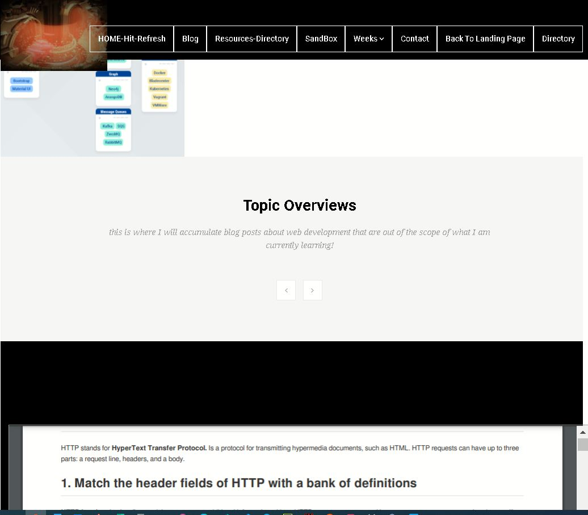
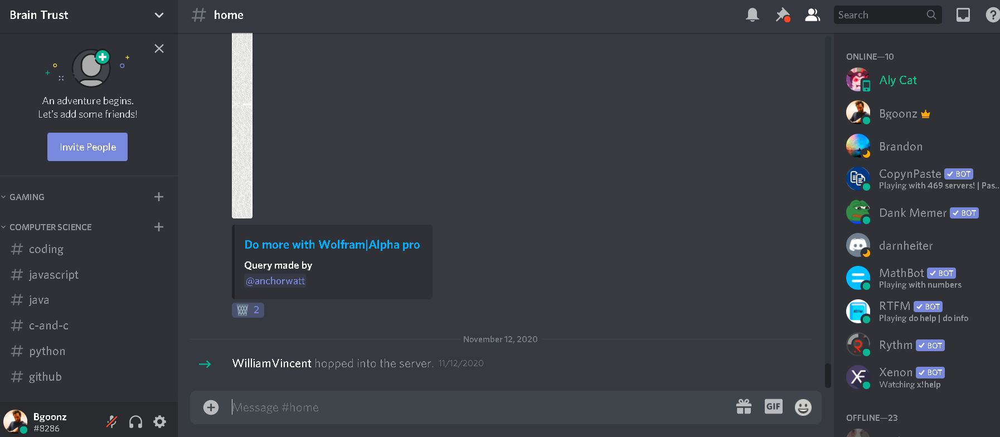

- [Home](#intro)
- [Projects](#one)
- [About Me](#two)
- [Get in touch](#three)

- <a href="https://github.com/bgoonz" class="icon brands fa-github">GitHub</a>
- <a href="https://www.instagram.com/bgoonz/" class="icon brands fa-instagram">Instagram</a>
- <a href="https://www.linkedin.com/in/bryan-guner-046199128/" class="icon brands fa-linkedin-in">LinkedIn</a>

# Hi I'm Bryan!

## This site is a work in progress... as such, you may need to zoom out to about 50% to see it as intended depending on your browser!

Web Developer, Electrical Engineer & Avid Musician/Producer!

- <a href="#one" class="button scrolly">See my Projects</a>

## Web Dev Resource Hub

### My personal Web Development blog and resource sharing site

- <a href="https://goofy-euclid-1cd736.netlify.app/" class="button">Live Site</a>
- <a href="https://goofy-euclid-1cd736.netlify.app/core-site/index.html" class="button">Main Page</a>

## Mihir_Beg.com

### Created a dynamic web page for a local musician using the Bootsrtap framework.

-Talk about App Features & Design Process Here-

- <a href="https://eloquent-sammet-ba1810.netlify.app/" class="button">Live Site</a>

## Interview Prep Static Site

### Data Structures Repository

-Hope this helps someone other than me!-

- <a href="https://gracious-raman-474030.netlify.app/" class="button">Live Site</a>

- <a href="" class="button">Learn more</a>

This is an embedded [Microsoft Office](https://office.com) presentation, powered by [Office](https://office.com/webapps).

This is an embedded [Microsoft Office](https://office.com) document, powered by [Office](https://office.com/webapps).

## Click the 100% button above (below the ) and select "Page Width" to see to scale!

## About Me

-To Do-

### Documentation

I produce my own documentation compulsivley, I'm not 100% sure exactly why but I can't help myself.

### Music

Playing, writing, recording and now developing audio applications are a huge part of my life.

### Automatic Guitar Effects Triggering Using Dynamic Time Warping

This project proposes an automatic solution to the restrictions that guitar effect pedals present. The performer will record the primary performances into the proposed software, which will analyze and store the sequential frequencies. The performer will then utilize the software during a subsequent live performance, to trigger effects when preceding frequencies of the live performance are recognized against the first performance.

### Life Long Learner

One of my greatest passions in life is learning and teaching, for as long as I can remember I have been trying to create collaborative learning enviornments on my own volition.

### Urna quis bibendum

Phasellus convallis elit id ullam corper amet et pulvinar. Duis aliquam turpis mauris, sed ultricies erat dapibus.

### Aliquam urna dapibus

Phasellus convallis elit id ullam corper amet et pulvinar. Duis aliquam turpis mauris, sed ultricies erat dapibus.

- <a href="generic.html" class="button">Learn more</a>

## Get in touch

As of now.... this form actually goes to my email... if you sent me a message before it was operational... I apologize.

Name

Email

Message

- <a href="" class="button submit">Send Message</a>

- ### Email

  [bryan.guner@gmail.com](#)

- ### Phone

  551-254-5505

- ### Social

  - <a href="https://github.com/bgoonz" class="icon brands fa-github">GitHub</a>
  - <a href="https://www.instagram.com/bgoonz/" class="icon brands fa-instagram">Instagram</a>
  - <a href="https://www.linkedin.com/in/bryan-guner-046199128/" class="icon brands fa-linkedin-in">LinkedIn</a>
