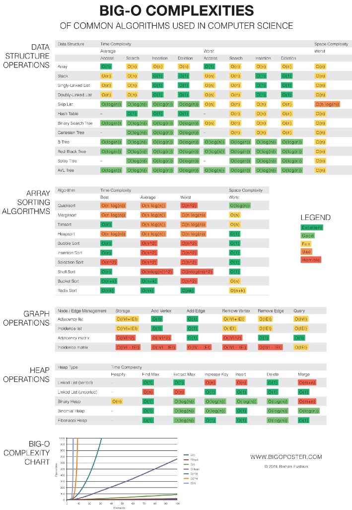
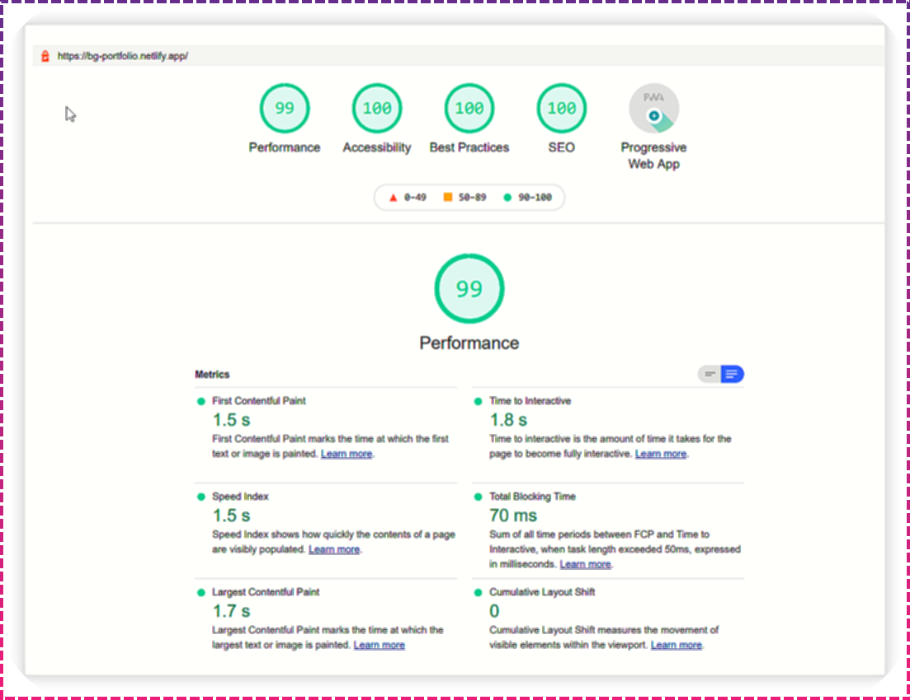
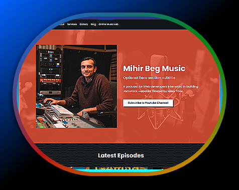
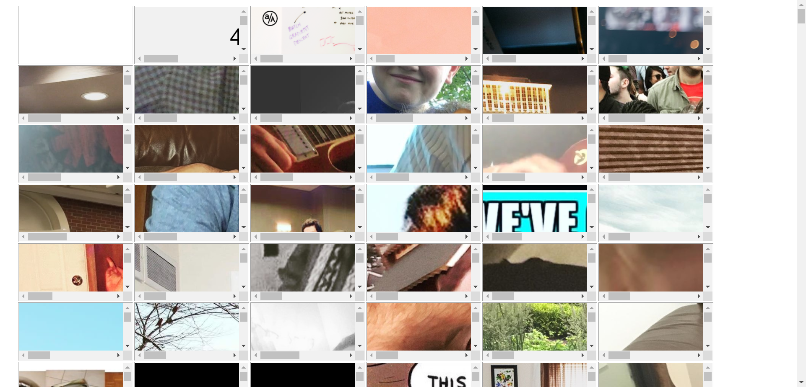

# Job Search Images

.jpg>) .png>) .png>) .png>)  .png>)  (1).png>)   .png>)

  .png>)  (1).png>)  (1).png>) .png>)     .png>) .png>) .png>)   .png>) .png>)    .png>) .png>)  .png>) .png>) .PNG>)  .PNG>) .png>) .png>) .png>) .png>)  .png>) .png>) .png>) .PNG>) .png>)   .png>)   .png>)      .PNG>) .gif>) .PNG>)  
